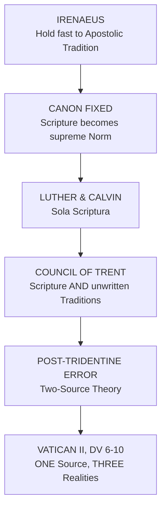

# 02 — The Sources of Theology

> **Chapter 2 of the textbook** · Faith and Revelation; the Historical Debate; Scripture, Tradition, Magisterium; the Resources

> [!quote] Ex 3:5
> "Come no closer; remove your sandals, for the place where you are standing is holy ground."

[[01 - What Is Theology]] asked what Theology **is**. This Chapter asks where the Theologian **stands** while doing it. Before naming a single Source, Moses is first told to stand differently.

---

## A. FOUNDATIONS OF THEOLOGY

The Foundations are **Faith** and **Revelation**: two Sides of one Event.

> [!important] The Formula
> **Revelation** is God's Self-Communication. **Faith** is the human Reception and Response. Neither exists without the other. Revelation becomes a concrete historical Reality only when human Persons receive it.

### 1. FAITH

Faith is a universal Human Phenomenon before it is a Christian Category.

> [!quote] Paul Tillich, Dynamics of Faith (1958)
> Faith is **Ultimate Concern**: the State of being ultimately concerned; whatever proceeds from the Centre of one's Being and absorbs the Energy of the whole Heart and Mind.

**Abraham is the Father of Faith**, "the father of all who believe" (Rom 4:3). "By faith, Abraham obeyed when he was called to go out to a place which he was to receive as an inheritance" (Heb 11:8, citing Gen 12:1-4). Judaism, Christianity and Islam share this Abrahamic Faith: Obedience to God's Word and deep Commitment to God's Call in History.

**Christian Faith has its own Specificity**: Faith in Jesus Christ, the Word of God Incarnate, in whom the Promises to Abraham and Israel are fulfilled and Salvation offered to all Nations.

#### Faith and Belief are not the Same

| | **Faith** (*fides qua*) | **Beliefs** (*fides quae*) |
|---|---|---|
| What it is | Total Response and Commitment of the whole Person | Rational, conceptual Expression of the Content |
| Character | One | Many, partial, culturally conditioned |
| Changes? | Deepens | Develops, diversifies |

> [!example] Why Doctrinal Development is not Betrayal
> "There is one Christ and one faith in Christ, but there have been different **Christologies**... one and the same faith in the real presence of Christ in the Eucharist, but different **doctrines and theories** to explain it."
>
> One Faith, many Formulations. Development is the natural Growth of Faith, not its Corruption.

#### Four Reasons Faith Changes and Deepens

1. **Personal Growth.** The Faith-Development Theories of **Piaget, Erikson and Fowler** trace Stages across a Lifetime.
2. **Historical Situation.** Time, History and Culture always situate Understanding.
3. **Doubt.** Faith is a perilous Journey between Belief and Unbelief. Doubt can clarify and consolidate a living Faith.
4. **Personal Appropriation.** Faith must pass from inherited, conventional Faith to Faith personally owned.

> [!warning] Cultural Christianity
> The book names the unconverted middle stage: those who are baptized, make First Communion, marry and are buried in the Church, but have no personal Faith. **From Cultural Christianity one must pass to personal Christianity.**

Faith is finally not intellectual Assent but a **Praxis**:

> [!quote] Jon Sobrino
> "To know the truth is to do the truth; to know Jesus is to follow Jesus."

And Faith remains, above all, the free Gift of God: "this revelation did not come from flesh and blood but from my Father who is in heaven" (CCC 153, on the Confession of Peter, Mt 16:17).

### 2. REVELATION

> [!quote] Edmund J. Dunn, What is Theology? (1998), 42
> Revelation is "God's gracious self-disclosure reaching out to humans as an invitation, as well as promise, to participate in God's own life of unfathomable love, mediated to us through persons, nature, history, everyday experience, and, in an ultimate way, in and through God's very Word, Jesus Christ."

> [!quote] Dei Verbum 2
> "In His goodness and wisdom, God chose to reveal Himself and to make known to us the hidden purpose of His will."

Revelation reaches its Fullness in Christ: "God, last of all in these days has spoken to us by his Son" (Heb 1:1-2; DV 4).

> [!important] A Polarity to hold
> Revelation is **Closed** in Christ: "there will be no other word than this One." **But** its Understanding is never closed: "it remains for Christian faith gradually to grasp its full significance over the course of the centuries" (CCC 65-66).

#### FOUR MODELS OF REVELATION

After **Alister E. McGrath**, *Christian Theology: An Introduction* (2001), 202-208. These are Dimensions of one Reality, not rival Options.

| Model | Revelation is... |
|---|---|
| **Doctrine** | Cognitive Propositions contained in Scripture or Tradition |
| **Presence** | Personal Encounter with the living God within the Believer |
| **Experience** | A universal existential Experience possible for every Person |
| **History** | A public historical Event open to historical Investigation |

#### The Question of Other Religions

If Revelation is universal, does Christianity hold a Monopoly? Vatican II affirms God's Presence and Action in other Cultures and Religions (*Nostra Aetate*; GS 22; AG 7). Christian Revelation, mediated through the concrete historical Event of Christ, does not threaten but **calls for Dialogue** with the universal Experience of Transcendence present in all Peoples. → [[06 - Theologizing in the Indian Context]]

---

## B. SOURCES OF THEOLOGY

### 1. THE HISTORICAL DEBATE

**Irenaeus** and the early Fathers, confronting Heresy, insisted that Interpretations of Scripture may vary but the **Apostolic Tradition is one**.

**Luther and Calvin** proposed ***Sola Scriptura***: Scripture alone, inspired by the Spirit, contains everything necessary for Salvation.

The **Council of Trent** answered by affirming both Scripture and unwritten Traditions, "received by the Apostles from the mouth of Christ Himself... and transmitted as it were from hand to hand" (Neuner and Dupuis, *The Christian Faith*, no. 210).

Post-Tridentine Theology then hardened this into a **defective Two-Source Theory**: Scripture and Tradition as two separate Reservoirs of Truth.

> [!important] How Vatican II resolves it
> There is in fact only **one Source**: the **Apostolic Tradition**, the foundational revelational and Faith Experience of the early Community. But this one Tradition is concretely identified through **three distinct Realities**: Scripture, Tradition, and the Teaching Authority of the Church.
>
> "Sacred Tradition and Sacred Scripture form one sacred deposit of the word of God which is committed to the Church" (DV 6-9). "Sacred Tradition, Sacred Scripture and the teaching authority of the Church... are so linked and joined together that **one cannot stand without the others**" (DV 10).

### 2. THE THREE SOURCES

#### a) SACRED SCRIPTURE

Scripture is the ***norma normans non normata***: the Norm which norms all else and is itself normed by no other Criterion.

Both Testaments are written by human Authors under Inspiration, teaching "firmly, faithfully, and without error that truth which God wanted to put into the sacred writings for the sake of our salvation" (DV 11). Scripture must be interpreted within "the living tradition of the whole Church", with final Authority in "the judgment of the Church" (DV 12).

> [!quote] Dei Verbum 24
> "Sacred theology rests on the written word of God, together with sacred tradition, as its primary and perpetual foundation... The sacred Scripture is **the soul of sacred theology**."

Inspiration is **not divine Dictation**. The human Authors remain conditioned by their own History, Culture and Thought-Patterns, even as the Authority of Scripture derives ultimately from Christ.

#### b) TRADITION AND traditions

> [!important] Capital T, small t
> **Tradition** is the one Apostolic Reality. **traditions** are its many concrete Vehicles. From the Latin *trado, tradere*: to hand over, to deliver.

**i) Different Ecclesial Traditions.** "Each Individual Church or Rite retains its traditions whole and entire" (*Orientalium Ecclesiarum* 2).

> [!info] The Indian Lens
> The Catholic Church is a Communion of **22 Individual Churches**, the Roman being the largest, the other 21 Oriental, belonging to **six ancient liturgical Families**: Roman, Alexandrian, Antiochian, Armenian, Chaldean and Byzantine. All of **equal Dignity**.
>
> India has two of these: the **Syro-Malabar** and the **Syro-Malankara**. The Indian Seminarian therefore studies Theology inside a living Instance of Ecclesial Pluralism, not an abstract Principle imported from elsewhere. → [[06 - Theologizing in the Indian Context]]

**ii) Liturgy, Sacraments and Prayers.** "Liturgy is the summit toward which the activity of the Church is directed; at the same time it is the fountain from which all her power flows" (SC 10). This is the Callback to *Lex Orandi, Lex Credendi* in [[01 - What Is Theology]]. The **Liturgy of the Hours**, drawn from Psalter, Scripture, Hymns and Litanies, is named a rich living Source.

**iii) Creeds or Symbols, Beliefs and Doctrines.** Creeds arose in the Context of Baptismal Liturgy and became the **Rule of Faith**. They are primarily Acts of Faith (*fides qua*) with an intellectual Content (*fides quae*). Examples: the **Apostles' Creed** (third century), the **Nicene** and **Constantinopolitan** Creeds.

**iv) The Teachings of the Fathers.** The patristic Period runs from the close of the New Testament to **John Damascene (749)** in the East, **Gregory the Great (604)** and **Isidore of Seville (639)** in the West.

> [!tip] Four Marks of a Father of the Church
> **Antiquity · Orthodoxy · Holiness of Life · Recognition by the Church**
>
> Their threefold Work: Scriptural Commentary, combating Heresy, translating Faith into the Philosophical Categories of their own Age. They are a **Model**, not a Repository of ready Answers for today. → [[03 - Development and Pluralism in Theology]]

**v) Dogmas.** A Dogma is a Truth of Revelation explicitly propounded by the Church: the Church's own fixed Faith-Language, safeguarding the Unity of Faith visibly and tangibly. Two Qualifications: Dogma **develops**, making explicit what was implicit, never adding new Content to the Deposit; and Dogmas stand in a **Hierarchy of Truths**, "since they vary in their relationship to the foundation of the Christian faith" (UR 11), that Foundation being the Mystery of Christ. → [[05 - The Criteria of Christian Theological Reflection]]

**vi) Customs, Disciplines and Codes.** The Church, a visible Society, needs Law.

| Date | Development |
|---|---|
| OT and NT | The Decalogue (Rom 13:8-10; Gal 5:13-25) |
| 12th century | **Gratian** makes the first proper Codification of the Decretals |
| 1917 | First Latin Code of Canon Law |
| **1983** | Post-Vatican II Latin Code: People of God, Collegiality |
| **1990** | Code of Canons of the Eastern Churches |

The Church is described as **breathing with two lungs**, of the East and of the West.

**vii) Catechisms of the Church.** Luther (1529), Canisius (1556), Bellarmine (1598); the **Roman Catechism of Trent (1566)**, compiled by Charles Borromeo; and the **Catechism of the Catholic Church (1992)**, commissioned by the 1985 Extraordinary Synod, keeping the fourfold Structure of Creed, Liturgy, Christian Life, Prayer, with entirely new Material from Vatican II.

#### c) MAGISTERIUM OR TEACHING OFFICE

Distinct from Scripture and Tradition, yet inseparably united with them.

**i) Collegiality of the Bishops.** The Bishops, as one College in Communion with the Roman Pontiff, hold the supreme Teaching Authority (LG 18-23). The New Testament Basis is the Choice of the Twelve. They teach at varying Levels: ordinary, and, acting collegially with the Pope, extraordinary or **Infallible** (LG 25).

**ii) Papal Magisterium.** Roman Primacy, rooted in the Role of Peter (Mt 16:18) and his Martyrdom in Rome, was solemnly defined only at **Vatican I (1870)**, though attested earlier at **Lyons (1274)** and **Florence (1439)**. Vatican I is today read together with Vatican II Collegiality: the Pope teaches **as Head of the College**, not apart from it.

**iii) Sensus Fidei, Sensus Fidelium.**

> [!quote] Lumen Gentium 12
> "The body of the faithful as a whole, anointed as they are by the Holy One, cannot err in matters of belief... it shows universal agreement in matters of faith and morals."

> [!important] The Threefold Blending
> Theologizing needs the harmonious Blending of three Elements:
> **1. the Sensus Fidei of the Community · 2. the Charism of the Magisterium · 3. the intuitive and prophetic Work of the Theologian**
>
> Not a one-way Chain of Command. The Magisterium must **discern** the Sense of the Faithful, not override it. → [[05 - The Criteria of Christian Theological Reflection]]

---

## HINGE

Is the Bush still Holy Ground when the Theologian moves from the Sources handed down to the Resources still being spoken? "Come no closer" was said once at the Bush. But the Voice that sent Moses to Pharaoh and to the Cry of the People (Ex 3:7, 10) did not fall silent when the Canon closed.

---

## C. RESOURCES OF THEOLOGY

> [!important] Sources and Resources: the Distinction to master
> **Sources** are the normative, historically fixed Media of the one Apostolic Tradition. **Resources** are the wider Field in which God continues to speak today, read through the Signs of the Times.
>
> Revelation is definitive in Christ, but God has not ceased to act: "Even prior to the incarnation of the Word in Jesus Christ, God had certainly intervened, acted and spoke in human history."

### 1. People and their Experience

> [!quote] Acts 10:34-35, the Cornelius Episode
> "God does not have favourites, but anybody of any nationality who fear God and does what is right is acceptable to him."

The whole of Humankind relates, in different Degrees, to the People of God (LG 14-16). Human Experience, in Art, Architecture, Music, Story and Struggle, is the Meeting-Point of God's Self-Gift and human Response, and so the Starting-Point of all theological Investigation.

### 2. Cultural Resources

Culture = the total Vision of Life of a People: Values, Symbols, Customs, Story. Humans create Culture and are in turn shaped by it (GS 55). **No Culture is superior or inferior**; each carries both authentic Value and the Distortion of Sin.

> [!quote] Gaudium et Spes 58
> God "speaks to humans according to their culture of different ages."

The older missionary Method too often imposed the Gospel from outside. The Task now is first to **listen** to a Culture and discern the Risen Lord already at work within it.

### 3. Diverse Religious Traditions

**Three historical Stages** in the Christian Encounter with other Religions:

| Stage | Attitude |
|---|---|
| **First** | Other Religions as Threat: false, merely human, even demonic |
| **Second** | Scientific Recognition of human Value in them, still subordinate to Christianity |
| **Third (today)** | God recognised as **present and active within** authentic religious Traditions |

"All those who strive to do the will of God as it is known to them through the dictates of conscience" may attain Salvation (LG 16). Other Religions "reflect a ray of that truth which enlightens all" (NA 2).

> [!quote] FABC, Taipei, 1974
> "We accept them, the Great religions of Asia, as significant and positive elements in the economy of God's design of salvation... over many centuries they have been the treasury of the religious experience of our ancestors... And how can we not acknowledge that God has drawn our peoples to Himself through them?"

Not every Religion is equally free of Distortion, since Sin can affect any Symbolic System. But the **Scriptures of other Religions are a Heritage of the whole of Humanity**, and Interreligious Dialogue is a central Task of Theology today.

### 4. The Peoples' Movements and the Voice of the Marginalized

> [!quote] The Exodus Paradigm
> "The Exodus was the story of the struggles and triumph of an oppressed people."

Israel's History and the Community Jesus gathered, tax collectors, the sick, sinners, the prostitutes, are one continuous **People's Movement** towards Freedom, Justice, Equality and Fellowship. Today's Equivalents named by the book: Human Rights, Women's, Peasants', Fisher-Folk, **Tribal**, **Dalit** and Ecological Movements.

Theology must attend especially to the Voice of **Women** (more than half the World's People, still under-represented), the **Dalits** and the **Tribals**. → [[06 - Theologizing in the Indian Context]]

### 5. The Cry of the Poor

> [!warning] The sharpest Sentence in the Chapter
> "In the traditional caste organization, the outcastes were discriminated; but they knew that they were wanted... today the worst thing is happening: **the poor are told that they are not wanted**, that they are redundant."

Poverty is not willed by God. It is the Consequence of Sin, incompatible with the Kingdom Jesus proclaimed. The Church must take "an unambiguous option for the poor, and listen to their cry" (*Ecclesia in Asia* 34).

> [!important] The Epistemological Privilege of the Poor
> Because the Poor depend wholly on the Benevolence of God, they have a privileged Nearness to God and therefore a privileged Knowledge of God. "God speaks today in a very special way through the cry of the poor, their struggles, aspirations, visions and hopes."

---

## CLOSE: THE CRY THAT SENT MOSES STILL SENDS

Chapter 1 opened at the Bush that burns and is not consumed. This Chapter has walked the Ground outward from the Fire: from Faith and Revelation, the Holy Ground itself; through Scripture, Tradition and Magisterium, the Sources that hand the Fire on; to the Resources, where the same Voice that said "I have seen the affliction of my people... I have heard their cry" (Ex 3:7) still speaks.

**"I will send you" (Ex 3:10) was not addressed to Moses alone.** Every Source and every Resource named in this Chapter exists only to be sent again towards that Cry.

---

## POLARITIES IN THIS CHAPTER

**1. Sources and Resources.** The historical Sources carry a permanent, normative Value. **But** the Resources are equally where God speaks today, and Theology draws from both without collapsing one into the other.

**2. Scripture and Tradition.** Scripture is *norma normans non normata*. **But** Scripture itself arose from and is authenticated by the Tradition and the *Sensus Fidei* of the Community that first received it (DV 10).

**3. Collegiality and Papal Primacy.** The whole College, in Communion with the Pope, holds supreme Teaching Authority. **But** the Primacy defined at Vatican I is not absorbed into the College. Both Councils are held together, not resolved into one.

**4. Magisterium and Sensus Fidelium.** The Magisterium teaches with Authority. **But** it teaches only what it has first listened for in the believing Sense of the whole People of God.

---

## Review Questions (from the textbook)

1. The Faith-Experience of the earliest Christian Community is the primary Source of Theology. Does this tally with the Notion that Revelation and Faith are the Sources and Foundations of Theology?
2. What were the Issues in Focus during the historical Debate on the Sources? Does Theology have one, two, or three Sources?
3. What are the respective Roles of the Magisterium, the *Sensus Fidelium* and the Theologians, and what exactly is the Relationship among them?
4. What is the Basis for the Distinction between Sources and Resources? Do you think such a Distinction is valid?
5. What are the Attitudes of the Church today towards other Cultures and Religions? Do you notice any significant Change?

---

prev:: [[01 - What Is Theology]]
next:: [[03 - Development and Pluralism in Theology]]
up:: [[Introduction to Theology - Course Home]]
