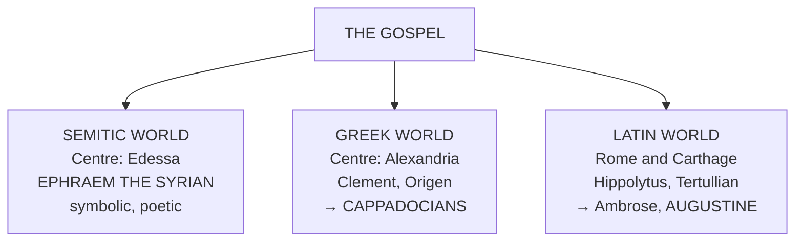
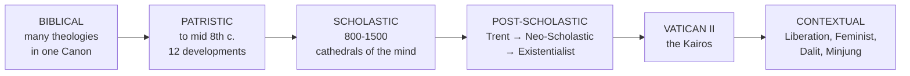

# 03 — Development and Pluralism in Theology

> **Chapter 3 of the textbook** · a Historical Outline across Five Eras: Biblical, Patristic, Scholastic, Post-Scholastic, Contextual

> [!quote] Ex 3:2
> "The bush was burning, yet it was not consumed."

One Fire, never consumed. But the Fire has been seen from many Angles across twenty Centuries. This Chapter answers one Question: **why is there not one Theology but many, and when is that a Gift and when a Betrayal?**

---

## A. PLURALISM AND RELATIVISM

Theology is hemmed in by two Dimensions:

| Dimension | Meaning |
|---|---|
| **Mystery** | God cannot be comprehended |
| **Mediation** | God has freely communicated God's Self |

Therefore Theology, unlike other Sciences, **does not proceed from Definitions**. Religious Language is not a Mirror of the Mystery but **Pointer Language**, working by Analogy and Metaphor. → [[01 - What Is Theology]]

### The Five Seedbeds of Pluralism

| Emphasis falls on... | Produces |
|---|---|
| What Theology itself is | **Fundamental Theologies** |
| The Use of Philosophy | **Speculative Theologies** |
| The Role of Scripture | **Biblical Theologies** |
| The Role of Tradition | **Magisterial Theologies** |
| The Questions of a Context | **Contextual Theologies** |

> [!important] Pluralism is NOT Relativism. Examinable.
> **Pluralism**: the same one Truth approached from more than one legitimate Angle. A Gift, not a Drawback.
>
> **Relativism**: there is no one Truth at all, only "what seems true" from a Perspective. It denies any deeper Unity beneath the Diversity of Expressions. At its Core it is **"a negation of realism."**

---

## B. THEOLOGIES IN THE BIBLE

The Bible itself already contains more than one Theology.

> [!quote] Dei Verbum 11
> "To compose the sacred books, God chose certain men who, all the while He employed them in this task, **made full use of their own faculties and powers** so that, though He acted in them and by them, it was as **true authors** that they consigned to writing whatever He wanted written, and no more."

**Old Testament, 46 Books.** Scholars identify a **Yahwist**, an **Elohist**, a **Priestly**, a **Deuteronomic** and several **Wisdom** Theologies. They differ because Israel itself changed: from an agrarian Society, to a Monarchy, to a Vassal of Assyria, Greece and Rome.

**New Testament, 27 Books.**

> [!tip] The Gospels developed BACKWARDS. Learn this.
> The oldest Preaching was not a Biography but the core Proclamation: **Jesus died and rose** (Acts 2:23, 32; 3:14-15; 4:10; 10:39-40; 1 Cor 15:3-4).
>
> From that grew the **Passion Narrative**, the oldest connected Story about Jesus.
>
> Only afterwards was the Ministry Material prefixed to the Passion Account. The Gospels are **anecdotal rather than biographical**, arranged logically rather than chronologically. They are **History interpreted through Faith**.

> [!example] Mark proves the point
> The oldest Gospel begins with the adult Jesus meeting John the Baptist, "the beginning of the Gospel of Jesus Christ" (Mk 1:1), and ends at the empty tomb (Mk 16:1-8). **Mark says nothing of the Birth or Youth of Jesus**, because his Purpose was to preach Salvation, not to write a Life.

Hence we rightly speak of a **Matthean**, a **Marcan**, a **Lucan** and a **Johannine** Theology. Within Paul alone:

| Christology | Starts from |
|---|---|
| **Ascending** | The Humanity of Jesus |
| **Descending** | His Divinity |
| **Cosmic** | Christ in relation to the whole Universe |

**The Key Point.** The New Testament never loses its single Focus, Jesus Christ, but expresses that one Focus in a genuine Variety of legitimate Ways. Uniqueness and Multiplicity together.

---

## C. THE ERA OF THE FATHERS OF THE CHURCH

**Extent:** from the apostolic Period to the middle of the **eighth Century**.

> [!tip] Four Qualifications of a Father
> **Soundness of Doctrine · Holiness of Life · Ecclesiastical Endorsement · Antiquity**
>
> In practice the Title is extended to some who lack the first three, notably **Origen** and **Tertullian** (Tixeront-Raemers, *A Handbook of Patrology*, 2). Compare the four Marks in [[02 - The Sources of Theology]].

### Three Phases of Dialogue

1. **Apologetic.** An *apology* was a formal Statement before a Judge on behalf of a Defendant. The Apologists sought official Recognition of the Right of Christians to practise publicly.
2. **Dogmatic.** Understanding the Faith by its own inner Dynamism.
3. **Theological.** The Emergence of Christian Systems of Theology.

### The Three Cultural Streams

**Apostolic Fathers** (pastoral, didactic, exhortatory): Clement of Rome, Ignatius, Polycarp.
**Apologists** (defence and cultural dialogue): Justin, Irenaeus, Clement of Alexandria.
**Cappadocians**: Gregory Nazianzen, Basil of Caesarea, Gregory of Nyssa.

> [!info] Why the Syriac Stream matters in India
> **Ephraem the Syrian** represents Christianity in its as yet **unhellenized and uneuropeanized** form. The Syro-Malabar and Syro-Malankara Churches of India inherit from this stream. → [[04 - Selected Models of Theology]] and [[06 - Theologizing in the Indian Context]]

### THE TWELVE KEY THEOLOGICAL DEVELOPMENTS

The backbone of this section. Learn all twelve by letter.

| | Development | Core point |
|---|---|---|
| **a** | **Fixing the NT Canon** | The Church did not authenticate what was apostolic; **what was apostolic was received** and interpreted authentically by the Church |
| **b** | **The Role of Tradition** | Against Gnosticism, Irenaeus: "The true Gnosis is the teaching of the Twelve Apostles" (*Contra Haereses* II, 25) |
| **c** | **Fixing the Ecumenical Creeds** | From Baptismal Professions and the Apostles' Creed to the **Nicene** and **Constantinopolitan** Creeds |
| **d** | **Deeper Understanding of Christ** | Milestone: **Chalcedon (451)**, driven by the Alexandrian and Antiochene Schools |
| **e** | **Approaches to the Trinity** | **Latins** (Augustine) begin from the One God, then the Three Persons. **Greeks** (Cappadocians) begin from the Three Persons, then the one God |
| **f** | **Fuller Understanding of the Church** | Pauline (unity of all local Churches) and Johannine (reality of each local Church) converge in Irenaeus. Rise of the **five Patriarchates**: Rome, Alexandria, Antioch, Constantinople, Jerusalem |
| **g** | **Sacramentality** | Against the Donatists, Augustine: the Sacrament works by **Christ**, not by the Holiness of the Minister |
| **h** | **The Doctrine of Grace** | Augustine against **Pelagius**: Grace is needed at **every** stage of Human Life |
| **i** | **Biblical Interpretation as Science** | **Origen** distinguishes the **corporeal** (literal, grammatical) and the **allegorical** Sense |
| **j** | **Theology meets Secular Culture** | **Justin** uses the Greek *logos*, at once Stoic Reason in the World and the Son of God in John |
| **k** | **Reason and Faith first related** | **Gregory Nazianzen**: Faith first, Reason serves. **Basil**: to submit a Mystery to Dialectic is self-contradictory, yet he uses Dialectic to define Doctrine precisely |
| **l** | **Schools of Theology emerge** | **Alexandrian** and **Antiochene** as the first organised Schools |

> [!warning] The Christological Schools, contrasted
> **Alexandrian** (Cyril of Alexandria): stresses the **Divinity** of Christ, tends to downplay his Humanity.
> **Antiochene** (Theodore of Mopsuestia): asserts the full **Humanity**, tends to loosen the Union with the Divinity.
> Chalcedon holds both.

---

## D. SCHOLASTIC THEOLOGIES

**Scholasticism** describes how Philosophy and Theology were organised in the medieval European **Universities**. *Universitas* originally meant the entire Body of Masters and Students residing in a Town. Two chief Methods of Teaching: **Lectures** and **Disputations**.

### The Shift that produced it

| From | To |
|---|---|
| **Semitic** Categories: **functional**, God's Actions | **Greek** Categories: **ontological**, Being |
| The Plane of Action | The Plane of Being |
| Concrete, symbolic, dynamic | Precise, technical, abstract |

Augustine sums up the underlying Attitude: **"Believe that you may understand."**

The Turning Point is the Arrival of **Aristotle** in Western Europe, whose naturalistic Vision of a Cosmos with its own internal Consistency both excited and alarmed Christian Thinkers.

> [!tip] The Four Periods, with dates
> **Pre-Scholasticism 800-1050 · Early Scholasticism 1050-1200 · High Scholasticism 1200-1350 · Late Scholasticism 1350-1500**

### The Two Focal Issues

1. **The Role of Reason in Theology.**
2. **The Development of Theological Systems.** The Pressure to systematize produced what **Étienne Gilson** called **"cathedrals of the mind."**

Two Emphases divide the Schools:

| Primacy of the **Intellect** | Primacy of the **Will** |
|---|---|
| Thomas Aquinas → **Thomism** | Bonaventure; also Scotus → **Scotism**, Ockham → **Ockhamism** |

### THE SIX FIGURES

**1. Anselm of Canterbury (1033-1109): Faith and Reason.** *Fides quaerens intellectum*. In his Scale of Values: Faith lowest, Insight into Faith in the middle, the **Beatific Vision** at the top. Disregarding Authority was only a **methodological Strategy** to show Faith reasonable; in any Clash between Scripture and Reason he held Scripture correct, and submitted his Works to the Judgement of the Pope. **Called the Father of Scholasticism.**

**2. Bernard of Clairvaux (1091-1153): Mystical Theology.** A Synthesis of Latin Augustine and Greek Gregory of Nyssa, elaborated out of personal Ecstasy. His Project of Life in one Phrase: **"to know Jesus and Him crucified."** Sin is willing oneself for oneself, or willing other Creatures for oneself, instead of willing both for God. A Forerunner of Western Mystical Theology.

**3. Thomas Aquinas (1225-1274): Synthesis on the Intellect.** Treated fully in [[04 - Selected Models of Theology]].

**4. Bonaventure (1221-1274): Synthesis on the Will.**

> [!quote] Bonaventure, Opera Omnia 8:33b
> "As the children of Israel carried away the treasures of Egypt (Ex 3:22; 12:35), so theologians make their own the teachings of philosophy."

Three Stages of the Ascent of the Soul: the **Shadows and Vestiges** of God in the sensible World; the **Image** of God in our Soul; and beyond created Realities into the **mystical Delights** of Knowledge and Adoration. Pope Leo XIII called him **"the prince who leads us by the hand to God."**

**5. John Duns Scotus (1266-1308): A Christocentric Synthesis.** Everything begins in **Love**. God is Love, created out of Love, and above every created Thing stands **Jesus Christ**, the God-Man, whose **Incarnation was willed by God from all Eternity**, independent of Sin. All others predestined to Glory are willed as **"co-lovers"** of the Trinitarian God. **M. Grabmann**: "the last of the great personalities of Scholasticism."

**6. William of Ockham (1285-1347): The Breakdown.**

> [!warning] Why the Synthesis fell apart
> **Ockham's Razor**: *Entia non sunt multiplicanda sine necessitate*. Entities must not be multiplied without necessity.
>
> **Nominalism**: Reality is a Collection of absolute Singulars. Universality is purely functional and refers to no common Nature outside the Mind.
>
> **Consequence**: Theology **is not a Science**, because its Principles are not evident but accepted from Revelation. The Gap between Philosophy and Theology widens; the Role of Reason is drastically restricted. His *via moderna* stands against the *via antiqua* of the earlier Scholastics.

---

## E. THE POST-SCHOLASTIC ERA

The Reformation split the Western Church; the Catholic Church rallied at **Trent**; and for several Centuries the theological Mood was **defensive**.

### 1. The Neo-Scholastic Renewal

Origin: **1879**, Pope **Leo XIII**, encyclical ***Aeterni Patris***, recommending the study of Philosophy and especially of **Aquinas**.

Core Orientations retained: the Doctrine of the **four Causes** (material, formal, efficient, final); the Doctrine of **Analogy**; the **Proofs** for the Existence of God; the clear Delimitation of Theology and Philosophy.

| Figure | Contribution |
|---|---|
| **Désiré-Joseph Mercier** | Aligning the scientific Temper with Catholic Faith |
| **Maurice de Wulf** | Respect for Tradition **and** Adaptation to modern intellectual Needs |
| **Jacques Maritain** | **Three Degrees of Knowledge**: scientific, metaphysical, suprarational |

### 2. The Existentialist Thrust

Existentialism is not a Body of Doctrines but an **Approach**: it begins by interrogating **Existence**, how the concrete Human Being lives, acts and decides, as against any fixed Essence. The Human Being is a **Wayfarer**, always incomplete.

**Gabriel Marcel** makes two Distinctions to memorise:

| | Can be approached objectively | Cannot be grasped from outside |
|---|---|---|
| | **Problem** | **Mystery** |
| | **Having** (Attitude of Domination) | **Being** (involves us in Relationships) |

The Locus of Human Existence is not the isolated **"I"** but the community **"we."**

### 3. The Kairos of Vatican II (1962-1965)

> [!important] Why the Council is a Watershed for Theology
> Three Groups shaped the new Awareness:
> 1. **Europeans**, living in close contact with other Christian Traditions
> 2. **Latin Americans**, with their Sensitivity to Injustice
> 3. **Asians and Africans**, living in a **multi-religious Context**
>
> The Neo-Scholastic Paradigm **lost its Position as the only Tool**. Note the Irony: Bea, Congar, Daniélou, de Lubac, Helder Camara and Rahner all began strictly within that Paradigm and then opened it.

Indian and Asian Bishops brought precisely the multi-religious daily Experience that Section F names as the Seedbed of Contextual Theology. → [[06 - Theologizing in the Indian Context]]

---

## F. CONTEXTUAL THEOLOGIES

Before Vatican II the accepted Model was one ***theologia universalis***, applicable everywhere. The dramatic Growth of the Church in what was called the **periphery**, Asia, Latin America, Africa and Oceania, brought not only a Shift in Population but a **Shift in Perspective**: from a Graeco-Roman Outlook into the Era of a **World Church**. Hence *Contextualization* and *Indigenisation*.

### Three Areas of Sensitivity

| | Sensitivity | Meaning |
|---|---|---|
| **Context** | Start from the Context itself | Rather than applying a received Theology onto it |
| **Procedure** | Communitarian | Ideas emerge in **Basic Christian Communities**, not only around individual Luminaries |
| **History** | The historical Dimension | Alongside the perennial and enduring |

### Three Roots

**Gospel** (the Good News, Scripture, Worship) · **Church** (the Gospel incarnate in the believing Community, that is Tradition) · **Culture** (the concrete Way of Life, with Values, Symbols and Meanings).

### THE INSTANCES

**a) Continental and National.** Asian, Latin American, African Theology; Indian, Filipino Theology.

**b) The Theology of Secularisation.** Secularisation = the Process whereby Elements of Human Life cease to be determined explicitly by Religion. Illustrated by three Contrasts: Faith and Knowledge; Church and State; This World and the Next as the End of the Human Being.

> [!quote] Dietrich Bonhoeffer
> How can we speak of God in "worldly terms"? How can we avoid speaking of God as a ***Deus ex machina***, the stopgap where human effort fails?

The Thesis: **"to genuinely Christianise the world is to secularise it."**

**c) The "Death of God" Theology.** Situated in a post-modern Scenario where God has ceased even to be a **Problem** for the contemporary Person immersed in the secular. The Task: reformulate the Self-Communication of God intelligibly for urbanized, industrialized, technological Thought-Forms.

**d) Black Theology.** Discerns, interprets and imparts the Word of God for the historical, religious, cultural and social Life of the **Black Community in the United States**.

**e) Feminist Theologies.** Articulate the Struggle of Women facing Discrimination on the basis of Gender, shaping Christian Language about God through the Voices of Women. Three interrelated Elements:
1. the **historical Reality of Women** as the theologizing Subjects
2. an Investigation into **Gender as a Source of Discrimination**
3. drawing out the **liberative Dimension** of Christianity as a Praxis of Transformation

**f) Ecofeminism.** Links the twin Oppressions of Women and of the rest of Nature, adding to Gender Discrimination the Category of ***naturism***, the Oppression of Nature.

**g) Dalit Theology.**

> [!info] The Indian Instance
> Stems from a new Consciousness of the **Dalits**, the socially and structurally oppressed Class of India, **from which Group a large number of Indian Christians derive**. In traditional Hindu Society the outcaste was considered ritually **polluted and polluting**.
>
> Dalit Theology strives for Liberation from that false Consciousness of Pollution and protests against the System that created and supports it. Its Focus is **not primarily economic Poverty** but **fundamental Human Dignity and the Equality of all Human Beings**. → [[06 - Theologizing in the Indian Context]]

**h) Minjung Theology (Korea).** The protracted colonial Presence produced ***han***, a repressed Anger seen as characteristic of the Korean People. The ***minjung*** are the powerless People on the Periphery, politically oppressed and economically deprived. **Jesus himself was a Victim of Oppression**; the Cross is the Irony of the Wisdom of God against the Powerful, permitting People to laugh at their own Suffering and at their Exploiters, as Jesus did.

> [!warning] The necessary Caution
> Contextual Theologies can at times be **lopsided** Reflections. Catholic Contextual Theologies understand themselves as definite Emphases **within** Catholic Self-Understanding. But a given Contextual Theology may fall outside it. Hence the Catholic Character of any Theology **needs to be authenticated**. → [[05 - The Criteria of Christian Theological Reflection]]

---

## THE MACRO-FLOW OF THIS CHAPTER

---

## Review Questions (from the textbook)

1. How can we understand the fact that, although the Bible is one, there is a plurality of theologies within it?
2. Highlight the basic Issues facing Christian Communities in the post-apostolic Period. What were the main Trends of Patristic Theology?
3. What were the significant Contributions of the Scholastic Debate on the respective Roles of Faith and Reason?
4. List some Factors that led to the Disintegration of the Scholastic Synthesis.
5. In what sense can Vatican II be considered a Turning Point for Catholic Theology?
6. In what does the Novelty of Contextual Theologies primarily consist?

---

prev:: [[02 - The Sources of Theology]]
next:: [[04 - Selected Models of Theology]]
up:: [[Introduction to Theology - Course Home]]
