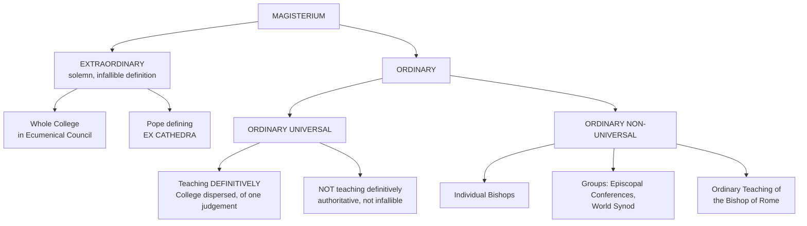

# 05 — The Criteria of Christian Theological Reflection

> **Chapter 5 of the textbook** · how we test whether a Theology is authentically Catholic

> [!quote] Ex 3:6
> "I am the God of your father, the God of Abraham, the God of Isaac, and the God of Jacob."

The Voice at the Bush **identifies itself**. Not every Fire is the Fire of God. This Chapter asks how the Church tests the Voice.

[[03 - Development and Pluralism in Theology]] and [[04 - Selected Models of Theology]] showed how many legitimate Forms Theology takes. The natural next Question follows: **where does legitimate Pluralism end and Heterodoxy begin?**

---

## A. THE ISSUE AND NEED FOR CRITERIA

> [!quote] Roy Eckhart, The Theologian at Work (1969), 212
> "A sensible way to discover what an enterprise means is to look at what its practitioners do."

Christian Theology involves a **datum**, a certain **"givenness."** It has a definite Identity and specific Limits.

> [!important] The Sentence to hold on to
> It will not do to say that **Christianity is what Christians say it is**. The Ultimates by which Christianity lives are **not negotiable under popular pressure**. To think so would deny the Quality of Givenness. A Theology cannot respond to the Challenges of the present Day **by betraying its Past**.

Catholic Theology has factually accepted Pluralism, yet Pluralism is sometimes viewed with Suspicion. There is a **twofold Demand**:

> [!quote] Paul VI, Evangelii Nuntiandi 65
> On the one hand, the need to **encourage and foster** theological Expression which takes account of differing cultural, social and even racial Milieux. On the other hand, the **indispensable Demand** that the Content of Faith be **neither impaired nor mutilated**.

**Identity** (what a Reality is) and **Identification** (how one recognises it) are distinct Questions. The Principle of Individuation **labels** a Reality as an Exemplar of a Species, whereas Identity requires a Concept that stresses **Uniqueness**.

---

## B. THE PROBLEM OF THE CRITERION OF THE CRITERION

A **Criterion** is a Principle or Standard whereby a Thing is judged. But here lies the Trap: most Criteria **presuppose a choice of Values**, and those Values presuppose an Understanding of the Realities of Faith. If one already stands committed to a given Understanding, it is easy to establish Criteria by which that Approach is preferred to others.

> [!warning] The Trap, named by an Indian Theologian
> **The Risk**: the Criteria simply **endorse one's own preferred Option**, presupposing the very Point at Issue.
>
> Hence the rhetorical Question of **Raimundo Panikkar**: **"What is the criterion of the criterion?"**

This Chapter takes that Warning seriously before proposing any Answer.

---

## C. THE ROMAN CATHOLIC STANCE

Whether a Theology may be called Catholic depends on whether it **harmonizes with the ecclesial Understanding**, not merely on whether it is personally intelligible.

The Church sees herself as the Recipient of the vital covenant Relationship God wills with Humanity, **perfect and definitive in Jesus Christ**, known through the Witness of the Apostles. That Collection of Events, Truths and Realities was **given once and for all** by the Apostles, and **no one can substantially add to it**.

### Three Features of Catholic Theology

| | Feature | Meaning |
|---|---|---|
| **1** | **Faith Commitment** | Not merely an objective Science. A Knowledge **from within**, involving Commitment |
| **2** | **Response to Revelation** | Therefore it has the Character of **Givenness** |
| **3** | **Communitarian** | The Reflection of a Person **within** the Community |

---

## D. THE SELF-UNDERSTANDING OF THE CHURCH

The Word of God is the **one Font** of Divine Revelation, and the Subject of Theology *par excellence* is the **Church**, *ecclesia*.

> [!tip] The Church as Sacrament: three Greek Words
> **Martyria** (Witness): announcing the Good News of the saving Deeds of God in Jesus Christ, transmitting the Confession of Faith to those to be baptized
> **Leitourgia** (Liturgy): professing that Faith in the Sacraments and in Prayer
> **Diakonia** (Service): serving Jesus Christ in the poor, the persecuted, the imprisoned, the sick and the dying (**Mt 25**)

The Vatican II Insight: **the whole People of God** has been addressed by the Word of God. That Word is articulated through a Set of ecclesial Relationships in which **all the baptized, professional Theologians and the College of Bishops** each have their Role.

---

## E. HISTORICAL EXCURSUS ON THE CHRISTIAN FACT

Judaeo-Christian Revelation understands itself as **Salvation History**: the Realization in Time of the salvific Plan of God in Jesus Christ.

The Gospel is "the source of all saving truth and moral discipline" (**DV 7**), transmitted orally and in writing and continued in **apostolic Succession**. That living Transmission accomplished in the Holy Spirit is called **Tradition**.

> [!quote] Dei Verbum 8
> "The Church, in her doctrine, life and worship, perpetuates and transmits to every generation **all that she herself is, all that she believes**."

The Apostles very soon saw the Danger of false Doctrines and Divisions (**Rom 16:17-18; Eph 4**) and entrusted the **sacred Deposit** to the **whole Church**:

> [!quote] Dei Verbum 10
> "By adhering to this heritage, the entire holy people, united to its pastors, remain always faithful to the teaching of the apostles... there should be a **remarkable harmony between the bishops and faithful**."

> [!tip] Paradosis in the Patristic Period: three Elements
> **1. A Deposit handed on · 2. A living Teaching Authority · 3. A Transmission by Succession**

### 1. SACRED SCRIPTURE

In fixing the **Canon** the Church **did no more than recognize** certain Writings as apostolic. **Not that an Act of the Church gave Authority to what was apostolic, but what was apostolic was received and interpreted authentically in the Church.**

> [!important] The Formula
> **Sacred Scripture is the Norm of our Faith only when conjoined with the Church and her Tradition.**

> [!warning] Council of Trent on the Canon
> "If anyone does not accept all these books in their entirety, with all their parts, as they are contained in the ancient Latin Vulgate edition, as sacred and canonical, and knowingly and deliberately rejects the aforesaid traditions, ***anathema sit***" (*The Christian Faith*, no. 213).

#### The Three Criteria for Interpreting Scripture (DV 12)

1. Be especially attentive to the **Content and Unity** of the whole of Scripture
2. Read Scripture **within the living Tradition** of the whole Church
3. Be attentive to the **Analogy of Faith**

### 2. SACRED TRADITION

> [!quote] J.M.R. Tillard, Church of Churches (1992), 141
> Memory, in the biblical sense, is not simply the storage of the sediment of the past. It is also **the humus from which life never stops borrowing**. As the Memory of the Church, Tradition represents the **Permanence of a Word which is always alive, always enriched, and yet radically always the same.**

Until the Reformation the Church **never made a sharp Distinction** between Scripture and Tradition. The purview of Tradition **included** the Scriptures, the Confession of Faith, the Reading of Scripture by the Church, and what she affirmed in the Creed. The mere Texts alone were insufficient.

The **Rule of Faith**, the authoritative apostolic Teaching, is **the principal Part but not the whole** of Tradition. Other Things are also transmitted: Rules of Discipline, of Behaviour, Usages in Worship. In these the Churches could **differ without affecting Communion**.

**Witnesses (monuments) of Tradition**: the **Liturgy**, the **Writings of the Fathers**, the **ordinary Expressions of Christian Life**.

> [!quote] Yves Congar, Tradition and Traditions (1967), 458
> "Tradition... contains **both documents and objective facts, both original data and life given through the Holy Spirit, an objective external norm together with a living subject**. We would not give an adequate account of Tradition if we were to reduce it to any single one of these constitutive elements."

---

## F. THE DIFFERENT CHRISTIAN EMPHASES

Three standard *loci* of Authority: **the Bible, Tradition, the Teaching Office**. Different Traditions weight them differently.

### 1. THE ORTHODOX EMPHASIS

In the Patristic Period the collegial Relationship of Bishops **expressed the Communion among the Churches**. The Orthodox reiterate this as the theological Principle of **Synodality**: ecclesial Authority must **emerge out of the Communion of Churches**, not be an external Principle exercised over them.

Tradition is more than the Continuity of Truth: it is **dynamic and living**, not reducible to external Aspects, **not attainable except by Participation from within**, by living in the Community of the Church.

> [!important] SOBORNOST
> The Core of Orthodox Ecclesiology. ***Sobornost*** = **Communion in an Organism simultaneously one and multi-personal, whose Nature is spiritual rather than juridical.**
>
> Authority is always exercised **within** the Church rather than **above** the Church.

> [!warning] The Catholic Reservation
> From a Roman Catholic Point of View, this Theology **does not take seriously enough the Magisterium of the Pope**, whose Role is to ensure the Authenticity of the Faith and to declare, if need be, that certain Elements have the force of a Rule of Faith.

### 2. THE PROTESTANT EMPHASIS

Insists on the **Sovereignty of the Gospel over all Church Offices**. ***Sola Scriptura*** was a Protest against the Teaching cumulatively built up by Scholastic Theologians and Popes; the Reformation was, under one Aspect, a **radical Call for Simplification**, a Return to primitive Purity.

> [!important] The deeper Intention: SOLUS DEUS
> It was to restore the Sovereignty of **God Alone** (*Solus Deus*) that they presented **Scripture Alone** (*Sola Scriptura*). Scripture is sufficient in **two** senses:
>
> **Materially**: as the **Object** of Faith, containing the whole of Faith
> **Formally**: as **the Means whereby we know**, the constitutive Light, the Principle of the Rule of Faith

> [!tip] Do not caricature the Reformers
> The word "alone" should **not be taken too exclusively**, for no Protestants really ignored Tradition. **Luther and Calvin were scarcely less eager than Roman Catholics** to square their Doctrine with the early Ecumenical Councils. The Principle of Tradition is **not denied**, but its Applications are rigorously submitted to the sovereign Criterion of Scripture.

Broadly: **Protestantism stressed the charismatic Foundations of Authority; Catholicism emphasized the institutional Offices of Authority.**

Trent definitively rejected the Principle, affirming that saving Truth is "contained in the **written books and unwritten traditions**" (*The Christian Faith*, no. 210).

> [!warning] Avery Dulles: three Catholic Objections to Sola Scriptura
> **1.** The Bible **did not collect itself**; it was collected by the Church. To trust the Bible implies a certain Trust in the Church that gathered these Writings.
> **2.** The Bible is **not self-interpreting**. If it is to speak to us today, its Meaning must be mediated through other Authorities.
> **3.** To accept no Authority but the Bible would be **to reject in part the Teaching of the Bible**, which refers us to other Christians who speak by the Spirit.

---

## G. THE ROMAN CATHOLIC UNDERSTANDING OF AUTHORITY

### 1. Authority in the Church

The Authority of the Church **depends on the Authority of God**. It is **not self-validating** but is situated by the Openness of the Church to the Spirit of God. Ecclesial Authority is exercised **within and not above** the Church.

> [!important] There is a PLURALISM of Authority in the Church
> The Authority of the **Bible** · of the **Magisterium** · of the **whole Church as a body of believers** · the Competence of **Pastors and Laity** · the Authority of **individual Conscience**.
>
> Acknowledging the special Authority of the Magisterium **does not limit the Activity of the Spirit to that Magisterium**. Office and Charism need not be in Opposition. There is to be **Harmony between the Magisterium and the *sensus fidelium***.

### 2. The College of Bishops and Communion

Communion exists at **two Levels**: within the College of Bishops and the Communion of Churches; and between the Bishop of Rome and the other Bishops of the College.

> [!important] The Pope is both Head and Member
> The Pope is **not an independent external Authority over** the Bishops. He is **both Head and Member** of the College. **Without the Pope there is no College.** The Pope as supreme Pastor may exercise his Authority at any time; when the College acts strictly collegially, it does so always with the Consent of its Head.

### 3. The Ecclesiastical Magisterium

> [!quote] Dei Verbum 10
> The Task of authentically interpreting the Word of God "has been entrusted to the living teaching office of the Church alone." This Magisterium **is not superior to the Word of God, but is its servant.**

The whole People of God is at once a **teaching Church and a learning Church**. Only within that larger Picture can the specific Role of the College of Bishops be understood.

Infallibility is manifested in **two collegial Forms**: **explicitly**, through a formal Act of the College (a conciliar Definition); **implicitly**, through a formal Act of the Bishop of Rome, who is always at the same time Head of the College (an *ex cathedra* Definition). The Infallibility of the College is **inextricably linked to the Infallibility of the whole Church**.

### 4. THE EXERCISE OF THE MAGISTERIUM

The Teaching Ministry of an individual Bishop is **kerygmatic** (Proclamation), **catechetical** (Education to the Faith), **pastoral** (Guidance of the Flock) and **doctrinal**. These overlap in the concrete.

> [!quote] Lumen Gentium 25, on the ordinary Teaching of the Pope
> Religious Assent of Will and Intellect is due in a special way to the Roman Pontiff **even when he is not speaking *ex cathedra***, discerned chiefly **by the nature of the documents, by the frequent repetition of the same doctrine, or by the style of verbal expression**.

### 5. CLARIFICATION OF TERMS

| | **Dogma** | **Doctrine** |
|---|---|---|
| Definition | A propositional Formulation that is **(1) divinely revealed** and **(2) proposed as such** by the Magisterium | **Broader**. Any authoritative or normative Formulation of the Belief of the Church, **whether revealed or not** |
| Proposed by | Solemn Definition of Pope or Council, or the ordinary and universal Magisterium of the Bishops | The authoritative Leaders of the Church |

> [!important] Doctrine does not end Discussion
> A Doctrine serves as a **Milestone or Reference Point** for further theological Interpretation. In its regulative Usage a Doctrine tends **not toward Comprehensiveness but toward Clarity**.
>
> **"Theological reflection will always be more comprehensive than doctrine."** A Doctrine can be the Norm of Christian Belief, **but it does not and cannot exhaust it.**

### 6. THE FOUR GRADATIONS OF CHURCH DOCTRINE

| # | Category | Taught how |
|---|---|---|
| **1** | **Definitive Dogma** | (a) Solemn *ex cathedra* Definition of the Pope; (b) solemn Definition of an Ecumenical Council; (c) the College dispersed throughout the World, agreed a Teaching is definitive |
| **2** | **Definitive Doctrine** | Irreformable, connected to revealed Truths; infallible Judgements on non-revealed Teachings insofar as required to safeguard Revelation |
| **3** | **Non-Definitive Authoritative Doctrine** | **Most Church Teaching falls here.** Authoritative, not proposed with the Charism of Infallibility |
| **4** | **Prudential Admonitions** | Explicitly pastoral; prudential Judgements on the Soundness of certain Orientations |

### 7. CORPORATE RECEPTION

> [!quote] Lumen Gentium 12
> "The universal body of the faithful, who have received the anointing of the Holy One, **cannot be mistaken in belief**."

This Infallibility does **not** refer to the individual Exercise of the Sense of Faith, but to the **corporate Belief of the whole People of God**.

### 8. PERSONAL RECEPTION: THE FOUR RESPONSES

> [!important] Pair each Gradation with its Response. Examinable.

| Gradation | Response owed |
|---|---|
| Definitive **Dogma** | **Assent of Faith**: an act of faith that the Teaching is revealed by God |
| Definitive **Doctrine** | **Firm Acceptance**: to accept and hold this Teaching to be true |
| **Non-Definitive** Authoritative Doctrine | **Religious Submission of Intellect and Will**: strive to assimilate it |
| **Prudential Admonitions** | **Obedience to the Spirit** of the Law or disciplinary Action |

### 9. THE ROLE OF THE PROFESSIONAL THEOLOGIAN

The Authority of Bishops is attached to their Function and **strictly they suffice to themselves**; but they **need the Work and Competence of Theologians** on the level of Research and Communication.

> [!important] The Twofold Mediation
> **Towards the Magisterium**: to ensure the authentic Teaching of the Church is communicated as clearly and effectively as possible.
> **Towards the People of God**: to **discern the unique Insights of all the baptized** and give them systematic Expression, so that they become part of the ongoing Discernment of the Church and of the Magisterium.

> [!quote] The Vocation in one Phrase
> Theologians are **Seekers**, and Research by its very Nature involves a **Margin of Incertitude**, since Catholic theological Reflection is situated **between a Creed and a Quest**.

---

## H. THE EIGHT PARAMETERS OF THE CATHOLIC THEOLOGICAL ENTERPRISE

> [!important] The Answer to the whole Chapter. Learn all eight.

**1. The Knowability of God.** While retaining the Aura of Mystery, God for a Catholic is **neither an empty Sign nor an arbitrary Symbol**. This goes counter to any type of **Agnosticism**.

**2. Faith and Reason as Friends.** Reason is used **within** Faith. Hence the Rejection of **Fideism** (Faith Alone) and **Rationalism** (Reason Alone). → [[01 - What Is Theology]]

**3. Universality transcending all Sectarianism.** Pre-eminently symbolized in the Centrality and Universality of **Jesus Christ**, and the universal missionary Consequence: Jesus Christ is the one and only Good News, to be shared with all Humanity.

**4. An essential communitarian Context.** The Catholic Church, a **Communion of Churches** in Communion with the Church of Rome. The Community plays a major Role in the Reception of Faith (**the Sense of the Faithful**) and in dialoguing with other Faith Communities (**Ecumenism**).

> [!info] The Indian Application
> This same communitarian Criterion is what allows the Church in India, herself a Communion of the **Latin, Syro-Malabar and Syro-Malankara** Individual Churches, to remain fully Catholic while living **three distinct ecclesial Traditions at once**. → [[06 - Theologizing in the Indian Context]]

**5. Catholicity in Time.** A certain **Continuity with the Past**, which avoids all Relativism, while not excluding Explicitation, deeper Insight and Growth.

**6. The Sacramental Principle.** The Self-Communication of God is normally **mediated by created Realities**, the supreme Example being the **Christ-Event**.

**7. Scripture within Tradition.** Revelation is transmitted through Scripture **and** Tradition; hence the need to **situate Scripture within Tradition**. → [[02 - The Sources of Theology]]

**8. The Role of Authority.** Primarily the **Magisterium**. And methodologically: Catholic Theology recognizes the **qualitative Difference** among magisterial Statements, from the definitive to the merely prudential. **Each should be respectfully received and accorded its due Weightage.**

---

## Review Questions (from the textbook)

1. Why does Christian Theology need a Criterion for its Authenticity? Give Reasons.
2. What are the different Emphases characterizing the Orthodox, the Protestant and the Roman Catholic Stances?
3. How does the Roman Catholic Church understand the Role of the Magisterium in authenticating a theological Assertion?
4. Describe the different Gradations of Church Doctrine and the Types of Assent due to them.
5. What is the Role of the professional Theologian?
6. Trace in broad Outlines the Parameters of the Catholic theological Enterprise.

---

prev:: [[04 - Selected Models of Theology]]
next:: [[06 - Theologizing in the Indian Context]]
up:: [[Introduction to Theology - Course Home]]
