# 07 — Mind Maps

> Every major Schema of the Course as a Mermaid Diagram. Reproduce these on a Blackboard from Memory. If you cannot draw it, you do not know it.

---

## 1. THE WHOLE COURSE

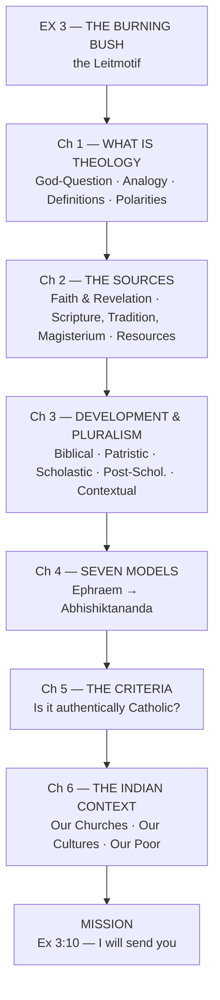

---

## 2. THE GOD-QUESTION AND THE LANGUAGE PROBLEM (Ch 1)

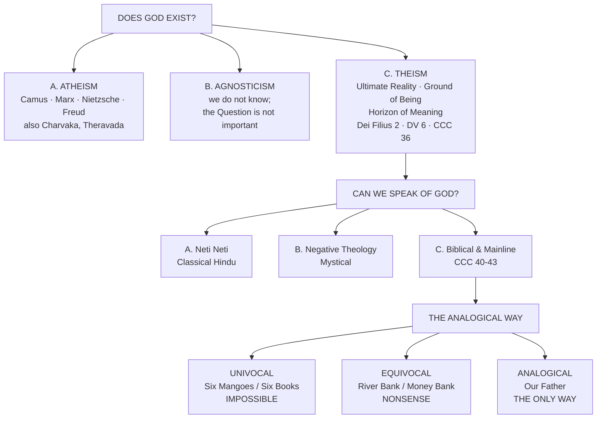

---

## 3. THE SEVEN DEFINITIONS OF THEOLOGY (Ch 1)

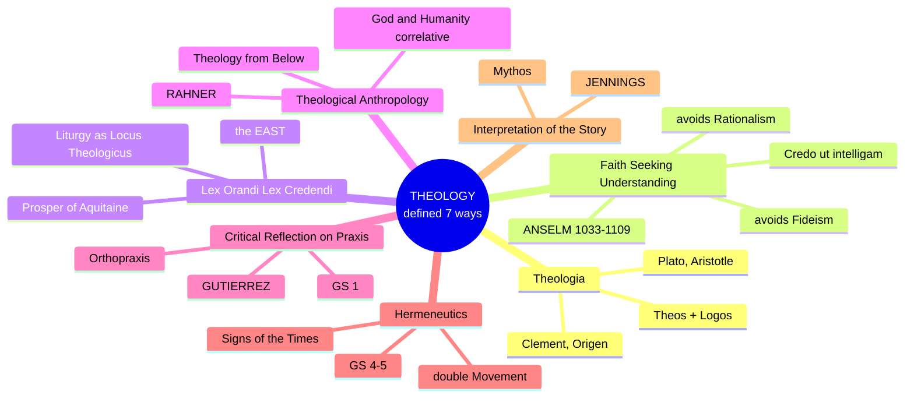

---

## 4. ONE SOURCE, THREE SOURCES, MANY RESOURCES (Ch 2)

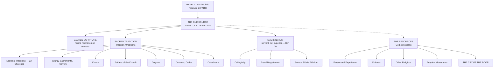

---

## 5. THE FIVE ERAS OF THEOLOGY (Ch 3)

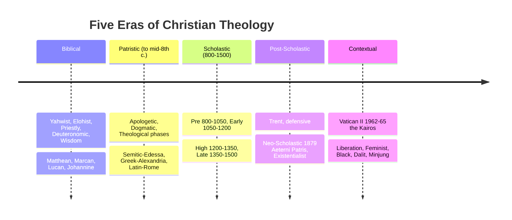

---

## 6. THE TWELVE PATRISTIC DEVELOPMENTS (Ch 3)

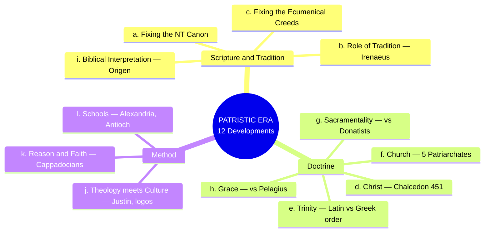

---

## 7. THE SEVEN MODELS (Ch 4)

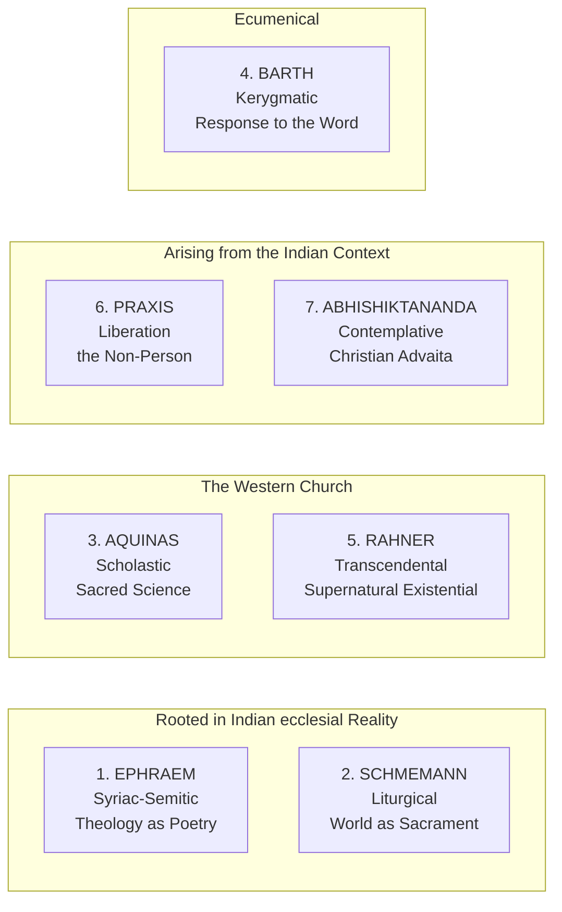

---

## 8. THE MAGISTERIUM AND ITS EXERCISE (Ch 5)

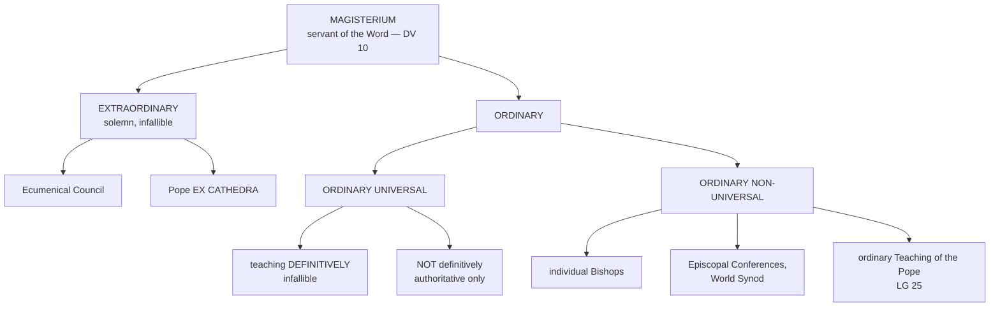

---

## 9. THE FOUR GRADATIONS AND FOUR RESPONSES (Ch 5)

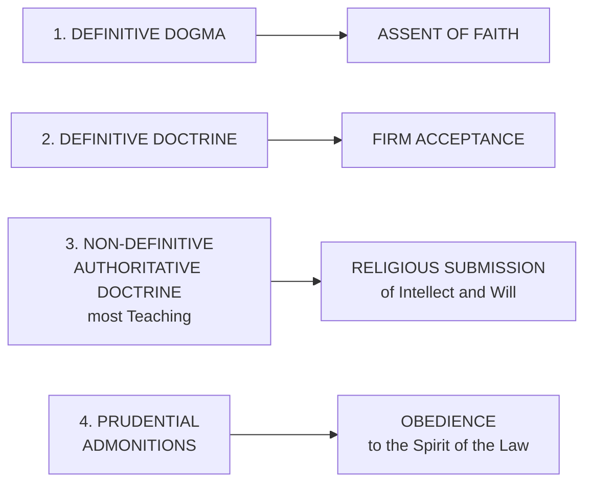

---

## 10. THE CHURCHES OF INDIA (Ch 6)

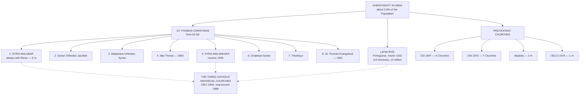

---

## 11. THE TWO TRENDS OF INDIAN THEOLOGY AND THEIR CONVERGENCE (Ch 6)

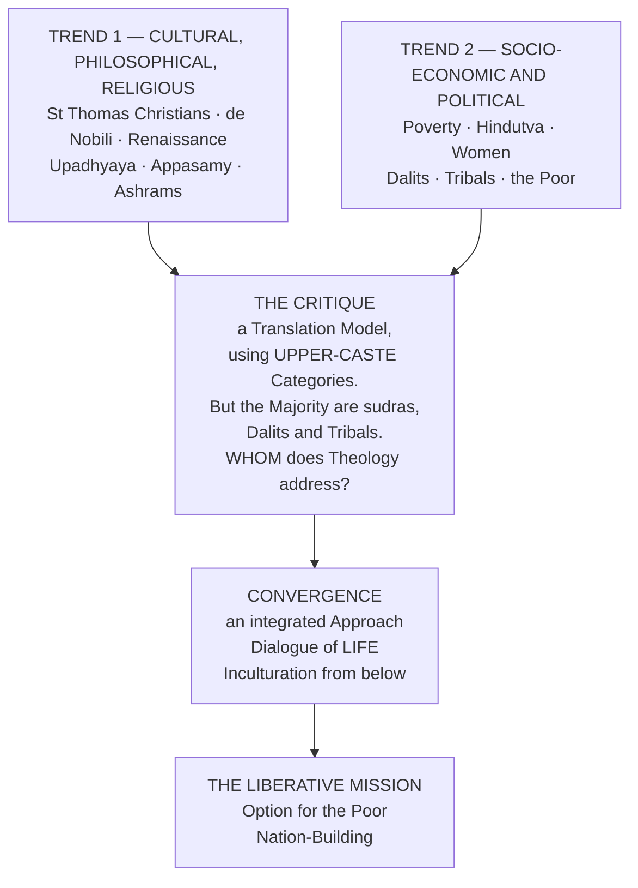

---

## 12. THE EIGHT PARAMETERS OF CATHOLIC THEOLOGY (Ch 5)

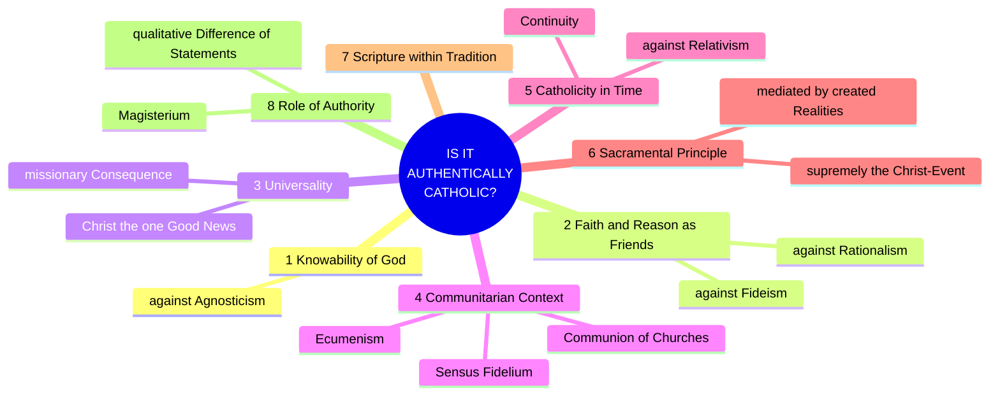

---

prev:: [[06 - Theologizing in the Indian Context]]
next:: [[08 - Flashcards]]
up:: [[Introduction to Theology - Course Home]]
