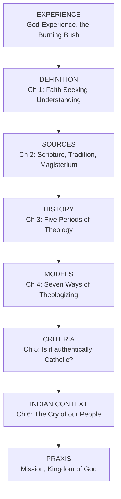

# Introduction to Theology — Course Home (BTh)

**What it is:** the foundational course of the whole BTh programme. It asks four questions in order: **What is Theology? Where does it come from? How has it changed? How do we do it in India?**

> [!quote] The course in one line
> Theology is Faith seeking Understanding, done by a believing Community, out of the Sources handed down, in answer to the Cry of the People among whom we actually live.

> [!info] The textbook
> Kuncheria Pathil, CMI and Dominic Veliath, SDB, *An Introduction to Theology*, Indian Theological Series, commissioned by the **Catholic Bishops' Conference of India**. Its whole purpose is to replace Western manuals with a Theology written for the Indian Church. Every unit below follows the book chapter by chapter.

---

## THE LEITMOTIF OF THIS COURSE: THE BURNING BUSH

One Text carries the entire course. Return to it at every Unit.

> [!quote] Ex 3:2-6
> "The angel of the Lord appeared to him in a flame of fire out of the midst of a bush; and he looked, and lo, the bush was burning, yet it was not consumed... Come no closer; remove your sandals, for the place where you are standing is holy ground."

| Reading of Ex 3 | Verse | Unit it opens |
|---|---|---|
| Faith Seeking Understanding | 3 (I will turn aside and see) | [[01 - What Is Theology]] |
| Holy Ground, where the Theologian stands | 5 (Remove the Sandals) | [[02 - The Sources of Theology]] |
| The Fire that burns and is not consumed | 2 (Identity and Change) | [[03 - Development and Pluralism in Theology]] |
| Many ways of Seeing one Fire | 2-6 | [[04 - Selected Models of Theology]] |
| Testing what is truly the Voice of God | 6 (I am the God of your Father) | [[05 - The Criteria of Christian Theological Reflection]] |
| I have heard the Cry of my People | 7, 10 (Come, I will send you) | [[06 - Theologizing in the Indian Context]] |

Is the Burning Bush beckoning us? How do we respond to the Indian Realities with the Cry for Life?

---

## Syllabus / notes in this unit

**Part I: What Theology Is and Where It Comes From**
1. [[01 - What Is Theology]] — the God-Question, Analogy, the sevenfold Definition, the Creative Polarities
2. [[02 - The Sources of Theology]] — Faith and Revelation; Scripture, Tradition, Magisterium; the Resources

**Part II: How Theology Has Changed**
3. [[03 - Development and Pluralism in Theology]] — Biblical, Patristic, Scholastic, Post-Scholastic, Contextual
4. [[04 - Selected Models of Theology]] — seven Models from Ephraem to Abhishiktananda

**Part III: Testing and Doing Theology**
5. [[05 - The Criteria of Christian Theological Reflection]] — how we know a Theology is authentically Catholic
6. [[06 - Theologizing in the Indian Context]] — the Indian Churches, our Cultures, our Poor

**Part IV: Study apparatus**
7. [[07 - Mind Maps]] — Mermaid diagrams of every schema
8. [[08 - Flashcards]] — spaced-repetition deck
9. [[09 - One-Page Revision Sheet]] — cram summary
10. [[10 - Glossary, Exam Questions, Bibliography]]

---

## What every BTh student must be able to do

- [ ] Give the A/B/C schema on the God-Question: **Atheism, Agnosticism, Theism**, and name the Atheists the book names
- [ ] Explain **Univocal, Equivocal, Analogical** with homely examples, and say why only Analogy makes God-Talk possible
- [ ] Define Theology in **seven ways** and reproduce the **Working Definition** by memory for the oral exam
- [ ] State the **Creative Polarities** in thesis-But-antithesis form
- [ ] Explain why there is **one Source** but **three Sources** (Dei Verbum 10)
- [ ] Distinguish **Tradition** from **traditions**, and **Sources** from **Resources**
- [ ] Explain **Sensus Fidei / Sensus Fidelium** and the threefold Blending of Community, Magisterium, Theologian
- [ ] Name the **twelve Patristic Developments** and the **four Periods of Scholasticism** with dates
- [ ] Name the **seven Models** of Chapter 4 and their representative Theologian
- [ ] Distinguish **Pluralism** from **Relativism**
- [ ] Give the **four Gradations of Church Doctrine** and the **four Responses** owed to each
- [ ] Name the **eight Parameters** of the Catholic Theological Enterprise
- [ ] Name the **three Catholic Individual Churches of India** and the **eight St. Thomas Christian Churches**
- [ ] Explain **Dalit Theology** and the **Epistemological Privilege of the Poor**

---

## Quick access

| Note | Use |
|------|-----|
| [[09 - One-Page Revision Sheet]] | Cram everything on one screen |
| [[08 - Flashcards]] | Spaced-repetition recall |
| [[07 - Mind Maps]] | Visual Mermaid schemas |
| [[10 - Glossary, Exam Questions, Bibliography]] | Glossary + exam questions |
| [[06 - Theologizing in the Indian Context]] | The Indian turn: Dalit, Tribal, Women |

---

## The Macro-Flow of the Course

> [!tip] How to study this unit
> Do not begin with the Models of Chapter 4. Begin with [[01 - What Is Theology]] and move in order. The book is cumulative: Chapter 5 cannot be understood without Chapter 2, and Chapter 6 gathers up all five preceding chapters.

---

## Related units in this vault

- [[Vatican II - Course Home]] — the Council whose documents this course cites on nearly every page
- [[Karl Rahner - Course Home]] — the Transcendental Model treated in [[04 - Selected Models of Theology]]
- [[Theology of the Trinity - Course Home]] — the Systematic Theology this course prepares you for

up:: [[Welcome]]
