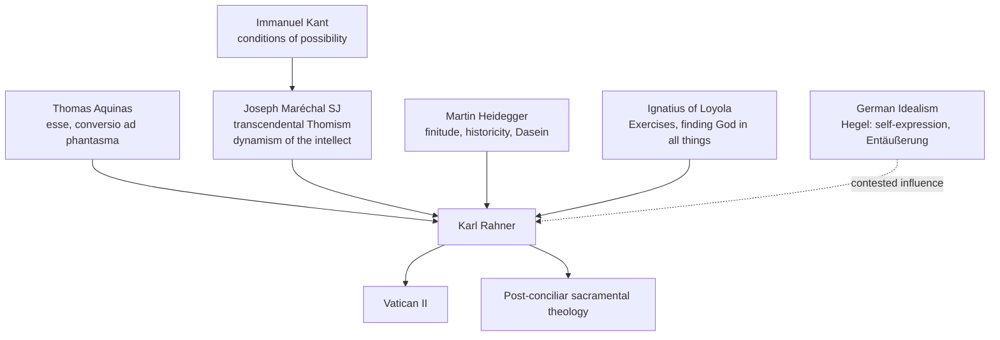

# 01 — Life, Context and Works

> [!info] Prev: [[Karl Rahner - Course Home]] · Next: [[02 - Philosophical Foundations I - Spirit in the World]]

## Timeline

| Year | Event | Why it matters theologically |
|---|---|---|
| **1904** | Born 5 March, Freiburg im Breisgau, fourth of seven children | Middle-class Catholic Germany; brother **Hugo Rahner SJ** became a major patristics scholar |
| **1922** | Enters the **Society of Jesus** | Ignatian *Exercises* become the hidden engine of his theology → [[14 - Mystagogy, Ignatian Roots and Spirituality]] |
| **1932** | Ordained priest | |
| **1934–36** | Doctoral studies in **philosophy at Freiburg**; attends **Martin Heidegger's** seminars | Absorbs finitude, historicity, *Dasein*, "being-in-the-world" |
| **1936** | Dissertation *Geist in Welt* **rejected** by Martin Honecker as too un-Thomist / too Heideggerian | Published anyway 1939; became a classic → [[02 - Philosophical Foundations I - Spirit in the World]] |
| **1936** | Doctorate in **theology** at Innsbruck (*E latere Christi* — the Church born from the pierced side of Christ) | The **pierced side / heart** theme returns in the symbol essay |
| **1937** | Salzburg lectures → *Hörer des Wortes* (1941) | → [[03 - Philosophical Foundations II - Hearer of the Word]] |
| **1939–45** | Jesuit house in Innsbruck suppressed by the Nazis; pastoral work in Vienna and rural Bavaria | Formed his pastoral instinct: theology answers real people |
| **1954–** | *Schriften zur Theologie* begins (ET *Theological Investigations*, eventually **23 volumes**) | His genre is the **essay**, not the *Summa* |
| **1959** | **"Zur Theologie des Symbols"** published (ET *TI* IV, 221–252) | **The core text of this unit** → [[07 - The Theology of the Symbol - The Core Essay]] |
| **1962** | Rome imposes **pre-censorship** on his writings (over concelebration and Mariology) | Lifted after John XXIII's intervention |
| **1962–65** | **Peritus at Vatican II**, adviser to Cardinal Franz König of Vienna | → [[15 - Rahner and Vatican II - The World Church]] |
| **1964** | Chair at **Munich**, succeeding Romano Guardini | |
| **1967–71** | Professor at **Münster** | Doctoral student: **Johann Baptist Metz** (later his sharpest friendly critic) |
| **1976** | *Grundkurs des Glaubens* (ET *Foundations of Christian Faith*) | His only systematic synthesis, written at 72 |
| **1984** | Dies 30 March at Innsbruck, weeks after his 80th birthday | Last major act: a letter defending **Gustavo Gutiérrez** against Roman censure |

## The intellectual currents he stands in

> [!note] The three-source formula for exams
> Rahner = **Aquinas** (metaphysics of being) + **Maréchal/Kant** (transcendental method) + **Heidegger** (finitude and historicity), all held together by **Ignatian spirituality**. The German Idealist inheritance (Hegel's *Entäußerung*, self-expression) is real but **disputed** — see [[17 - Critical Reflection II - Theological]].

## The corpus — what to cite

| Work | Date | Content |
|---|---|---|
| *Encounters with Silence* (*Worte ins Schweigen*) | 1938 | Prayers. Proof his theology is prayer first |
| *Spirit in the World* (*Geist in Welt*) | 1939 | Philosophical anthropology from Aquinas ST I q.84 a.7 |
| *Hearer of the Word* (*Hörer des Wortes*) | 1941 | Philosophy of religion; the human as potential hearer |
| *On the Theology of Death* | 1958 | Death as act and passion; pancosmic soul |
| **"The Theology of the Symbol"** | 1959 | **Core text of this unit** |
| *Theological Investigations* | 1954–84 | 23 vols; his real *oeuvre* |
| *The Trinity* (*Der dreifaltige Gott*) | 1967 | The *Grundaxiom* |
| *Foundations of Christian Faith* | 1976 | The one systematic synthesis |
| Edited: *Lexikon für Theologie und Kirche*, *Sacramentum Mundi*, later *Denzinger* editions | | He shaped the reference shelf of a whole generation |

> [!tip] Citation habit
> Cite the symbol essay as: Karl Rahner, "The Theology of the Symbol," in *Theological Investigations* IV, trans. Kevin Smyth (London: Darton, Longman & Todd, 1966), 221–252. Give the page for every quotation — examiners notice.

## Character of his theology — five marks

1. **Pastoral origin.** Almost every essay begins from a real question — may we concelebrate? is devotion to the Sacred Heart superstitious? can my Hindu neighbour be saved?
2. **The essay, not the system.** He writes *Untersuchungen* (investigations), provisional and open. Do not expect a closed architecture.
3. **Mystagogical intent.** The goal is not information but leading the reader into the experience of grace already present.
4. **Radical continuity with tradition.** He almost never rejects a dogma; he re-reads it from the inside so it becomes livable.
5. **Notoriously difficult prose.** Long German sentences, coined compounds. This is a genuine criticism, not just a joke → [[16 - Critical Reflection I - Philosophical]].

> [!quote] Rahner on his own project
> His stated aim was to show that Christian dogma, far from being a burden imposed from outside, articulates what the human being already is: a creature whose very existence is a question to which God is the answer.

## Self-check
- Which two thinkers stand behind Rahner's method, and which behind his metaphysics?
- Why is the *rejection* of *Geist in Welt* theologically significant?
- Name three works and date them.
