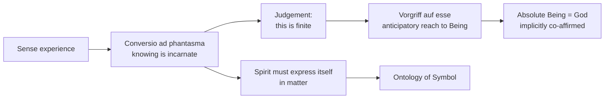

# 02 — Philosophical Foundations I: *Spirit in the World*

> [!info] Prev: [[01 - Life, Context and Works]] · Next: [[03 - Philosophical Foundations II - Hearer of the Word]]

## The question of the book

*Geist in Welt* (1939) is a commentary on one article of Aquinas: **ST I, q.84, a.7** — *"Can the intellect understand anything without turning to phantasms?"* Aquinas answers no. Rahner asks what that answer implies about the human being as such.

**The paradox in the title:** the human is **spirit** (open to being as such, capable of the infinite) yet always **in world** (bound to sense, matter, history). Neither half may be dropped.

## Step 1 — *Conversio ad phantasma* (the turn to the image)

- The human intellect never grasps a pure essence directly. It must **turn to the sense image** (*phantasma*).
- You cannot think "tree" without some imagined tree; you cannot think "justice" without a remembered scene of injustice.
- **Consequence:** human knowing is **incarnate**. There is no angelic short cut. Knowledge of God will therefore always be mediated through the world — never a bare intuition of the divine.

> [!example] Illustration
> A student can define *dharma* only by summoning instances — the elder who kept his word, the story from the *Mahābhārata*, the teacher who refused a bribe. The concept lives on the back of the image. Strip away every image and the concept goes silent.

## Step 2 — *Excessus* / the *Vorgriff auf esse*

If knowing is always tied to the finite image, how do we know that any given thing is **finite**? To recognise a limit you must already, somehow, be beyond it.

- **Vorgriff auf esse** = the **pre-apprehension / anticipatory reach toward Being as such** that accompanies every act of judgement.
- It is not a concept, not an object, never directly seen. It is the **unthematic horizon** within which objects appear.
- In every judgement ("this is a *tree*, and only a tree") the mind silently measures the object against the whole of being.

> [!example] The horizon illustration (use this in exams)
> You never look *at* the horizon; you look at the field, the tree, the road. Yet nothing could appear as a bounded thing without the horizon behind it. The *Vorgriff* is the horizon of the mind. God is not an object in the field of vision — God is the light and reach that makes the field visible.

> [!example] Second illustration — the frame
> A photograph shows a courtyard. The frame is never in the picture, but without it there is no picture. Rahner: absolute Being is the frame of every finite act of knowing.

## Step 3 — From *Vorgriff* to God

Rahner's move (inherited from **Joseph Maréchal SJ**, *Le point de départ de la métaphysique*, cahier V):

1. Every act of knowing reaches beyond the object toward unlimited being.
2. This reaching is not an empty projection — a dynamism cannot be intelligibly oriented toward nothing.
3. Therefore the term of the *Vorgriff* is **absolute, infinite Being = God**, affirmed implicitly in every act of knowledge.

**Result:** the human being is a **transcendent** creature by structure. Even the atheist affirms God performatively in the very act of denying God, because the denial is a judgement, and judgement runs on the *Vorgriff*.

> [!warning] This is exactly where critics attack
> Does a *dynamism* toward the infinite prove an *actual* infinite term? Kant would say no — this is the ontological move smuggled back in. See [[16 - Critical Reflection I - Philosophical]].

## Step 4 — The consequences that feed the rest of the system

| Finding in *Geist in Welt* | Where it is cashed out later |
|---|---|
| Knowing is incarnate, mediated by the sensible | Ontology of **symbol**: spirit must express itself in matter → [[07 - The Theology of the Symbol - The Core Essay]] |
| The human is spirit-in-world, never pure spirit | **Body as real symbol of the soul** → [[08 - Realsymbol Applied - Trinity, Christ, Church, Sacraments, Body]] |
| God is known as the ever-receding **horizon**, never as an object | God as **absolute mystery**; negative theology; [[06 - God's Self-Communication and Quasi-Formal Causality]] |
| Human openness is unlimited but unfulfilled by itself | **Obediential potency** → [[03 - Philosophical Foundations II - Hearer of the Word]] |

## Key term: *emanatio* and self-presence

Rahner reads Aquinas's account of knowledge as the being's **return to itself** (*reditio completa in seipsum*). A stone cannot return to itself; a plant partially; a human completely — self-consciousness. But — and this is decisive for the symbol essay — **the return to self happens only by going out into the other** (the world, the image, the body). *There is no self-possession without self-expression.*

> [!quote] The sentence that becomes the symbol ontology
> A being comes to itself precisely by emptying itself out into what is other than itself. Twenty years later this becomes: "Being is of itself symbolic, because it necessarily 'expresses' itself" (*TI* IV, 224). → [[07 - The Theology of the Symbol - The Core Essay]]

## Mermaid: the argument in one view

## Self-check
- Why can there be no human knowledge without the *phantasma*?
- Define *Vorgriff auf esse* in one sentence without using the word "God".
- Give the horizon illustration and say precisely what it illustrates.
- State the one sentence in this note that becomes the seed of the symbol essay.
