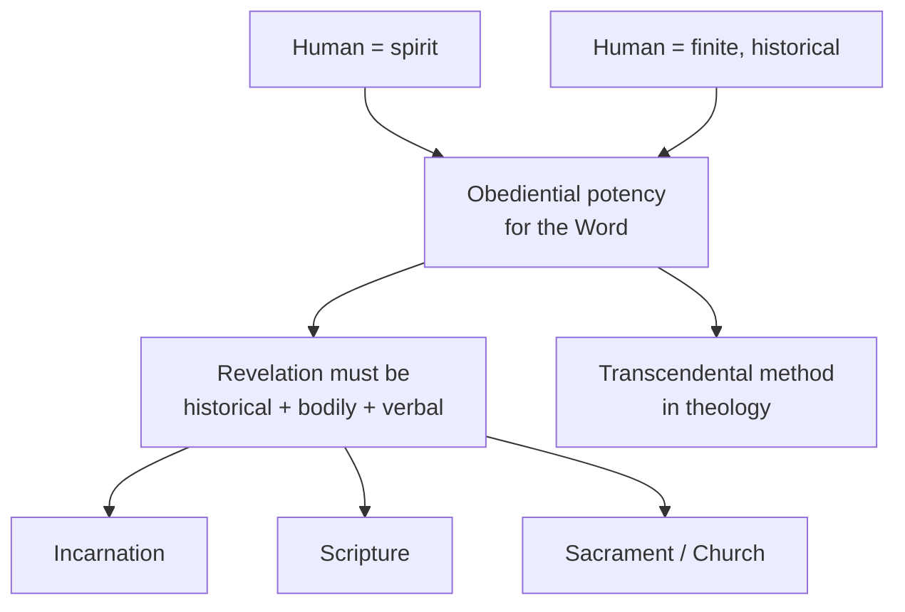

# 03 — Philosophical Foundations II: *Hearer of the Word*

> [!info] Prev: [[02 - Philosophical Foundations I - Spirit in the World]] · Next: [[04 - The Transcendental Method in Theology]]

## The question of the book

*Hörer des Wortes* (1941) is Rahner's **philosophy of religion**. If *Geist in Welt* asked *what is the human being who knows?*, this asks: **what must the human being be, if God should choose to speak in history — and if that word is to be hearable?**

Note the modesty of the claim. Philosophy cannot prove that God has spoken. It can only show that the human being is **structurally the one who must listen**.

## The three theses

1. **The human being is spirit** — constituted by the *Vorgriff*, standing before Being as such, therefore before God as absolute mystery.
2. **The human being is finite and historical** — spirit *in world*. Any divine word must therefore come **in history, in matter, in words, in a body** — never as a private mystical bypass of the world.
3. **The human being must therefore attend to history** as the place where a possible revelation would occur. The human is *homo audiens* — "the one who listens into history for a possible word of God."

> [!quote] The formula
> The human being is **"the obediential potency for the Word of God"** — *potentia oboedientialis pro Verbo Dei*.

## *Potentia oboedientialis* (obediential potency)

| | Scholastic use | Rahner's transformation |
|---|---|---|
| Meaning | A merely passive, negative non-repugnance: the creature does not resist God's action | A **positive, dynamic openness**; the creature is *made for* this, though it cannot claim it |
| Danger avoided | — | Extrinsicism: grace as an arbitrary superstructure bolted on from outside |
| Danger risked | — | Making grace **owed** to nature; see the corrective in [[05 - The Supernatural Existential - Nature and Grace]] |

Rahner walks a razor's edge here, and he knows it:
- If openness to God is only negative, revelation becomes **extrinsic**, an interruption with no purchase on human life. Result: a religion nobody can experience as their own.
- If openness is positive in the sense of a **demand**, grace ceases to be free gift. Result: naturalism.
- His solution: the openness is **real and constitutive**, but the fulfilment remains **utterly gratuitous** — an emptiness that cannot fill itself and has no claim on being filled.

> [!example] Illustration — the unaddressed letterbox
> A letterbox is genuinely, structurally *for* letters. Yet no letterbox can produce a letter, and no amount of waiting obliges anyone to write. The human being is a letterbox shaped for a word that may never be spoken — and *has* been spoken.

> [!example] Illustration from Indian experience
> A village builds a *mandapa* for a guest who has not yet come, because the tradition says a guest may come. The structure is real, ordered, expectant — and the coming remains pure gift. *Atithi devo bhava* ("the guest is God") describes a readiness, not a claim.

## Why revelation must be *historical* and *verbal*

Because the human is spirit **in world**:
- A revelation that bypassed body, language, community and history would be **unhearable** by a being whose knowing runs through the *phantasma* ([[02 - Philosophical Foundations I - Spirit in the World]]).
- Hence: incarnation, scripture, sacrament, Church are not concessions to human weakness. They are the **only possible form** a word of God could take for beings like us.

> [!tip] Exam line
> "For Rahner, the Incarnation is not God stooping to a lower medium; it is God taking the *only* medium in which a being that is spirit-in-world can hear anything at all."

## Where this leads

Two roads lead out of this note:
- Toward **method**: how do you actually *do* theology this way → [[04 - The Transcendental Method in Theology]]
- Toward **grace**: the openness is not merely natural; it has already been graced → [[05 - The Supernatural Existential - Nature and Grace]]

## Critical note (preview)

**Karl Barth's objection in principle:** any "philosophy of the possible hearer" builds a *praeambula fidei* that lets human reason set the terms on which God may speak. Barth's *Nein!* to Emil Brunner's natural theology applies here with full force. Rahner's reply: he is not deriving revelation from anthropology, only showing that revelation, if given, is not alien to the hearer. See [[16 - Critical Reflection I - Philosophical]].

## Self-check
- State the three theses of *Hörer des Wortes*.
- What is obediential potency, and how does Rahner change its traditional sense?
- Why must revelation be historical? Answer from the structure of human knowing, not from Scripture.
- Give the letterbox illustration and name the two errors it avoids.
