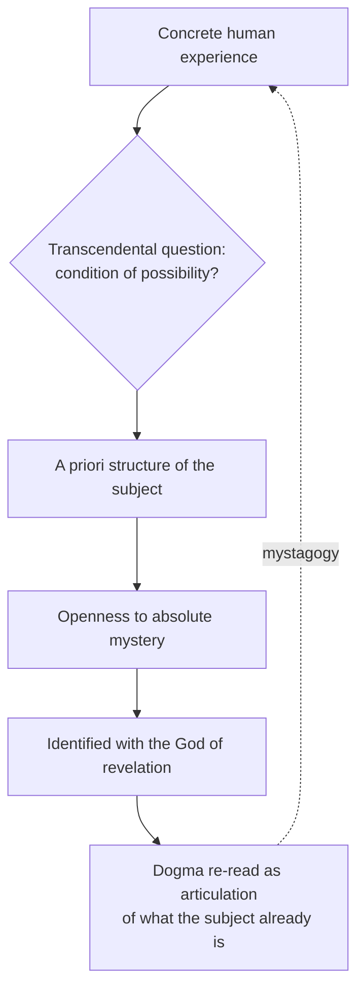

# 04 — The Transcendental Method in Theology

> [!info] Prev: [[03 - Philosophical Foundations II - Hearer of the Word]] · Next: [[05 - The Supernatural Existential - Nature and Grace]]

## What "transcendental" does *not* mean

Not "mystical", not "otherworldly", not "transcendent". **Transcendental** is a technical Kantian term:

> A **transcendental** enquiry asks not *what do we know?* but *what must be true of the knower for such knowledge to be possible at all?*

It is a search for **conditions of possibility** (*Bedingungen der Möglichkeit*).

> [!example] The classroom illustration
> Ordinary question: "What is written on the blackboard?"
> Transcendental question: "What must light, eye and mind be, such that anything can be read at all?"
> Rahner does the second kind of question about faith: not only "what does the Church teach about grace?" but "what must the human being be, such that a doctrine of grace could mean anything to them?"

## The two poles: transcendental and categorical

| | **Transcendental** | **Categorical** (*kategorial*) |
|---|---|---|
| What it is | The a priori structure of the subject; unthematic, always operative | The concrete, historical, objectified, nameable |
| In revelation | God's universal self-offer in every human's depth | Sinai, the prophets, Jesus of Nazareth, Scripture, dogma |
| In grace | The supernatural existential | Baptism, the Eucharist, an act of charity |
| In knowing | The *Vorgriff* | This tree, this proposition |
| Risk if isolated | Vague religiosity with no content | Extrinsicism: revelation as arbitrary information |

**Rahner's constant claim:** the two poles are *never* separable. There is no transcendental revelation without categorical mediation, and no categorical revelation that is not the coming-to-word of what the transcendental already is.

> [!tip] Exam sentence
> "Transcendental revelation is the *always-and-everywhere* of God's self-offer; categorical revelation is its *here-and-now* historical objectification. Rahner's whole theology is an argument that neither survives without the other."

## The method in four moves

1. **Start from a lived human experience** — loving without return, standing by a promise, facing death, forgiving.
2. **Ask the transcendental question** — what must be true of the human being for this experience to be possible?
3. **Show that the answer opens onto absolute mystery** — the experience only makes sense if the human is oriented to an infinite, self-giving horizon.
4. **Identify this horizon with the God of Christian revelation**, and show that the dogma in question is the precise articulation of what step 3 uncovered.

> [!example] Worked example — the dogma of grace
> 1. **Experience:** a nurse sits with a dying stranger through the night, with nothing to gain.
> 2. **Transcendental question:** what makes such unconditional self-gift possible?
> 3. **Answer:** only a being already carried by an unconditional love that it did not generate.
> 4. **Dogma:** this is what the Church calls *gratia*, and specifically *uncreated grace* — God's own self-communication → [[06 - God's Self-Communication and Quasi-Formal Causality]].

> [!example] Worked example — the Trinity
> 1. **Experience:** we are addressed by God in Jesus (Word) and inwardly enabled to respond (Spirit).
> 2. **Transcendental question:** what must God be for this double structure of salvation to be a genuine giving of *God*, not of a created substitute?
> 3. **Answer:** God must *be* self-utterance and self-giving in Godself.
> 4. **Dogma:** immanent Trinity → [[09 - Rahner's Rule - The Grundaxiom of the Trinity]].

## The "turn to the subject" (*anthropologische Wende*)

Rahner's programmatic claim: **dogmatic theology today must be theological anthropology**, and such a turn is not a reduction of God to the human but the recognition that every statement about God is made *by* and *for* a human hearer, and therefore already says something about the human.

> [!quote] Rahner's formula
> Christology is "self-transcending anthropology," and anthropology is "deficient Christology" — the human being is the question to which Jesus Christ is the unsurpassable answer.

> [!warning] The most contested sentence in Rahner
> Balthasar, Ratzinger and Metz all read the "turn to the subject" as the point where theology risks becoming anthropology in a louder voice. Know both the claim and the objection → [[16 - Critical Reflection I - Philosophical]], [[17 - Critical Reflection II - Theological]].

## Strengths and costs of the method

| Strengths | Costs |
|---|---|
| Makes dogma **experienceable**, not merely authoritative | Can make the *particular* (Jesus, Israel, the Church) look like an illustration of a general truth |
| Grounds a genuine theology of the **non-Christian** → [[11 - Anonymous Christians and the Non-Christian Religions]] | Tends to abstract from **body, class, gender, culture, oppression** (Metz, feminists, liberationists) |
| Defends the **gratuity and universality** of grace at once | The a priori subject may be a modern Western construct read back into humanity as such |
| Bridges to modern philosophy and to secular hearers | Notoriously difficult prose; hard to preach |

## Mermaid: method schema

## Self-check
- Define "transcendental" without using the word "spiritual".
- Distinguish transcendental from categorical revelation; give one example of each.
- Run the four-move method on the doctrine of the resurrection of the body.
- Name one strength and one cost of the method, with a named critic for the cost.
