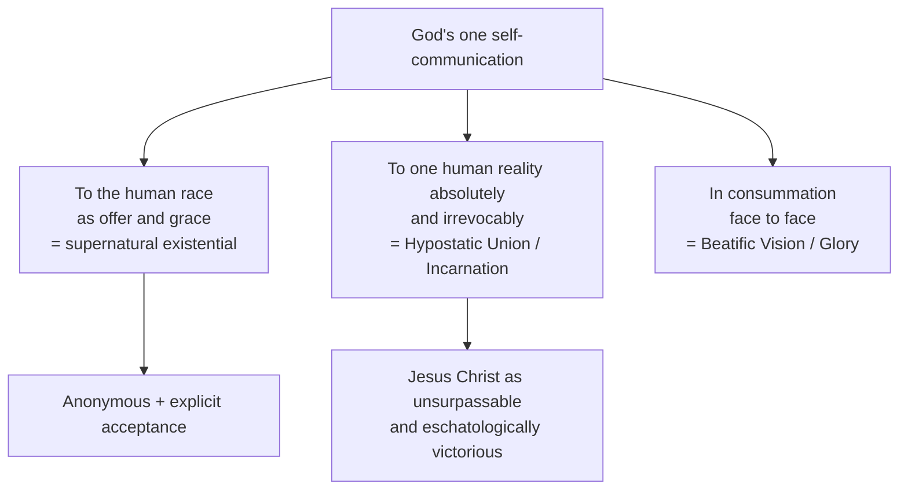

# 06 — God's Self-Communication and Quasi-Formal Causality

> [!info] Prev: [[05 - The Supernatural Existential - Nature and Grace]] · Next: [[07 - The Theology of the Symbol - The Core Essay]]

## The governing category: *Selbstmitteilung Gottes*

**God's self-communication** is Rahner's master-concept for grace, Trinity, Incarnation and glory alike.

> [!quote] The claim
> In grace God does not merely give **something**; God gives **Godself**. The gift and the Giver are identical.

This is not a novelty but a retrieval. The scholastic tradition had drifted toward treating grace primarily as **created grace** (*gratia creata*) — a supernatural quality infused into the soul, a created effect of God's action. Rahner reverses the priority:

| | Created grace | **Uncreated grace** |
|---|---|---|
| What it is | A created supernatural quality in the soul | **God's own self**, the indwelling Trinity |
| Scholastic priority | Primary; uncreated grace follows as a consequence | **Secondary**; it is the *effect and disposition* produced by God's self-gift |
| Rahner's order | Consequence | **Primary reality of grace** |

**Rahner's thesis:** created grace is the *created consequence* of uncreated grace — the change in the creature that necessarily follows when God gives Godself. Not the other way round.

**Scriptural warrant:** Jn 14:23 ("we will come to them and make our home with them"); Rom 5:5 ("God's love has been poured into our hearts through the Holy Spirit *who has been given to us*"); 2 Pet 1:4 ("participants of the divine nature").

## The causal problem

If God gives Godself, how does God relate to the creature? Standard scholastic causality offers:

- **Efficient causality** — God as the cause producing an *effect distinct from himself*. But then the gift is a creature, not God. Too little.
- **Formal causality** — the form actually constituting the being of the thing (as the soul is the form of the body). But then God would become an intrinsic constituent of the creature. **Pantheism.** Too much.

## The solution: *quasi-formal causality*

**Definition.** In grace God communicates Godself to the creature in the manner of a **formal cause** — as an inner, constitutive, determining principle of the graced person's being — **yet without ceasing to be free, transcendent and unchanged**, and without being absorbed into the creature as a component part. Hence *quasi*.

Unpack the "quasi":
1. **Real formal determination:** the graced person is genuinely, intrinsically transformed; God is not merely acting on them from outside.
2. **No ontological composition:** God does not become a part of a larger whole. The creature does not become divine in essence.
3. **Freedom preserved:** unlike a natural form, which informs by necessity, God informs by free personal self-donation, and can be freely refused.

> [!example] The illustration of the beloved
> When someone loves you, they do not merely send gifts (efficient causality); nor do they dissolve into you (formal causality strictly speaking). They **give themselves**, and you become genuinely a different person — a *beloved* person — from the inside, while remaining wholly yourself and while they remain wholly other. That is the analogy Rahner is reaching for.

> [!example] The light illustration
> Air becomes luminous when light is present. The light really determines the air from within: the air *is* now lit air. Yet the light is not a part of the air, does not become air, and can withdraw. Aquinas used *lumen*; Rahner uses the same instinct with a personalist grammar.

> [!warning] Precision matters here
> Do not say "God becomes the form of the soul." Say: "God communicates Godself **after the manner of** a formal cause, without the composition that formal causality would ordinarily entail." That word *manner* is the whole doctrine.

## The three modalities of one self-communication

Rahner's elegance is that a single act of divine self-gift takes three forms:

- **Grace** = the self-communication *offered* and freely acceptable or refusable.
- **Incarnation** = the self-communication given to one human reality so radically and irrevocably that it becomes the self-utterance of God → [[10 - Christology - Self-Communication and Evolution]].
- **Glory** = the same self-communication no longer mediated by faith.

**Therefore:** grace and Incarnation are not two different divine acts but **one act in different modalities**. This is why Rahner can say Christology is "self-transcending anthropology."

## God as *absolute mystery* (*Geheimnis*)

The self-communicating God remains **incomprehensible** — and Rahner insists incomprehensibility is not a defect to be overcome in heaven. Even the beatific vision is the vision *of* the incomprehensible God as incomprehensible: the mystery is not solved, it is embraced.

> [!quote]
> Mystery for Rahner is not "the not-yet-known" but the permanent, positive horizon of all knowing. God is mystery not because we have too little light but because we stand in too much.

This links straight back to the *Vorgriff* ([[02 - Philosophical Foundations I - Spirit in the World]]) and forward to mystagogy ([[14 - Mystagogy, Ignatian Roots and Spirituality]]).

## Critical reflection

- **Is "quasi-formal causality" coherent, or a verbal fix?** Critics (neo-Thomists; analytically minded readers) argue that *quasi* does all the work and is never cashed out. Either God formally determines the creature — with the metaphysical consequences — or God does not.
  **Reply:** all analogical language about God works this way; "quasi" flags a genuine analogy of proper proportionality, not an evasion. Compare "God is a *person*" — no less strained.
- **Does the priority of uncreated grace endanger the creature's integrity?** If the primary reality of grace is God, is the creature's real change still real?
  **Reply:** created grace is retained precisely to secure that. Rahner subordinates it; he does not delete it.
- **Trent's concern:** Trent taught that justification involves a real inherent transformation, against a merely imputed righteousness. Rahner's scheme keeps inherent transformation, but as consequence. Whether that satisfies Trent's intent is a live disputed question → [[17 - Critical Reflection II - Theological]].

## Self-check
- Distinguish created and uncreated grace, and state Rahner's ordering.
- Why is efficient causality inadequate for grace? Why is strict formal causality dangerous?
- Explain "quasi" in "quasi-formal causality" with one illustration.
- Name the three modalities of God's one self-communication.
