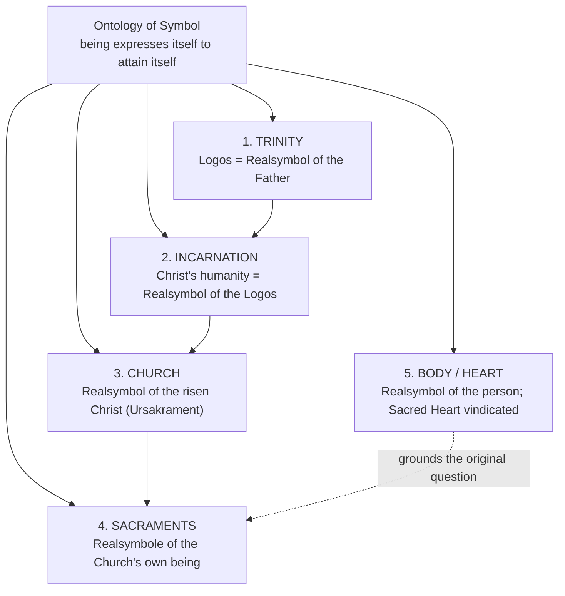

# 07 — The Theology of the Symbol: *Zur Theologie des Symbols*

> [!info] Prev: [[06 - God's Self-Communication and Quasi-Formal Causality]] · Next: [[08 - Realsymbol Applied - Trinity, Christ, Church, Sacraments, Body]]

> [!abstract] Reference
> Karl Rahner, "The Theology of the Symbol," *Theological Investigations* IV (London: DLT, 1966), 221–252. German: "Zur Theologie des Symbols," *Schriften zur Theologie* IV (1960), first published 1959 in a collection on devotion to the **Sacred Heart**.

## 1. The occasion — a small question with a huge answer

Rahner was asked to justify **devotion to the Sacred Heart of Jesus**. The pious objection was blunt: is it not crude, even superstitious, to venerate a bodily organ? Is the Heart "just a symbol"?

Rahner's response is characteristic: the problem is not the devotion but the impoverished notion of **symbol** presupposed by the objection. Theology, he observes, is **saturated with symbol** — sacraments, the Church as sign, the Incarnation, sacred images, the Body of Christ — yet has **no worked-out ontology of symbol**. So he writes one.

> [!quote] The programmatic complaint
> Theology cannot go on using the word "symbol" in a dozen incompatible senses while never asking what a symbol *is* in the order of being.

**Method note:** this is transcendental method applied to a devotional practice — start from what Christians actually do, ask its conditions of possibility, and end with an ontology → [[04 - The Transcendental Method in Theology]].

## 2. The decisive distinction

| | ***Realsymbol*** (real symbol / symbolic reality) | ***Vertretungssymbol*** (representative sign, arbitrary symbol) |
|---|---|---|
| Relation to what it signifies | The symbolised **constitutes** the symbol as its own self-realisation; it is genuinely **present** in it | Extrinsic, conventional, assigned by agreement |
| Could it be otherwise? | **No** — it is *this* reality's own way of existing outwardly | **Yes** — any other sign could be substituted |
| Presence | The reality is **there**, in and through the symbol | The reality is **absent**, merely pointed to |
| Examples | A smile as symbol of joy; a body as symbol of a person; the Word as symbol of the Father | Traffic light; national flag; the letters *d-o-g*; a mathematical sign |

> [!warning] The error the whole essay exists to kill
> **"Only a symbol."** In ordinary speech "symbol" means *less real than the thing*. Rahner reverses it: a real symbol is the **maximal presence** of a reality outside itself. Where the modern says "merely symbolic," Rahner says "therefore truly present."

> [!example] Smile and joy
> A smile is not a coded message *about* joy, agreed by convention, which could equally have been a raised eyebrow. Joy **realises itself** in the smile; the joy is *there*, in the face. Remove the bodily expression entirely and the joy has not been hidden — it has been prevented from fully being.

> [!example] Word and speaker
> When someone says "I forgive you," the forgiveness is not somewhere else, being reported. The forgiveness *happens* in the word. That is a real symbol. Contrast: the word "chair" for a chair — pure convention, an entirely arbitrary Vertretungssymbol.

> [!example] Contrast pair for exams
> **Handshake** (real symbol of a reconciliation actually occurring) vs **the referee's yellow card** (pure convention; could have been blue).
> **A mother's embrace** (real symbol of love realising itself) vs **a wedding invitation card** (a sign about an event elsewhere).

## 3. The two theses of the essay

### Thesis 1 — the ontological thesis

> [!quote] TI IV, 224
> **"All beings are by their very nature symbolic, because they necessarily 'express' themselves in order to attain their own nature."**

Read this in three steps:

1. **Being is plural in itself.** Rahner starts from the scholastic axiom *omne ens est unum* (every being is one), but argues that unity is not the bare absence of plurality. In every finite being there is an inner plurality (matter and form, essence and existence, act and potency). **Even in God** there is a plurality — the divine processions — and there it is not a defect but the highest perfection.
2. **This plurality is a *self*-plurality.** A being "others" itself: it produces from itself an *other* which is nevertheless *itself*. Rahner calls this the being's **expression** (*Ausdruck*), its *Selbstvollzug* — self-realisation.
3. **The being attains itself in what it expresses.** The expression is not an optional overflow after the being is already complete. It is **how** the being comes to itself. *There is no self-possession without self-expression.*

> [!note] Where this comes from
> Directly out of *Geist in Welt*: the human comes to self-presence (*reditio in seipsum*) only by going out into the world through the *phantasma* ([[02 - Philosophical Foundations I - Spirit in the World]]). Rahner now universalises that structure into a general ontology.

> [!question] The obvious objection, answered in advance
> "Doesn't this make God incomplete before self-expression?" Rahner's answer: in God, the self-utterance is **eternal and necessary and internal**, and it constitutes God's perfect self-possession. God is not first solitary and then expressive. God *is* the eternal act of self-utterance. Plurality-in-unity is thus the **highest** mode of being, of which finite symbolic structure is a distant participation. (Whether this fully escapes the charge of a Hegelian necessity is the great critical question → [[17 - Critical Reflection II - Theological]].)

### Thesis 2 — the definition of symbol

> [!quote] TI IV, 234 (substance)
> **"The symbol strictly speaking (symbolic reality) is the self-realisation of a being in the other, which is constitutive of its essence."**

And the fuller formula near the end of the essay:

> [!quote] TI IV, 251
> The symbol is **the reality, constituted by the thing symbolised as an inner moment of itself, which reveals and proclaims the thing symbolised, and is itself full of the thing symbolised, being its concrete form of existence**.

Break this definition into its four claims — memorise these four:

| # | Claim | Meaning |
|---|---|---|
| 1 | **Constituted by** the symbolised | The symbol is *produced* by what it symbolises, not chosen by an observer |
| 2 | As an **inner moment of itself** | The symbol belongs to the symbolised's own being; it is not external to it |
| 3 | **Reveals and proclaims** | It has genuine epistemic function — you really know the reality through it |
| 4 | Is **full of** the symbolised: its **concrete form of existence** | The reality is not elsewhere; the symbol is *where the reality is* |

## 4. Two corollaries Rahner draws out

**(a) Symbol and knowledge.** Because a being expresses itself in its symbol, **the symbol is the place where it is known**. This is not second-best knowledge. To know a person through their face, words and deeds is not a poor substitute for some direct intuition of their soul — there *is* no such intuition available to spirit-in-world.

**(b) Symbol and causality.** If a reality constitutes its symbol as its own self-realisation, then the symbol **causes by signifying**. The scholastic axiom *sacramenta significando causant* ("the sacraments cause by signifying") ceases to be a puzzle and becomes an instance of a general ontological law → [[12 - Ecclesiology and Sacramental Theology]].

## 5. The five applications (summarised here, developed in note 08)

Notice the **descending chain**: Father → Word → flesh → Church → sacrament → this water, this bread, this word of absolution. One single logic runs the whole length of it. That is the *elegance* of Rahner and also the point at which critics say the system is too smooth.

## 6. And so: the Sacred Heart

Rahner returns to the original question. The **heart** is what he calls an *Urwort* — a **primordial word**, one of those words (heart, light, water, bread, word, birth, death) which are not technical labels but original expressions of a total human reality.

- Because the **body is the real symbol of the person** (not a container for a soul), the body's centre can genuinely symbolise the person's centre.
- The **heart** names the innermost core of the person as loving and self-giving.
- The **pierced heart** of Christ (Jn 19:34) is therefore the real symbol of the total self-gift of the incarnate Word — and, note, the very theme of Rahner's 1936 theology dissertation *E latere Christi*.

**Conclusion:** devotion to the Sacred Heart is not a sentimental attachment to an organ. It is the adoration of the whole self-giving Christ **precisely where he expresses himself**.

> [!tip] The exam paragraph
> "Rahner's essay begins with a devotional embarrassment and ends with an ontology. Its thesis — that being is symbolic because it must express itself to attain itself — allows him to say that a real symbol is not less real than what it signifies but is that reality's own mode of presence. This single principle then unifies Trinity, Incarnation, Church, sacrament and Christian devotion under one law of being."

## 7. First critical soundings (developed fully in 16–17)

1. **Is the ontology Christian or Idealist?** "Being must express itself to attain itself" reads very like Hegel's *Entäußerung* (self-externalisation). If self-expression is **necessary** to being, is creation still free? Rahner distinguishes the *necessary* inner-Trinitarian utterance from the *free* utterance *ad extra* — but critics ask whether the distinction is stable given that he grounds both in one law of being.
2. **Does the analogy stretch too far?** The essay moves from smiles to the Trinity in a few pages. Is "symbol" being used univocally across creaturely and divine being? Rahner would invoke analogy; the reader must check that he actually deploys it.
3. **Does symbolic causality preserve sacramental efficacy?** If grace is already universally offered ([[05 - The Supernatural Existential - Nature and Grace]]), does the sacrament *confer* or merely *manifest*? Colman O'Neill OP and other Thomists press hard here → [[17 - Critical Reflection II - Theological]].
4. **Where is sin?** An ontology of self-expression handles fullness well. It has more difficulty with the symbol that *lies* — the body that conceals, the sacrament received unworthily, the Church that misrepresents Christ. Rahner touches this but does not develop it.

## Self-check
- State Thesis 1 and Thesis 2 in Rahner's own terms.
- Give the four components of the TI IV, 251 definition.
- Distinguish *Realsymbol* and *Vertretungssymbol* with two examples of each.
- Why is plurality in God a perfection rather than a defect?
- Explain how the ontology of symbol vindicates devotion to the Sacred Heart.
- State the Hegelian objection and Rahner's distinction in reply.
