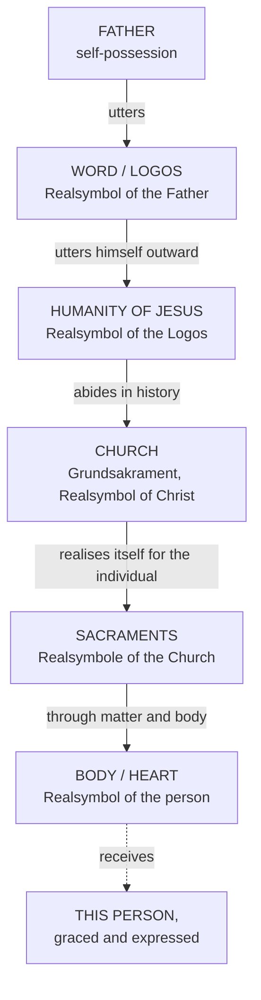

# 08 — *Realsymbol* Applied: The Five Applications

> [!info] Prev: [[07 - The Theology of the Symbol - The Core Essay]] · Next: [[09 - Rahner's Rule - The Grundaxiom of the Trinity]]

This note takes the ontology of note 07 and walks it down the whole chain of Christian doctrine. **One principle, five applications.**

---

## Application 1 — The Trinity: the Logos as *Realsymbol* of the Father

**The claim.** The Father, in perfectly knowing and possessing himself, **utters himself**. That utterance is not a thought *about* the Father; it is the Father's own reality, wholly received in another mode of subsisting. The **Word is the real symbol of the Father**.

Scriptural anchoring Rahner leans on:
- Jn 1:1 — "the Word was with God and the Word was God"
- Col 1:15 — "the **image** (*eikōn*) of the invisible God"
- Heb 1:3 — "the **reflection** of God's glory and the exact **imprint** (*charaktēr*) of God's very being"

> [!important] The decisive point
> The Father does not first exist in solitary self-possession and *then* speak. **The Father possesses himself precisely in uttering the Word.** Self-expression is constitutive of self-possession — Thesis 1 of the symbol essay, now read into the immanent Trinity.

**Why this matters:** it means the symbol structure is not a creaturely limitation projected onto God. It is the reverse — **creaturely symbolism is a distant participation in the Trinitarian structure of being itself**. God is the archetypal *Realsymbol*.

> [!warning] Guard against modalism
> Rahner is not saying the Word is an "expression" in the sense of an appearance or mode of the one God. The Word is a distinct *hypostasis*, consubstantial. But note that Rahner *does* prefer "distinct manners of subsisting" (*distinkte Subsistenzweisen*) to "three persons" for modern ears — which earns him a charge of near-modalism from Moltmann and others → [[17 - Critical Reflection II - Theological]].

---

## Application 2 — Christology: the humanity of Jesus as *Realsymbol* of the Logos

**The claim.** The human nature of Jesus is not an instrument the Logos picks up, nor a costume worn, nor a screen behind which God hides. It is **what comes to be when the Logos utters himself outwards into the non-divine**.

> [!quote] Rahner, TI IV
> The humanity of Christ is the self-disclosure of the Logos itself, so that when God, expressing himself, exteriorises himself, that very thing appears which we call the humanity of the Logos.

Two enormous consequences:

1. **Against every hidden-God Christology.** We do not see the humanity *and infer* the divinity. In seeing the man Jesus we see the self-utterance of God — "whoever has seen me has seen the Father" (Jn 14:9) becomes an ontological statement, not a pious hyperbole.
2. **Human nature is defined Christologically.** If human nature is what comes to be when God expresses himself, then **to be human is precisely to be the possible self-expression of God**. Hence Rahner's famous formula: *Christology is self-transcending anthropology; anthropology is deficient Christology* → [[10 - Christology - Self-Communication and Evolution]].

> [!example] Illustration — the singer and the song
> A song is not an instrument the singer uses; it is the singer's own self going out into audible form. You do not hear the song and then deduce a singer; the singer is *there*, in the song. Push the analogy no further than Rahner does — the song does not have a human will and a human soul. The illustration carries the *presence*, not the hypostatic union.

> [!warning] Limit of the analogy
> Any illustration of the hypostatic union risks Monophysitism (the humanity swallowed by divinity) or Nestorianism (two subjects side by side). Rahner's symbolic reading preserves Chalcedon by insisting the humanity is fully real and fully **other** precisely *because* it is the Logos's own self-utterance. **The more united to God, the more genuinely itself** — his axiom of *radical dependence and genuine autonomy increasing in direct, not inverse, proportion*.

---

## Application 3 — The Church: *Realsymbol* of the risen Christ

**The claim.** The Church is the **abiding presence of the incarnate Word in space and time** — Christ's own self-realisation in history after the Ascension.

Terms:
- ***Ursakrament*** / ***Grundsakrament*** — primordial or basic sacrament. Strictly: **Christ** is the *Ursakrament*; the **Church** is the *Grundsakrament*, the basic sacrament, deriving from him. (Usage varies among authors — Otto Semmelroth, Edward Schillebeeckx and Rahner all use these terms with slight differences. Say which sense you mean.)
- The Church is therefore not an organisation *founded by* Christ and now running on its own; it is Christ's **symbolic reality**.

**Reception:** this is the language *Lumen Gentium* 1 adopts — the Church as "sacrament, that is, sign and instrument of communion with God and of unity among the whole human race" → [[15 - Rahner and Vatican II - The World Church]].

> [!question] Then what about the sinful Church?
> A real symbol can be a *deficient* symbol. Rahner grants that the Church can obscure what it exists to express. This is why he speaks of the Church as *ecclesia semper reformanda* and of the "sinful Church," and it is the point at which the symbol ontology needs supplementing — an unresolved edge in his system.

---

## Application 4 — The Sacraments: *Realsymbole* of the Church's own act

**The claim.** In the seven sacraments the Church **realises its own essence** in relation to an individual at a decisive moment of that person's life. The sacrament is the Church's *Realsymbol*.

**The classic axiom becomes intelligible:** *sacramenta significando causant* — the sacraments **cause by signifying**. On the ordinary understanding this is nearly paradoxical: how can a sign cause? On Rahner's ontology it is a straightforward instance of the general law: a reality's self-expression is the mode in which that reality is present and operative.

| Traditional framing | Rahner's re-framing |
|---|---|
| Sacrament = instrumental efficient cause; grace "flows" through the sign as through a channel | Sacrament = the symbolic self-realisation of the Church, in which the grace always-already offered becomes **historically, bodily, ecclesially tangible and eschatologically definitive** for this person |
| Risk: a "grace-machine" picture, grace as a quantity dispensed | Risk: the sacrament looks **declaratory** rather than conferring — the main objection against him |

> [!example] Illustration — the wedding vow
> "I take you as my wife" does not report a marriage occurring elsewhere; it is where the marriage *happens*. The words do not describe reality, they **effect** it, precisely by signifying it. Every sacrament works on this grammar. (Compare J. L. Austin's *performative utterance* — a useful modern parallel, though Rahner does not use it.)

> [!example] Illustration — the letter of pardon
> A prisoner has already been pardoned by the ruler's decision (the grace always-already offered). The document read aloud in the prison yard does not create the ruler's mercy — but it is the moment when that mercy becomes public, dated, tangible, irrevocable, and *this prisoner's own*. Rahner's sacrament sits here. Whether that is enough for *ex opere operato* conferral is precisely the disputed point → [[12 - Ecclesiology and Sacramental Theology]].

---

## Application 5 — The body as *Realsymbol* of the person (and so: the Sacred Heart)

**The claim.** The body is not a container, vehicle or prison of the soul. On Aristotelian-Thomist hylomorphism (the soul as *forma corporis* — dogmatically affirmed at the **Council of Vienne, 1312**), the body is the **soul's own self-realisation in space and matter**. Therefore: **the body is the real symbol of the person**.

Consequences that matter pastorally:
- A caress, a blow, a tear, a shared meal are not "external signs of inner states." They are where the person actually *is* and *acts*.
- Therefore: the resurrection **of the body** is not a curious appendix to salvation. If the body is the person's real symbol, then a disembodied salvation would be an unfinished salvation → [[13 - Theological Anthropology, Death and Eschatology]].
- Therefore: sacraments *must* be bodily. Water, oil, bread, touch, word.
- Therefore: bodily sin and bodily reverence are serious. What is done to the body is done to the person.

**And so the *Urwort* "heart".** Heart, light, bread, water, word, birth, death — these are *Urworte*, **primordial words** which name a total human reality rather than labelling a part. "Heart" names the person's innermost core as loving. Hence:

> The **pierced heart** of Christ (Jn 19:34; cf. Zech 12:10) is the real symbol of the total self-gift of the incarnate Word. Devotion to the Sacred Heart adores the whole Christ **at the point where he expresses himself most completely** — the self-emptying love of the crucified.

---

## The chain in one diagram

> [!tip] The single sentence to carry into the exam
> "For Rahner, God's eternal self-utterance in the Word, God's historical self-utterance in the flesh of Jesus, Christ's abiding self-utterance in the Church, the Church's decisive self-utterance in the sacraments, and the person's self-utterance in the body are **five instances of one ontological law**: a being attains itself by expressing itself in another."

## Comparison table — where each application is strongest and weakest

| Application | Greatest strength | Sharpest objection |
|---|---|---|
| Trinity | Grounds symbolism in God, not in creaturely deficiency | Risks necessity / Idealist emanation; "modes of subsisting" sounds modalist |
| Christology | Kills every "God hiding behind a man" picture; secures Jn 14:9 | Can the humanity's full autonomy and human freedom survive being "the Logos's self-utterance"? |
| Church | Gives *Lumen Gentium* its central image | Cannot easily accommodate the Church's sin and counter-witness |
| Sacraments | Makes *significando causant* intelligible at last | Does grace get *conferred*, or only *manifested*? |
| Body / Heart | Recovers a genuinely bodily anthropology; vindicates popular devotion | Little developed on gender, difference, disability, the wounded body |

## Self-check
- For each of the five applications, state what is the symbol and what is symbolised.
- Why does Rahner say human nature is what comes to be when God expresses himself?
- Explain *significando causant* using the wedding-vow illustration.
- What is an *Urwort*? Give four examples.
- Which application do you find weakest, and why? (Examiners want a defended judgement.)
