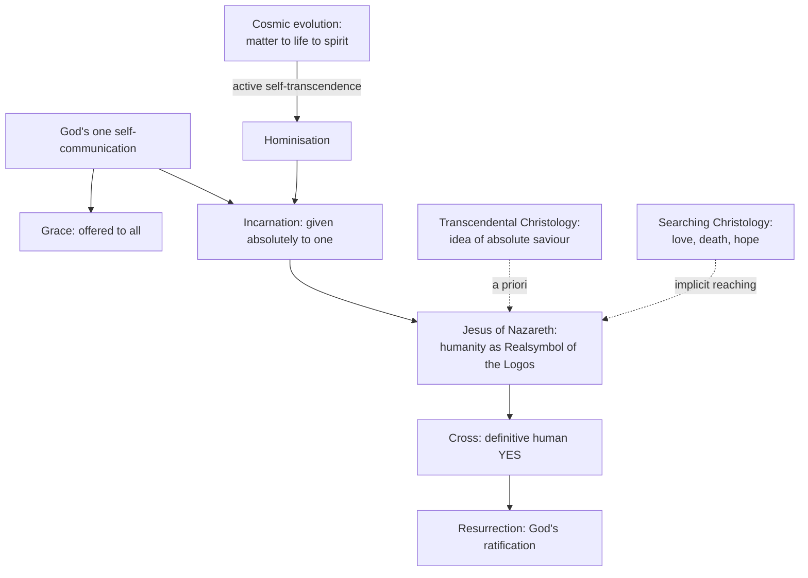

# 10 — Christology: Self-Communication, Evolution, and the Searching Heart

> [!info] Prev: [[09 - Rahner's Rule - The Grundaxiom of the Trinity]] · Next: [[11 - Anonymous Christians and the Non-Christian Religions]]

## The problem with textbook Christology

Rahner's complaint about the manuals: Chalcedon is treated as a **terminus** rather than a beginning. "Two natures in one person" is repeated as a formula while the underlying picture remains **mythological** — God disguised as a man, a divine subject wearing a human costume, the humanity a mere instrument.

> [!quote] Rahner's principle about Chalcedon
> A dogmatic formula is not only an end but a beginning: every genuine formula opens onto the mystery it protects, and must be thought further, not merely repeated.

## 1. The hypostatic union as the supreme case of symbolic causality

From [[08 - Realsymbol Applied - Trinity, Christ, Church, Sacraments, Body]]: **the humanity of Jesus is the *Realsymbol* of the Logos.** Not a tool, not a veil, not a puppet — the Logos's own self-utterance into the non-divine.

**Rahner's axiom of proportionality (learn this; it does enormous work):**

> [!important] Nearness to God and creaturely autonomy vary in **direct**, not inverse, proportion.
> The closer a creature is to God, the *more* genuinely itself, free and autonomous it is. God is not a competitor to creaturely freedom.

**Applied to Christ:** Jesus is not less human because he is God's self-utterance; he is the **most fully human being who has ever existed**. His human freedom, his human knowledge, his human obedience, his human fear in Gethsemane are all fully real. This gives Rahner a strong defence of Chalcedon's *vere homo* against every latent Monophysitism in popular piety.

> [!warning] Practical test
> Ask a congregation: "Did Jesus really not know the day or the hour (Mk 13:32)?" Latent Monophysitism will say "he pretended not to know." Rahner's Christology permits the plain answer: **his human consciousness genuinely did not know**, while he possessed an unthematic, immediate self-presence to the Logos at the ground of his being. (Rahner develops this as the distinction between Christ's **basic self-consciousness** and his **thematic, historically developing knowledge**.)

## 2. Incarnation as the unique modality of self-communication

Recall the three modalities from [[06 - God's Self-Communication and Quasi-Formal Causality]]:

| Modality | Character |
|---|---|
| Grace | Self-communication **offered**, acceptable or refusable |
| **Incarnation** | Self-communication given to one human reality **absolutely and irrevocably**, and *accepted* absolutely from the human side |
| Glory | Self-communication unveiled |

**Therefore the Incarnation is not a foreign body in the order of grace.** It is that order's **unsurpassable and eschatologically victorious instance** — the point at which the offer becomes irrevocable because it has been definitively accepted.

**Corollary that shocked many:** grace and Incarnation are not two divine acts but one, in different modes. This is why Rahner can move so freely between anthropology and Christology — and why critics say the Incarnation loses its scandalous particularity → [[17 - Critical Reflection II - Theological]].

## 3. Evolutionary Christology (*Christologie innerhalb evolutiver Weltanschauung*)

Rahner asks: can the Incarnation be thought within a world understood as **evolving**?

**The argument in five steps:**
1. Matter and spirit are not two unrelated realms. Spirit is **not** foreign to matter; the human being is spirit-in-world ([[02 - Philosophical Foundations I - Spirit in the World]]).
2. Evolution shows genuine novelty: matter → life → consciousness. Each stage is more than a rearrangement of the previous.
3. Such becoming-more is **active self-transcendence** (*aktive Selbsttranszendenz*): the creature genuinely transcends itself, yet only by a power **given** by God, who is the dynamism within the process rather than an occasional intervener from outside.
4. **Hominisation:** in the human being, the cosmos becomes conscious of itself and stands open before absolute mystery.
5. **The Incarnation is the goal-point of this self-transcendence:** the moment when the cosmos, in one of its members, accepts God's self-communication absolutely. Christ is where the world's openness reaches its unsurpassable term.

> [!note] Rahner and Teilhard de Chardin
> There is genuine convergence (cosmic Christology, the world's ascent toward Christ as Omega). But Rahner's argument is **transcendental and metaphysical**, not scientific-cosmological, and he is more careful than Teilhard to keep the Incarnation **free**: the world's openness does not *produce* Christ; it is the receptivity that God's free self-gift fulfils. Distinguish the two in an exam.

> [!warning] The objection to state
> If Christ is the "goal" of cosmic self-transcendence, does the Incarnation become **necessary** — the natural completion of evolution rather than free grace? Rahner's reply: the world's openness is an *empty capacity*, and its fulfilment remains wholly gratuitous; a summit is not caused by the slope that leads up to it. Whether that fully answers the objection is a fair essay question.

## 4. Transcendental and searching Christology

**Transcendental Christology.** By transcendental method Rahner derives the *a priori idea* of an "absolute saviour" (*absoluter Heilbringer*) — the one in whom God's self-communication to history becomes irreversible and historically manifest. Philosophy cannot say that such a one exists; it can say what would count as one. Then **a posteriori**, the Christian says: this is Jesus of Nazareth.

> [!tip] Guard the order
> The transcendental step **does not deduce Jesus**. It shows that the Gospel is not an arbitrary intrusion into human history. Confuse the order and you have made Christ a corollary of anthropology — which is exactly what Balthasar accused Rahner of doing.

**Searching Christology** (*suchende Christologie*). Rahner names three ordinary human acts in which people are already implicitly reaching for the absolute saviour:

| Act | What it implicitly affirms |
|---|---|
| **Absolute love of neighbour** | That the other is worth an unconditional gift — which is intelligible only if the human is loved unconditionally by God |
| **Readiness for death** | Accepting one's own end in hope means entrusting oneself to a mystery that receives it |
| **Hope in the future** | Refusing to treat history as absurd means expecting an unsurpassable fulfilment |

> [!example] Pastoral illustration
> A woman who has spent forty years caring for a disabled child, without recognition and without expectation, is enacting an absolute love. Rahner's claim is not that she is "secretly Christian" in her opinions. It is that the *structure* of her act only makes sense if the absolute self-gift she practises is grounded in reality — and Christians name that ground Jesus Christ. This is the doorway to [[11 - Anonymous Christians and the Non-Christian Religions]].

## 5. Cross and resurrection

Rahner is often accused of a thin theology of the Cross. His actual position:

- The Cross is the **historical embodiment** of the definitive acceptance of God's self-communication by a human freedom — obedience unto death is where the absolute "yes" is uttered from within history.
- The Resurrection is not an added miracle proving the Cross; it is the **manifestation of the Cross's validity** — the definitive acceptance shown to have been accepted by God.
- Rahner is reserved about satisfaction theories (Anselm's *Cur Deus Homo*): he denies that the Cross *causes* God to become gracious. God's saving will is prior; the Cross is its **real symbol** in history — again the symbol ontology.

> [!question] Is that enough?
> **Balthasar's charge:** Rahner's Cross is an epistemological event (it *manifests*) rather than a soteriological one (it *achieves*); the descent into hell, the *Ernstfall*, the sheer horror, are underweighted. This is a strong criticism and you should engage it, not dodge it → [[17 - Critical Reflection II - Theological]].

## Summary diagram

## Self-check
- State Rahner's axiom about nearness to God and creaturely autonomy, and apply it to Christ's human freedom.
- Explain "active self-transcendence" and the objection that it makes the Incarnation necessary.
- Distinguish transcendental from searching Christology.
- Name the three acts of searching Christology.
- State Balthasar's objection on the Cross and offer a Rahnerian reply.
