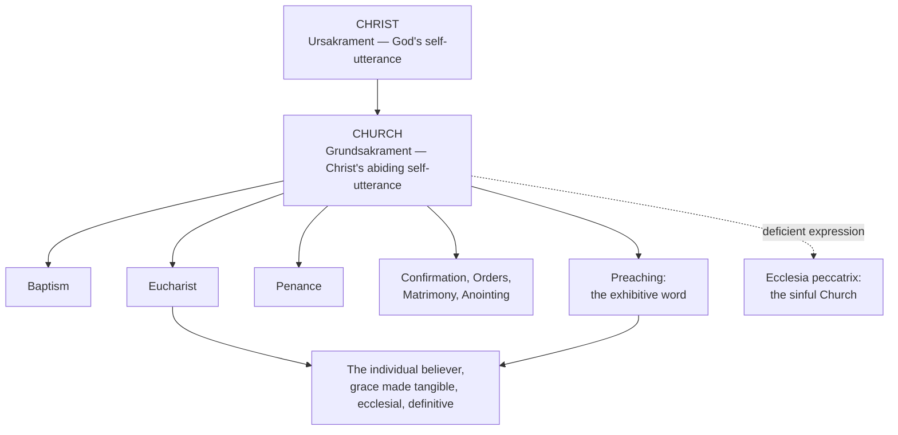

# 12 — Ecclesiology and Sacramental Theology

> [!info] Prev: [[11 - Anonymous Christians and the Non-Christian Religions]] · Next: [[13 - Theological Anthropology, Death and Eschatology]]

## 1. The Church as *Grundsakrament*

**The claim.** The Church is the **abiding real symbol of the risen Christ in history**: the sign in which he continues to utter himself, and therefore the sign in which he is genuinely present and effective.

**Terminology — get this right:**

| Term | Standard usage | Referent |
|---|---|---|
| ***Ursakrament*** (primordial sacrament) | Christ himself | The Incarnate Word is the original sacrament of God |
| ***Grundsakrament*** (basic/fundamental sacrament) | The Church | Derived from Christ; the sacrament of the sacraments |
| The seven sacraments | Acts of the Church | The Church's self-realisation for the individual |

> [!note] Usage warning
> Otto Semmelroth (*Die Kirche als Ursakrament*, 1953), Edward Schillebeeckx (*Christ the Sacrament of the Encounter with God*, 1960) and Rahner all use these terms with slight variations; some authors call the Church the *Ursakrament*. **State your usage explicitly in an essay** and you cannot be marked wrong.

**Magisterial fruit:** *Lumen Gentium* 1 — the Church is "in Christ like a sacrament, that is, a sign and instrument both of a very closely knit union with God and of the unity of the whole human race." *LG* 9, 48; *Sacrosanctum Concilium* 5, 26; *Gaudium et Spes* 45 repeat the pattern. This is arguably the single most consequential piece of Rahner-influenced language in the conciliar documents → [[15 - Rahner and Vatican II - The World Church]].

## 2. Sacramental causality re-thought

### The classic axiom
*Sacramenta significando causant* — "the sacraments cause by signifying" (Aquinas, ST III q.60–62; Trent, DS 1606, 1608).

### The classic difficulty
On a picture of **instrumental efficient causality**, the sign and the causing are two things loosely tied together: God attaches an effect to a rite. This invites the "grace-machine" caricature — grace as a substance dispensed through a channel, and the *sign* as almost incidental.

### Rahner's re-framing
On the ontology of the real symbol, **signifying and causing are one act**:

> A real symbol is the self-realisation of a reality in the other. The Church, realising itself in this act for this person, *is* Christ's grace becoming present here. It causes **because** it signifies, and it signifies **because** it is that reality's own way of being present.

| | Instrumentalist picture | Rahner's symbolic picture |
|---|---|---|
| Sign and cause | Externally joined | **Identical in one act** |
| Grace | A created quality conveyed | God's **self-communication** made tangible → [[06 - God's Self-Communication and Quasi-Formal Causality]] |
| Where grace begins | At the rite | **Always already offered** ([[05 - The Supernatural Existential - Nature and Grace]]); the rite makes it historical, ecclesial, definitive |
| *Ex opere operato* means | God guarantees the transfer | God guarantees the **Church's self-realisation** in this act, independent of the minister's worth |

> [!example] Illustration — the wedding vow (performative)
> "I take you as my wife" does not *report* a marriage happening elsewhere. It is where the marriage happens. The saying **is** the doing. Every sacrament runs on this grammar.

> [!example] Illustration — the amnesty proclaimed
> A ruler has already decreed pardon for all prisoners (grace universally offered). The herald reading the decree in the prison yard does not manufacture the ruler's mercy — but at that moment the mercy becomes public, dated, addressed to *this* prisoner, and irrevocable in the order of history. Rahner's sacrament stands here.

### The standing objection
**Colman O'Neill OP** and other Thomists: if grace is universally offered before the sacrament, and the sacrament makes it *tangible*, has the sacrament actually **conferred** anything, or only **declared** it? Trent taught that the sacraments *contain* and *confer* the grace they signify (DS 1606). A merely manifestative account would fall short.

**Rahner's reply:**
- The sacrament genuinely **effects** something new: grace previously offered and (perhaps) accepted unthematically now becomes **historically embodied, ecclesially owned, eschatologically certain**. That is not nothing — on his ontology it is the difference between a reality half-realised and a reality fully expressed.
- On his own principles, **what is not expressed is not fully real**. So the sacrament does not merely announce a completed fact; it completes it.

**Assessment for your essay:** the reply is strong *given* the symbol ontology and weak *if* one does not grant that ontology. This is a genuine watershed: your judgement on Rahner's sacramental theology depends almost entirely on whether you accept Thesis 1 of the symbol essay.

## 3. *Opus operatum* and the *Wort-Sakrament* connection

Rahner extends the symbol logic to the **word**:
- The Church's **preaching** is also a form of self-realisation. He speaks of an "**exhibitive word**" (*exhibitives Wort*) — a word which does not merely inform but effects what it says.
- This gives a Catholic account of the Protestant emphasis on the Word: the sacrament is the **word at its highest density** (*Wort in seiner höchsten Dichte*), not an alternative to it. Ecumenically fruitful.

## 4. Ecclesiology of the diaspora

Rahner's sociological realism about the Church's future in the West:

- The era of a culturally Christian society is over. The Church will be a ***Diasporakirche*** — a **minority in a pluralist world**, held together by personal conviction rather than social inheritance.
- **The "little flock" (*kleine Herde*)**: not a defeat but a return to the Church's normal condition.
- Consequence: faith must become **personally appropriated and experienced**, or it will not survive at all → [[14 - Mystagogy, Ignatian Roots and Spirituality]].
- Practical proposals, often controversial in his day: married clergy as a possibility to be discussed, wider lay ministry, "basic communities," the ordination of *viri probati* for communities deprived of the Eucharist, structural decentralisation after the "world Church" turn.

> [!quote] The best-known sentence in Rahner
> "The devout Christian of the future will either be a 'mystic', one who has 'experienced' something, or he will cease to be anything at all."
> — "Christian Living Formerly and Today," *TI* VII, 15.

## 5. Church, sin, and the limits of the symbol model

The hardest question for Rahner's ecclesiology: **how can the real symbol of Christ persecute, abuse, or betray?**

His answer: the Church is a ***sündige Kirche*** — a sinful Church, not merely a Church of sinners. As a real symbol it can be a **deficient** and even **distorting** expression of what it symbolises, without ceasing to be its symbol. The indefectibility promised is of the whole in the end, not of every act.

> [!warning] Critical judgement
> This is honest but under-developed. The symbol ontology is built to explain **fullness of expression**; it explains **failure of expression** only by negation. A theology of the *lying* symbol — the body that conceals, the Church that misrepresents — is the largest unfilled gap in Rahner's system, and is worth saying so in an essay.
> For the constructive completion — counter-witness, the anti-sacrament, and why scandal in the Church is *ontologically* worse than the same act elsewhere — see [[24 - The Theology of the False Symbol]].

## Diagram

## Self-check
- Distinguish *Ursakrament* and *Grundsakrament* and say who each names.
- Explain *significando causant* on the instrumentalist and on the symbolic account.
- State O'Neill's objection and Rahner's reply; give your own verdict with a reason.
- What is the *exhibitive word*, and why is it ecumenically useful?
- What does Rahner mean by a diaspora Church, and what follows for spirituality?
