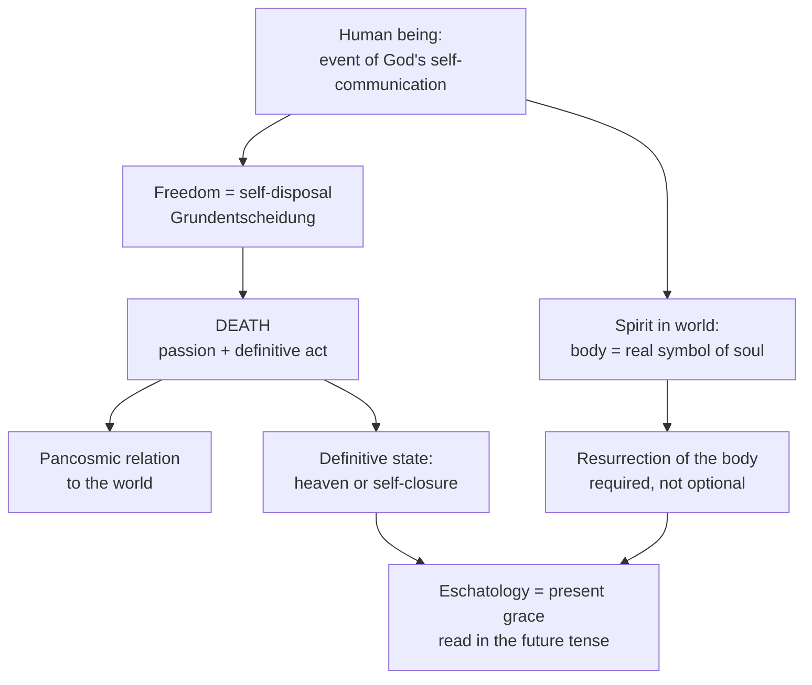

# 13 — Theological Anthropology, Death and Eschatology

> [!info] Prev: [[12 - Ecclesiology and Sacramental Theology]] · Next: [[14 - Mystagogy, Ignatian Roots and Spirituality]]

## 1. The human being defined

Rahner's compressed definition, which gathers the whole of notes 02–06:

> [!important] The human being is
> **the event of God's free, forgiving, absolute self-communication** — the finite spirit whose very being is an unlimited openness (*Vorgriff*) to absolute mystery, who is spirit only in and through matter and history, and who is always already addressed by God's offer of Godself.

Four consequences:

| Statement | Where it comes from |
|---|---|
| The human is **transcendence** — a question that cannot answer itself | [[02 - Philosophical Foundations I - Spirit in the World]] |
| The human is **historical and bodily** — no escape into pure interiority | [[03 - Philosophical Foundations II - Hearer of the Word]] |
| The human is **always already graced** | [[05 - The Supernatural Existential - Nature and Grace]] |
| The human is **defined Christologically** — Christ shows what humanity is | [[10 - Christology - Self-Communication and Evolution]] |

> [!quote] The formula to memorise
> **"Anthropology is deficient Christology; Christology is self-transcending anthropology."**
> Not: theology reduced to anthropology. Rather: whoever asks what a human being *is* has already begun to ask about Christ.

## 2. Body and soul: the symbol ontology applied to the person

- Following the Council of Vienne (1312), the soul is *forma corporis* — the form of the body, not a pilot in a ship.
- Therefore **the body is the real symbol of the soul** ([[08 - Realsymbol Applied - Trinity, Christ, Church, Sacraments, Body]]).
- Therefore human freedom is enacted **bodily and historically**, or not at all.

**Pastoral payoff:** the widespread popular dualism — "the body is just a shell; what matters is the soul" — is not Catholic doctrine. Rahner gives students the metaphysics to say why.

## 3. Freedom and the *Grundentscheidung*

- Freedom, for Rahner, is not primarily the capacity to choose between this and that (*Wahlfreiheit*). It is the capacity to **dispose of oneself as a whole** before God — *Freiheit* as self-determination toward one's final destiny.
- Hence a **fundamental option** (*Grundentscheidung*): the total orientation of a life, realised through, but not identical with, individual acts.
- A single act may express or contradict the fundamental option; it is not automatically identical with it.

> [!warning] The controversy
> This is developed further by Josef Fuchs and others, and criticised in *Veritatis Splendor* (John Paul II, 1993, §§65–70) where the theory is judged, in some forms, to detach the fundamental option from concrete acts and so to weaken the reality of mortal sin. **Note carefully:** *Veritatis Splendor* does not condemn the notion of a fundamental orientation as such; it rejects a separation between that orientation and particular free choices. Rahner's own version keeps the two connected precisely by his symbol ontology — the fundamental option must *express itself* in acts to be real at all.

## 4. Death: *On the Theology of Death* (1958)

**Death as act and as passion (the central thesis).**

| Aspect | Meaning |
|---|---|
| **Passion** (*Leiden*) | Death happens *to* us: violent, unchosen, the wage of sin, the visible face of finitude |
| **Act** (*Tat*) | Death is also our final, total **self-disposal** — the moment when a whole life is gathered into one definitive act of freedom |

Both must be held. Death as pure passion makes salvation something that happens to a corpse; death as pure act romanticises an experience most people meet in helplessness.

**The pancosmic thesis.** At death the soul does not become *acosmic* (worldless, an isolated spirit awaiting reassembly). It becomes ***pancosmic***: it enters into a deeper, open relation to the material universe as a whole rather than to one body.

> [!note] What the pancosmic thesis is for
> 1. To preserve **hylomorphism**: a soul is essentially related to matter, so a wholly worldless soul is incoherent.
> 2. To make sense of the communion of saints and the intercession of the dead as a real relation to the world.
> 3. To give a framework for the "already/not yet" of the resurrection.
>
> **Status:** speculative, and Rahner presents it as such. It has been criticised as unverifiable and as a metaphysical patch. Say so.

**Death and Christ.** Christ's death is the supreme instance: the total passion (he is killed) which is also the total act (he hands himself over). "Into your hands I commend my spirit" (Lk 23:46) is the definitive human self-disposal. Our deaths become salvific by participation in his → [[10 - Christology - Self-Communication and Evolution]].

## 5. The hermeneutics of eschatological assertions

> [!abstract] Key text
> "The Hermeneutics of Eschatological Assertions," *Theological Investigations* IV, 323–346.

**The rule:**

> [!important]
> **Eschatological statements are not advance reportage of future events.** They are the transposition into the future of what the Christian already experiences of salvation in Christ *now*. Eschatology is **anthropology and Christology conjugated in the future tense**.

**The distinction that follows:**

| **Eschatology** | **Apocalyptic** |
|---|---|
| Extrapolates from the present experience of grace in Christ toward its fulfilment | Claims direct knowledge of future events, projecting a script backwards from heaven |
| Legitimate; necessary; controlled by Christology | Illegitimate as theology; a genre to be interpreted, not a source of information |
| "Because Christ is risen, our future is..." | "In the year X, the following will occur..." |

**Worked applications:**
- **Heaven** = the final and unveiled state of God's self-communication now given in grace — not a place with furniture.
- **Hell** = the real possibility of a definitive self-closure against that self-communication. Rahner holds it must be preached as a **real possibility for me**, never asserted as a fact about anyone. He is not a universalist; he insists we may and must **hope** for the salvation of all while affirming that damnation is genuinely possible.
- **Purgatory** = the process of the integration of the whole person into the definitive act of self-disposal; not a punishment-tariff.
- **Resurrection of the body** = required by the symbol ontology: since the body is the person's real symbol, salvation of the person entails salvation of the body → [[08 - Realsymbol Applied - Trinity, Christ, Church, Sacraments, Body]].
- **Parousia** = the manifestation of what is already true in Christ, not the arrival of a new fact.

> [!example] Illustration — the seed and the letter
> To say "this acorn will become an oak" is not a report from the future; it is a statement about what the acorn *now is*, projected forward. To say "on the third Tuesday of next March a tree will be felled by lightning" is a different kind of claim entirely. Eschatology speaks the first way; apocalyptic pretends to speak the second.

> [!warning] The objection
> If eschatology is only the future tense of present experience, do we still have a genuine **promise of God about the future**, or only a description of ourselves? Critics (Moltmann, *Theology of Hope*; Metz) argue Rahner's rule domesticates biblical hope, removing its power to protest against present injustice. This is the same abstraction critique as elsewhere → [[17 - Critical Reflection II - Theological]].

## 6. Diagram

## Self-check
- Give Rahner's definition of the human being in one sentence.
- Explain "death as act and passion" and why both halves are needed.
- What is the pancosmic thesis, what is it for, and what is its status?
- State the hermeneutical rule for eschatological assertions and apply it to hell.
- Distinguish eschatology from apocalyptic with an illustration.
