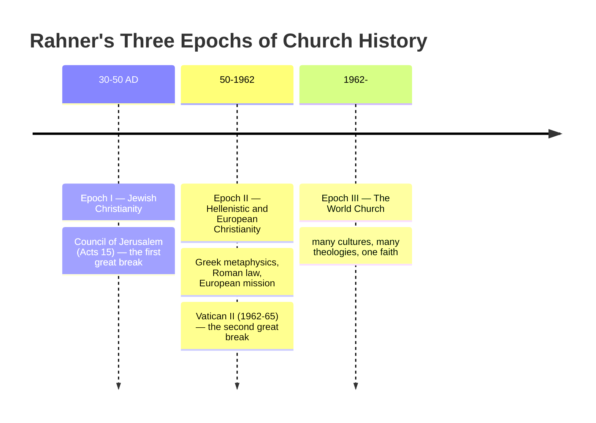

# 15 — Rahner and Vatican II: The World Church

> [!info] Prev: [[14 - Mystagogy, Ignatian Roots and Spirituality]] · Next: [[16 - Critical Reflection I - Philosophical]]

> [!tip] Companion unit
> For the Council itself — what it was, how it ran, and what each document says — see [[Vatican II - Course Home|the Vatican II unit]]. Directly relevant here: [[03 - How the Council Ran]] (the *periti* and how they exercised influence without a vote), [[09 - The Turning Points]] (the rejection of *De fontibus*, and the reordering of *Lumen Gentium*), and [[05 - Lumen Gentium - The Church]].

## 1. His actual role

- **Peritus** (expert) appointed by John XXIII, serving principally as adviser to **Cardinal Franz König of Vienna**; also consulted by the German-speaking bishops as a bloc.
- Present at the crucial rejection of the preparatory schemas in the first session (1962), especially *De fontibus revelationis*, which he had criticised in a widely circulated memorandum.
- Not the author of any document. **Influence, not authorship** — say this precisely in an exam. The conciliar texts are compromises; Rahner supplied concepts and arguments that shaped them.

> [!note] The irony worth mentioning
> In 1962 Rome had placed his writings under **pre-censorship**. Within months he was a council *peritus* advising a cardinal. The reversal marks the change of theological climate that the Council itself was.

## 2. Where his fingerprints are

| Document | Rahnerian contribution | Cross-reference |
|---|---|---|
| ***Lumen Gentium* 1, 9, 48** | The Church as **sacrament** — "sign and instrument" of union with God and unity of humanity | [[12 - Ecclesiology and Sacramental Theology]] |
| ***Lumen Gentium* 16** | Salvation possible for those who through no fault of their own do not know the Gospel | [[11 - Anonymous Christians and the Non-Christian Religions]] |
| ***Lumen Gentium* 2** (People of God before Hierarchy) | The reordering of the chapters, so that the whole People precedes the structures | |
| ***Dei Verbum*** | Rejection of the "**two sources**" theory (Scripture *and* Tradition as separate deposits) in favour of one source, the Word of God, transmitted in two modes; revelation as **God's self-communication**, not a set of propositions (*DV* 2) | [[06 - God's Self-Communication and Quasi-Formal Causality]] |
| ***Gaudium et Spes* 22** | Christ reveals the human being to himself; the Spirit offers all, "in a manner known to God," association with the Paschal Mystery | [[10 - Christology - Self-Communication and Evolution]] |
| ***Nostra Aetate* 2** | The Church rejects nothing true and holy in other religions | [[11 - Anonymous Christians and the Non-Christian Religions]] |
| ***Sacrosanctum Concilium*** | Liturgy as the Church's self-realisation; symbol taken seriously as efficacious | [[07 - The Theology of the Symbol - The Core Essay]] |

> [!important] The single most important shift
> **Revelation as *self-communication* rather than as a deposit of propositions.** *Dei Verbum* 2 states that God reveals *himself* and the mystery of his will, and that this happens in "deeds and words having an inner unity." That last phrase is the symbol ontology in conciliar dress: word and deed are not two channels but one self-expression.

## 3. The "World Church" thesis

> [!abstract] Key text
> "Towards a Fundamental Theological Interpretation of Vatican II" (1979), *Theological Investigations* XX, 77–89.

**The thesis:** Vatican II is the beginning of the **third epoch** of Church history — the moment when Christianity begins actually (not merely theoretically) to be a **world Church** (*Weltkirche*).

| Epoch | Duration | Character | Turning point |
|---|---|---|---|
| **I. Jewish Christianity** | c. 30 – c. 50 | The Church within Judaism; the Gospel in Jewish categories | The **Council of Jerusalem** (Acts 15): Gentiles need not become Jews |
| **II. Hellenistic and European Christianity** | c. 50 – 1962 | The Gospel in Greek philosophical and Roman legal form; Europe exports a European Church | **Vatican II** |
| **III. World Church** | 1962 – | The Gospel takes flesh in many cultures on their own terms, not as European Christianity in translation | — |

**Rahner's crucial claim:** the transition from epoch I to II involved a genuine, painful, *theological* discontinuity — circumcision, kashrut, the whole Torah-observant shape of discipleship was set aside. The transition to epoch III must be **equally radical**. It cannot be satisfied by translating Latin texts into Tamil or by adding local music to a Roman rite.

**Evidence he cites at the Council itself:** the vernacular liturgy (*Sacrosanctum Concilium*), the genuinely worldwide episcopate present in the aula, the declaration on religious liberty (*Dignitatis Humanae*), the openness to other religions (*Nostra Aetate*), the address to the whole world rather than to Catholics only (*Gaudium et Spes*).

> [!example] What epoch III actually demands
> If the Jerusalem Council could set aside circumcision — the very sign of the covenant — then a genuine world Church must be willing to ask which of its European inheritances are Gospel and which are Hellenistic-Roman packaging: canonical structures, philosophical vocabulary, liturgical forms, clerical culture, the shape of ministry. Rahner does not answer these questions; he insists they are legitimate and unavoidable.

> [!warning] Contested
> Critics from both directions: **conservatives** say the thesis relativises the doctrinal achievements of the patristic and scholastic tradition, treating Nicaea's *homoousios* as culturally contingent packaging; **contextual and liberation theologians** say Rahner announced the world Church from a chair in Münster and never handed over the microphone — the theory of inculturation remained European. Both criticisms have force → [[18 - Rahner in the Indian Context]].

## 4. Rahner on the Council's reception

- He judged the Council a **beginning**, not a conclusion, and grew impatient with restorationist readings in the 1970s.
- His late writings press for structural consequences: real episcopal collegiality, decentralisation, subsidiarity, wider ministries, a Church willing to be a **creative minority** rather than a defensive fortress → [[12 - Ecclesiology and Sacramental Theology]].
- His last public act (1984) was a letter defending **Gustavo Gutiérrez** to Cardinal Juan Landázuri Ricketts of Lima against Roman moves toward censure — evidence that he had absorbed the political critique of his own student Metz.

## 5. Diagram

## Self-check
- What exactly was Rahner's role at the Council? (Be precise about authorship.)
- Name four conciliar texts he influenced and the concept he supplied to each.
- Why is *Dei Verbum* 2's "deeds and words having an inner unity" a symbol-theological statement?
- State the three-epoch thesis and explain why the Council of Jerusalem is the decisive precedent.
- Give one conservative and one contextual criticism of the world-Church thesis.
