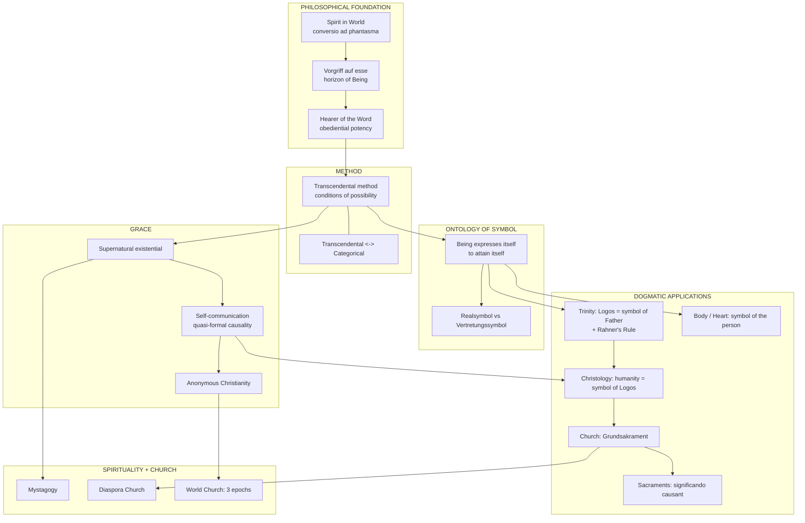
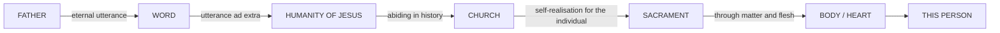
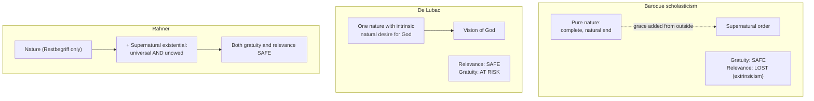
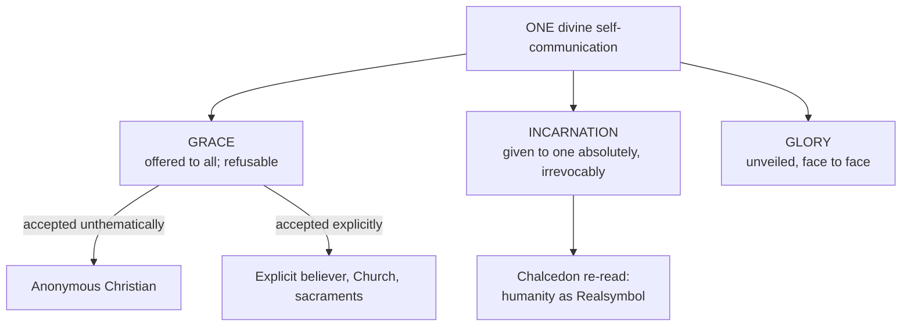
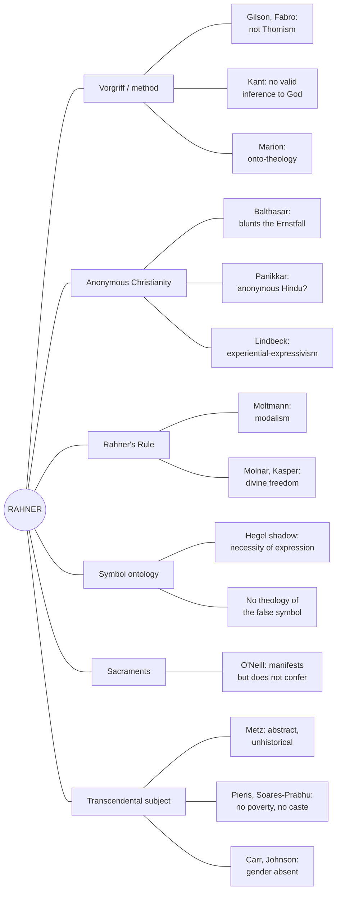
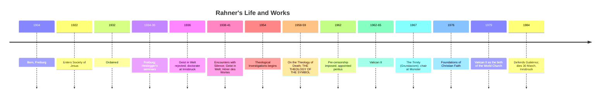

# 19 — Mind Maps and Diagrams

> [!info] Prev: [[18 - Rahner in the Indian Context]] · Next: [[20 - Flashcards]]

## 1. The whole system on one page

## 2. The symbol chain (the single most examinable diagram)

**One law all the way down:** *a being attains itself by expressing itself in another.*

## 3. Nature and grace — the three positions

## 4. God's one self-communication, three modalities

## 5. Critique map — who attacks what

## 6. Rahner vs the other giants — comparison table

| | **Rahner** | **Balthasar** | **Lonergan** | **Schillebeeckx** |
|---|---|---|---|---|
| Starting point | The **subject's** transcendental structure | The **form** (*Gestalt*) of revelation; glory | The **operations of consciousness**; intentionality analysis | **Experience** and its interpretation; hermeneutics |
| Key term | *Realsymbol*, supernatural existential | *Gestalt*, *Herrlichkeit*, *Ernstfall* | Transcendental precepts; conversion; method | Sacrament as encounter; "salvation from God in Jesus" |
| Method | Transcendental | Theological aesthetics / dramatics | Generalised empirical method | Historical-critical + hermeneutical |
| Non-Christians | Anonymous Christians (inclusivism) | Suspicious; stresses the scandal | Openness via conversion | Positive; stresses history and praxis |
| Christ | Unsurpassable self-communication | The form of God's glory; kenosis, Holy Saturday | Meaning and value transformed | The eschatological prophet; parable of God |
| Risk | Abstraction from history | Elitism; aestheticism | Formalism | Reduction to historical reconstruction |
| Strength | Universality of grace | Particularity, beauty, Cross | Methodological clarity | Historical and pastoral realism |

## 7. Timeline strip

## Self-check
- Reproduce diagram 2 from memory and explain each arrow.
- Reproduce diagram 3 and state which value each position secures and which it loses.
- For any four critics in diagram 5, state the critique and a reply.
