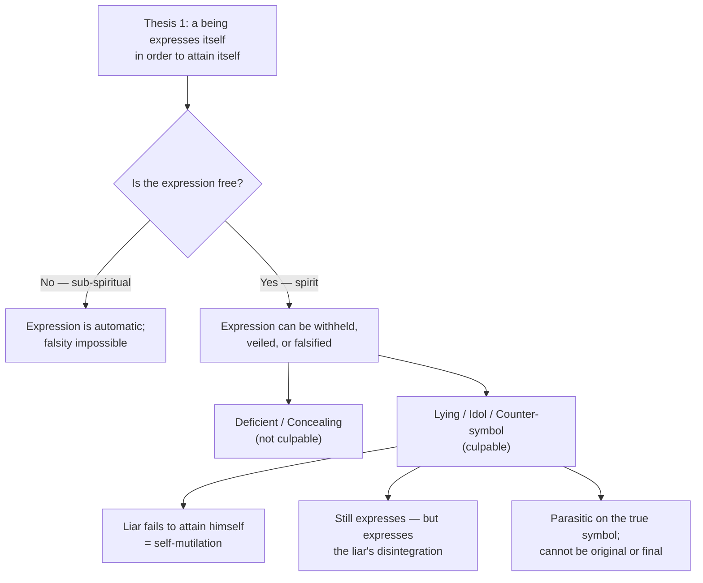

# 24 — The Theology of the False Symbol

> [!info] Prev: [[23 - Knowledge Graph]] · Presupposes [[07 - The Theology of the Symbol - The Core Essay]] and [[08 - Realsymbol Applied - Trinity, Christ, Church, Sacraments, Body]]

> [!warning] Status of this note — read first
> **Rahner did not write this.** Notes 01–18 expound him; this note **extends** him. Throughout, the register is marked:
> - **[R]** = Rahner's own stated position
> - **[R→]** = follows from Rahner's principles though he did not draw it
> - **[+]** = constructive proposal, mine to defend, not his to blame
>
> In an exam, keep these distinct. An examiner will reward a clearly flagged constructive extension and penalise the same material presented as exegesis.

---

## 1. The gap, stated precisely

Rahner's Thesis 1: *"All beings are by their very nature symbolic, because they necessarily 'express' themselves in order to attain their own nature."* **[R]**

The ontology is built to explain **plenitude**: the Father utters the Word, the Logos utters flesh, Christ utters the Church, the Church utters sacraments, the soul utters the body. Expression is fullness overflowing.

But the actual religious world is full of expressions that **do not tell the truth about what they express**:

| Case | The trouble |
|---|---|
| The hypocrite's smile | Genuine bodily expression — of something other than joy |
| Judas's kiss | The sign of love performing betrayal |
| A Eucharist at a segregated table | The rite says "one body"; the seating says "two" |
| A Church that abuses the vulnerable | The real symbol of Christ acting against Christ |
| A sacrament received in bad faith | The sign performed, the reality refused |
| Devotion that stops at the image | Symbol that has ceased to point beyond itself |

Rahner touches this only privatively: the Church is *ecclesia peccatrix*, a real symbol that can be a **deficient** expression of what it symbolises **[R]** → [[12 - Ecclesiology and Sacramental Theology]]. That is honest but thin. Deficiency is not the same as **falsity**, and a metaphysics that cannot distinguish them cannot say what is wrong with Judas.

> [!question] The question of this note
> **What is the ontological status of a symbol that misrepresents what it symbolises?**

---

## 2. First move: the false symbol is *not* a *Vertretungssymbol*

The tempting shortcut is to say: a false symbol is merely an arbitrary sign misapplied. **This is wrong, and getting it wrong wrecks everything after it.** **[+]**

> [!important] The load-bearing claim
> **A lying symbol deceives precisely because it is a real symbol, not an arbitrary one.**
> Judas's kiss betrays *because* a kiss really is the self-realisation of affection. If a kiss were a mere convention like a traffic light, the betrayal would carry no weight — one does not feel betrayed by a mislabelled road sign.

So: **falsity is a mode of real symbolisation, not its absence.** The false symbol borrows the whole ontological weight of the *Realsymbol* and turns it against the one who reads it. This is why the deepest wounds are inflicted through the truest signs — the parent's embrace, the priest's blessing, the friend's word.

**[+] Corollary — the parasitism thesis.** The false symbol is **ontologically parasitic**. Counterfeit currency circulates only because real currency exists; forgery presupposes signature; a lie presupposes a background of truth-telling. There can be no world in which most symbols are false, for then none would function and none could deceive. Falsity is therefore always **secondary, derivative, unoriginal** — Augustine's *privatio boni* transposed into semiotics: a *privatio veritatis symbolicae*.

---

## 3. A typology — five modes of symbolic failure

Not all failure is falsity. Distinguish, or you will call reticence a lie and a lie a limitation. **[+]**

| # | Mode | Definition | Culpable? | Example |
|---|---|---|---|---|
| 1 | **Deficient symbol** | Genuine expression, inadequate to what it expresses | **No** — this is finitude itself | Any human word about God; the Church always short of Christ |
| 2 | **Concealing symbol** | Expression that veils while revealing | **Not necessarily** | The composed face at a funeral; the *disciplina arcani*; the messianic secret |
| 3 | **Lying symbol** | Expression asserting what is not the case | **Yes** | Judas's kiss; the whitewashed tomb; Ananias's gift |
| 4 | **Idol** | Symbol that arrests the gaze instead of transmitting it | **Usually** | Clericalism; institutional self-preservation; devotion that stops at the image |
| 5 | **Counter-symbol / anti-sacrament** | Symbol that effects the **contrary** of what it signifies | **Yes, gravely** | Eucharist at a segregated table |

### On (1) — deficiency is not failure
Every finite symbol is deficient. **[R]** God remains incomprehensible even in the beatific vision → [[06 - God's Self-Communication and Quasi-Formal Causality]]. To call finitude "failure" would make creation itself a lie. Deficiency is the *condition* of creaturely symbolisation, not a defect in it.

### On (2) — concealment can be truthful
**[R→]** Rahner's own doctrine of God as absolute mystery requires this: revelation **conceals in revealing**. God's self-communication does not abolish incomprehensibility; it gives it. So a symbol that veils is not thereby false — it may be the only truthful way to express something that would be falsified by full display.

*Test for the difference:* concealment serves the reality; lying serves the expresser against the reality. Reticence protects what it does not show; hypocrisy substitutes for what it does not have.

### On (4) — borrowing Marion against Rahner's critic
**[+]** Jean-Luc Marion's **idol/icon** distinction (*God Without Being*) is usually deployed *against* Rahner → [[16 - Critical Reflection I - Philosophical]]. It is better used *inside* him:
- **Icon** — the gaze passes through toward the invisible; the symbol effaces itself in serving what it expresses.
- **Idol** — the gaze stops; the symbol reflects the viewer back to himself and goes opaque.

On Rahner's ontology the idol is a symbol that has **ceased to be transitive** — it no longer realises another in itself but only itself. This gives a precise account of clericalism: a ministry instituted to express Christ that now expresses the minister.

### On (5) — the anti-sacrament
This is the sharpest category and the real payoff of the note. See §6.

---

## 4. How is falsity possible at all? The ontological account

If being expresses itself in order to attain itself, how can expression go wrong? Four steps. **[+], built on [R]**

**Step 1 — Falsity requires freedom.**
In God, self-utterance is necessary, eternal and perfect: the Word is the adequate expression of the Father, and there is no gap **[R]** → [[08 - Realsymbol Applied - Trinity, Christ, Church, Sacraments, Body]]. In creatures below spirit, expression is automatic: a stone cannot misrepresent itself. Only where self-expression is **free** — where a being disposes of itself (*Grundentscheidung*, → [[13 - Theological Anthropology, Death and Eschatology]]) — can it be withheld, distorted, or falsified.

> [!important] Therefore: **the possibility of the false symbol is the price of spirit.**
> Lying is not a lower capacity than truth-telling; it is a *higher* one than mere deficiency, because it presupposes self-possession. Only someone who can express himself truly can express himself falsely. This is why hypocrisy is a *specifically* human and a specifically religious sin — cf. Aquinas, ST II-II q.111 a.2, that hypocrisy is a species of lying.

**Step 2 — The liar damages himself first.**
On Rahner's law, a being **attains itself** by expressing itself. It follows immediately that one who expresses himself falsely **fails to attain himself**. **[R→]**

> [!quote] The result worth stating in one line
> **The lie is self-mutilation before it is deception.** Whatever it does to the hearer, it first prevents the speaker from becoming who he is.

This grounds the intrinsic evil of lying without appeal to consequences — an argument Augustine (*De mendacio*) and Aquinas (ST II-II q.110) reach by other routes. Rahner's ontology gets there in one step, and this is arguably the strongest confirmation that the ontology is worth having.

**Step 3 — Nothing escapes self-expression, including falsity.**
The lying symbol still expresses — it expresses **the liar's disintegration**. Judas's kiss is a *false* symbol of love and a *true* symbol of Judas. So the false symbol does not defeat Thesis 1; it confirms it in a privative mode. **[R→]**

> [!tip] Pastoral consequence
> This is why hypocrisy eventually becomes legible. A person cannot indefinitely express what he is not, because he is expressing himself the whole time in everything else. The lie has to be maintained; the truth maintains itself. Institutions work the same way, which is why cover-ups fail late but reliably.

**Step 4 — Falsity is parasitic, therefore defeasible.**
Because the false symbol borrows its power from the true (§2), it can never be foundational and can always in principle be exposed by the reality it borrows from. **[+]** There is no symmetry between truth and falsehood in Rahner's ontology, and therefore no dualism: the counterfeit presupposes the coin.

---

## 5. Scriptural dossier

Scripture is far more interested in the false symbol than Rahner was. This is the strongest evidence that the gap is a real one.

| Text | The false symbol |
|---|---|
| **Lk 22:48** | "Judas, is it with a kiss that you are betraying the Son of Man?" — the paradigm case; note that Jesus names the *sign* itself as the scandal |
| **Mk 11:12–25** | The fig tree **in leaf but without fruit**, framed around the cleansing of the Temple — display without substance, cursed; the framing makes the tree an image of the Temple |
| **Mt 23:27–28** | **Whitewashed tombs** (*taphoi kekoniamenoi*) — "outwardly beautiful, but inside full of dead bones"; the exterior really expresses, and expresses falsely |
| **Mt 23:25** | Cleaning the **outside of the cup** — ritual purity as counter-symbol of inner rapacity |
| **Isa 1:11–17; Amos 5:21–24** | "I hate, I despise your festivals" — cult offered without justice is not deficient worship but **repudiated** worship |
| **1 Cor 11:17–34** | "It is **not the Lord's supper** that you eat"; "not discerning the body"; the assembly meets "not for the better but for the worse" — **the anti-sacrament, named** |
| **Acts 5:1–11** | **Ananias and Sapphira** — the gift as lying symbol; the sin is not the withholding but the *sign* of total gift over a partial one |
| **Jas 2:15–16** | "Go in peace, be warmed and filled" — the blessing as counter-symbol of the refusal to feed |
| **2 Tim 3:5** | "Holding to the **outward form of godliness** (*morphōsin eusebeias*) but denying its power" — almost a technical definition |
| **Ezek 13:10–16** | **Whitewashing a flimsy wall** — the false prophet's word as cosmetic symbol over structural collapse |

> [!note] What the dossier shows
> Biblically, the false symbol is not a marginal case but a **central prophetic concern**, and the prophets' verdict is consistently harsher on false worship than on no worship. A theology of symbol with no account of this cannot preach Amos or Matthew 23.

---

## 6. Application I — the Church as counter-witness

**The problem.** If the Church is the *Realsymbol* of the risen Christ **[R]**, what happens when it acts against him?

**[R→] Three theses:**

**(a) The Church does not cease to be Christ's symbol when it sins.**
Otherwise sin would have power to unmake the historical prolongation of the Incarnation. Compare the doctrine of the indelible **character** in orders and baptism: the minister who betrays remains ordained. The symbol persists under falsification — which is exactly what makes falsification possible and grave.

**(b) It becomes a *counter-witness* (*Gegenzeugnis*): it reveals Christ and obscures him in the same act.**
Not two alternating states, but one act with two symbolic vectors. The Church that preaches mercy while protecting an abuser expresses both, simultaneously, and the observer will believe the one enacted in bodies.

**(c) Therefore scandal in the Church is *ontologically* worse than the same act elsewhere.**

> [!important] The consequence Rahner's ontology forces
> Because a real symbol is the reality's own mode of presence, **what is done in the symbol is predicated of what it symbolises**. An assault committed by a bank employee defames a bank. An assault committed by a priest, in a Church that is Christ's real symbol, is read — accurately, on Rahner's own principles — as saying something about Christ.
>
> This is why the abuse crisis is a **theological** catastrophe and not merely a moral or administrative one, and why "a few bad individuals" is not merely a poor defence but an **ontologically incoherent** one. It presupposes exactly the *Vertretungssymbol* view of the Church that the whole essay was written to destroy.

**(d) The remedy is not disowning the symbol but re-expression.**
On Rahner's own law, the Church attains itself by expressing itself. Repentance is therefore not an interruption of the Church's symbolic function but its **exercise**: public, bodily, costly contrition is itself a real symbol, and one that expresses Christ truly. **[R→]** Concealment of sin is symbolic self-mutilation; confession of sin is symbolic self-attainment.

---

## 7. Application II — the sacramental lie

Rahner reinterprets *sacramenta significando causant* as **symbolic causality**: signifying and causing are one act **[R]** → [[12 - Ecclesiology and Sacramental Theology]].

**[+] Run the axiom in reverse and you get a doctrine of the anti-sacrament.**

> If a sacrament causes by signifying, then a rite that **signifies division** will **cause division** — by the same law, with the same efficacy.

This is not a rhetorical flourish. It is Paul's actual argument at 1 Cor 11: the Corinthian assembly performs the rite correctly and the meal "is not the Lord's supper," and the assembly meets "not for the better but for the worse." The rite retains its causal structure and its content has been inverted.

**Three levels of sacramental falsity:**

| Level | Who falsifies | Protected by | Result |
|---|---|---|---|
| **Minister** | The unworthy celebrant | ***Ex opere operato*** — the sacrament's objectivity does not rest on his holiness **[R]** | Sacrament valid; the minister lies about himself, not about the sacrament |
| **Recipient** | The one who receives in bad faith | Not protected | 1 Cor 11:29 — receives "judgement"; the *sacramentum* is present, the *res* refused |
| **Assembly** | The community whose enacted arrangements contradict the rite | **Nothing protects this** | The **counter-symbol**: two contradictory real symbols in one act |

> [!important] The rule of competing symbols **[+]**
> **When a verbal symbol and a bodily symbol contradict each other, the bodily one is believed.**
> This follows directly from Rahner's own doctrine that the body is the person's real symbol and that human knowing runs through the *phantasma* → [[02 - Philosophical Foundations I - Spirit in the World]], [[08 - Realsymbol Applied - Trinity, Christ, Church, Sacraments, Body]]. Words are the thinner symbol; arrangements of bodies are the thicker one; and the thicker, repeated weekly, wins.

### The caste case, now completed

Note 18 built an argument against caste segregation at the Eucharist and stopped at step 3 for want of this doctrine → [[18 - Rahner in the Indian Context]]. It can now be finished:

1. The body is the person's *Realsymbol*: what is done to bodies is done to persons. **[R]**
2. The Church is Christ's *Realsymbol*; the Eucharist is the Church's self-realisation. **[R]**
3. A Eucharist celebrated with segregated seating, separate cemeteries, separate cups or a divided procession enacts **two contradictory real symbols in one act** — "one body" verbally, "two bodies" bodily. **[+]**
4. By the rule of competing symbols, the bodily one is what is actually communicated and therefore, by *significando causant*, what is actually **caused**. The rite produces division while saying unity. **[+]**
5. Therefore this is not a moral supplement to sacramental theology but a **sacramental defect in the act itself** — which is precisely Paul's charge at 1 Cor 11:29, that failing to discern the body makes the assembly's meal not the Lord's Supper.

> [!example] The everyday version
> A house draws a *rangoli* at its threshold — the real symbol of welcome, the household expressing its own hospitality — and then turns away the guest who comes to it. Or: a public garlanding of Ambedkar's statue in a village that maintains the two-tumbler system at the tea shop. In each case the symbol is not weakened but **inverted**: it now expresses, with full symbolic force, the falsity of the one who performs it.

---

## 8. Five criteria for discerning a false symbol

**[+]** A workable test, since the ontology is useless pastorally unless it can be applied.

| # | Criterion | Question | Source |
|---|---|---|---|
| 1 | **Fruit** | Does what it produces match what it claims? | Mt 7:16; the fig tree |
| 2 | **Coherence** | Do the verbal symbol and the bodily symbol agree? | The rule of competing symbols, §7 |
| 3 | **Cost** | Does the symbol cost the expresser anything? A costless symbol of self-gift is suspect | Balthasar's *Ernstfall* → [[17 - Critical Reflection II - Theological]] |
| 4 | **Direction** | Does it point beyond itself, or arrest attention on itself? | Marion's icon/idol |
| 5 | **Victim** | **Who is excluded by this symbol?** Ask them — they read it accurately | Metz's *memoria passionis*; Soares-Prabhu |

> [!important] Why criterion 5 matters most
> It is the point where the critiques of notes 16–18 stop being **objections to** Rahner's ontology and become **operations within** it. Metz, Pieris and Soares-Prabhu argue that the transcendental subject arrives too late at suffering. Criterion 5 answers structurally: **the excluded are the privileged readers of symbols**, because a false symbol is transparent from underneath and opaque from above. The man at the head of the procession cannot see that the procession is divided; the man at its tail can see nothing else.
>
> This is a genuine integration, not a truce — and it is the single most useful thing in this note.

---

## 9. The Cross — the limit case that resolves everything

The Cross looks like a false symbol, and by every ordinary criterion it fails:

- Omnipotence expressed as total helplessness.
- Kingship expressed by a placard nailed up in mockery (Jn 19:19).
- The Son of God expressed as one apparently abandoned by God (Mk 15:34).

**[+] Why it is nevertheless the truest symbol.**

There is no gap between expression and expressed at Golgotha. The apparent contradiction *is* the content: God's power **is** self-emptying love, so a symbol showing omnipotence as helplessness is not a lie about God but the one adequate statement of him. Pilate's title, intended as a *Vertretungssymbol* of contempt, turns out to be **objectively true** and is written in three languages so that all may read it.

> [!important] Two payoffs at once
> **(a) The criterion of falsity is refined.** A symbol is false not when it *looks unlike* what it expresses but when it *is unlike* it. Judas's kiss looks like love and is not; the Cross looks like defeat and is love. Appearance is not the test — **coincidence of expression and reality** is.
>
> **(b) The kenosis gap closes.** Note 17 charged that a metaphysics of self-expression as *self-attainment* has no room for the Cross as **self-emptying** → [[17 - Critical Reflection II - Theological]]. The answer is now available and Rahner never gave it: **at the Cross, self-expression and self-emptying are the same act.** The Son attains himself precisely in pouring himself out (Phil 2:6–11), because what he is, is self-gift. Far from being an exception to Thesis 1, the Cross is its supreme instance — and the point at which the thesis has to be read Christologically rather than merely metaphysically.

> [!note] The honest addition
> If this reply works, it also **corrects** Thesis 1 as stated. Rahner wrote that a being expresses itself "in order to attain its own nature," which sounds acquisitive — expression as a means to self-possession. The Cross requires the stronger form: **for a being whose nature is self-gift, expressing itself and expending itself are one and the same.** That is not a gloss on Rahner; it is an amendment, and it is the amendment Balthasar was asking for.

---

## 10. Interlocutors — who has actually worked this ground

Rahner did not, but others have. Cite these when defending the note.

| Thinker | Contribution |
|---|---|
| **Louis-Marie Chauvet**, *Symbol and Sacrament* (1987 / ET 1995) | The major post-Rahnerian sacramental theology. Replaces the scholastic triad *sign–cause–instrument* with *symbol–linguistic act–mediation*, and does possess a typology of sacramental corruption — though on a **different axis** from this note's. **The indispensable dialogue partner: see §10a.** |
| **Jean-Luc Marion**, *God Without Being* | Icon/idol — supplies category 4 |
| **Paul Ricoeur**, *Freud and Philosophy*; *The Symbolism of Evil* | The **hermeneutics of suspicion**: Marx, Nietzsche and Freud are precisely theorists of the false symbol — of consciousness expressing what it does not know and concealing what it does |
| **Augustine**, *De mendacio*; **Aquinas**, ST II-II qq.110–111 | The classical analysis of lying and of *simulatio* / hypocrisy as a species of lying |
| **Pierre Bourdieu**, on symbolic violence | Secular but indispensable for the structural cases (caste, class): how symbols enforce domination while appearing natural |
| **Metz**; **Pieris**; **Soares-Prabhu** | Supply criterion 5 → [[18 - Rahner in the Indian Context]] |
| **Stephen M. Fields SJ**, *Being as Symbol* | The standard defence of Rahner's ontology; note that even Fields does not address falsity — evidence the gap is real and not merely my reading |

---

## 10a. Chauvet checked — where this note stands corrected

> [!warning] Sourcing caveat, stated first
> This section was compiled from the publisher's description, reviews, and a chapter-by-chapter reading summary — **not from the book open in front of me.** The "three temptations" below are a summariser's rendering, not Chauvet's verbatim wording, and **no page references are given because none have been verified.** Before teaching this section, read *Symbol and Sacrament* Part II (symbolic exchange) and the chapter on Christian identity, and replace the paraphrases with real citations.

**Bibliographic detail, verified.** Louis-Marie Chauvet, *Symbole et sacrement: une relecture sacramentelle de l'existence chrétienne* (Paris: Cerf, 1987); ET *Symbol and Sacrament: A Sacramental Reinterpretation of Christian Existence*, trans. Madeleine M. Beaumont and Patrick Madigan SJ (Collegeville: Liturgical Press, 1995).

### What checks out

- **The onto-theology critique is the book's actual project**, not an incidental theme. Chauvet argues that scholastic sacramental theology adopted the language of *causality* because of its onto-theological metaphysics, not because causality was theologically apt — grace, being (in his phrase) a **non-object, a non-value**, resists instrumental and productionist categories.
- **"Symbolic exchange and mediation"** is right: the programme replaces *sign, cause, instrument* with *symbol, linguistic act, mediation*.
- **He does have a doctrine of sacramental corruption**, and this note's claim on that point survives — see below.

### Correction 1 — Chauvet's target is Aquinas, not Rahner

**This note's earlier wording implied Chauvet critiques Rahner. He does not, at least not centrally.** The critique of the "productionist scheme" is aimed at **Thomas Aquinas and classical scholasticism**; the opening argument tracks shifts within Aquinas's own thought between the *Sentences* commentary and the *Summa*. Rahner is not the antagonist.

The accurate statement is **succession, not attack**: reviewers place Chauvet as the first radically different European sacramental theology since the transformation of neo-scholasticism by **Rahner and Schillebeeckx**. He displaces the causality framework that Rahner was still working to reinterpret from inside — which is a real difference, but a difference of generation and strategy, not a polemic.

> [!tip] How to say it in an essay
> "Rahner reinterprets sacramental causality **as** symbolic causality; Chauvet proposes to abandon the register of causality altogether in favour of symbolic exchange. Chauvet is not refuting Rahner but declining the terrain on which Rahner fought."

### Correction 2 — Chauvet's typology of corruption runs on a different axis from mine

He identifies **three temptations**, each a way of "killing the presence of the absence" of the Risen One — of converting him into *a dead body or an available object*:

| Chauvet's temptation | What it does |
|---|---|
| **Closed systems of religious knowledge** | Doctrine that masters the mystery instead of serving it |
| **Sacramental magic** | The rite as a technique that secures grace as a product |
| **Moralism divorced from God's otherness** | Ethics that no longer receives, only performs |

> [!important] The distinction that matters
> **Chauvet's axis is grasping; mine is misrepresenting.**
> His corrupt symbol is the symbol **held too tightly** — reified, objectified, made available, turned from gift into possession. My lying symbol is the symbol that **says what is not the case** — Judas's kiss, the divided assembly saying "one body."
>
> These are genuinely different failures, and **neither typology contains the other**. His "sacramental magic" overlaps my **idol** (§3.4) almost exactly. But he has no equivalent of the **lying symbol** or the **counter-symbol**, and I have no equivalent of his first and third temptations. The honest verdict: this note's §3 typology is **complementary to Chauvet, not derived from him and not superseded by him.**

### Correction 3 — his ethics-as-verification is a stronger ally than I claimed

Chauvet structures Christian identity as a triad — **Scripture / Sacrament / Ethics**, corresponding to *cognition–recognition–praxis* — and holds that abstracted from one another the three lose their meaning. Crucially, **ethics functions as the return-gift that verifies the reception of the divine gift**: sacraments are valueless if they are not the living memory of the crucified God and if they do not lead worshippers to become in their practice what they have received.

That is an independent route to **criterion 1 (fruit)** and **criterion 5 (victim)** in §8, and it substantially reinforces the **anti-sacrament** argument of §7: on Chauvet's own terms, a liturgy that does not issue in the practice it signifies has failed *as liturgy*, not merely as morals. Cite him here — it is the strongest external support this note has.

### The real tension — and it touches §2

Chauvet's governing formula is **"the presence of the absence."** The liturgical assembly is the sacramental representation of the *absence* of the Risen One; Christ is symbolically present precisely as bodily absent, and the temptation is always to fill that absence with an available object.

**Rahner's *Realsymbol* runs the other way: the symbol is the reality's own mode of maximal presence.**

This bears directly on §2's load-bearing claim that a false symbol deceives *because* it is a real symbol. On Rahner's account, that works: the symbol carries genuine presence and can therefore be turned against its reader. On Chauvet's account, one would have to say instead that the false symbol deceives by **converting an absence into a possession** — the lie is not misrepresented presence but refused absence.

> [!question] Open question, worth an essay
> Are these two accounts of symbolic falsity reconcilable, or does a Chauvetian reading dissolve §2? A defensible answer: they name **the two directions** in which symbolisation fails — Rahner's ontology exposes the symbol that **says what is not**, Chauvet's exposes the symbol that **holds what cannot be held**. If so, the five-mode typology of §3 needs a sixth column for possessive falsity, and this note is incomplete as it stands.

---

## 11. Summary — the seven claims of this note

1. The false symbol is **not** an arbitrary sign; it deceives *because* it is a real symbol. **[+]**
2. Five modes must be distinguished: deficient, concealing, lying, idol, counter-symbol. Only the last three are culpable. **[+]**
3. Falsity is possible only for **free spirit** — it is the price of self-possession. **[+]**
4. The liar **fails to attain himself**: the lie is self-mutilation before it is deception. **[R→]**
5. Falsity is **parasitic** on truth and therefore never original, never final, and always in principle exposable. **[+]**
6. Run *significando causant* in reverse and you get the **anti-sacrament**: a rite signifying division causes division. This completes the caste argument of note 18. **[+]**
7. The **Cross** shows that the test of a true symbol is not resemblance but the coincidence of expression and reality — and in closing that question it also closes the kenosis gap of note 17. **[+]**
8. **Open and unfinished:** Chauvet's "presence of the absence" names a *second* direction of symbolic falsity — the symbol held too tightly rather than the symbol that misrepresents. §3's typology does not yet cover it. → §10a **[+]**

> [!tip] The thesis sentence if you write this as an essay
> "Rahner's ontology of the symbol has no doctrine of the lying symbol, and the omission is not accidental: an ontology in which being expresses itself *in order to attain itself* is built to explain plenitude. Yet the resources for the missing doctrine are his own. Because self-expression in spirit is free, it can be falsified; because a being attains itself by expressing itself, the falsifier fails to attain himself; and because symbolic causality is real, a rite that signifies division causes it. The completed doctrine does not overturn Rahner — it makes his ecclesiology able to say what is wrong with a Church that betrays, and his sacramental theology able to say what is wrong with a Eucharist that divides."

## Self-check
- Why is it fatal to classify the false symbol as a *Vertretungssymbol*?
- Distinguish the five modes of symbolic failure, and say which are culpable and why.
- Why can only a free being produce a false symbol? What follows about the liar?
- State the rule of competing symbols and apply it to a case in your own diocese.
- Explain the anti-sacrament and show where Paul states it.
- Give the five criteria of discernment. Why is criterion 5 the most important?
- How does the Cross both refine the criterion of falsity and close the kenosis gap?
- Which claims in this note are Rahner's, which follow from him, and which are additions?
- State Chauvet's three temptations. Which one overlaps this note's typology, and which two do not?
- Why is it inaccurate to say Chauvet "critiques Rahner"? State the relation precisely.
- Contrast "the presence of the absence" with the *Realsymbol* as maximal presence. Does the contrast damage §2?
