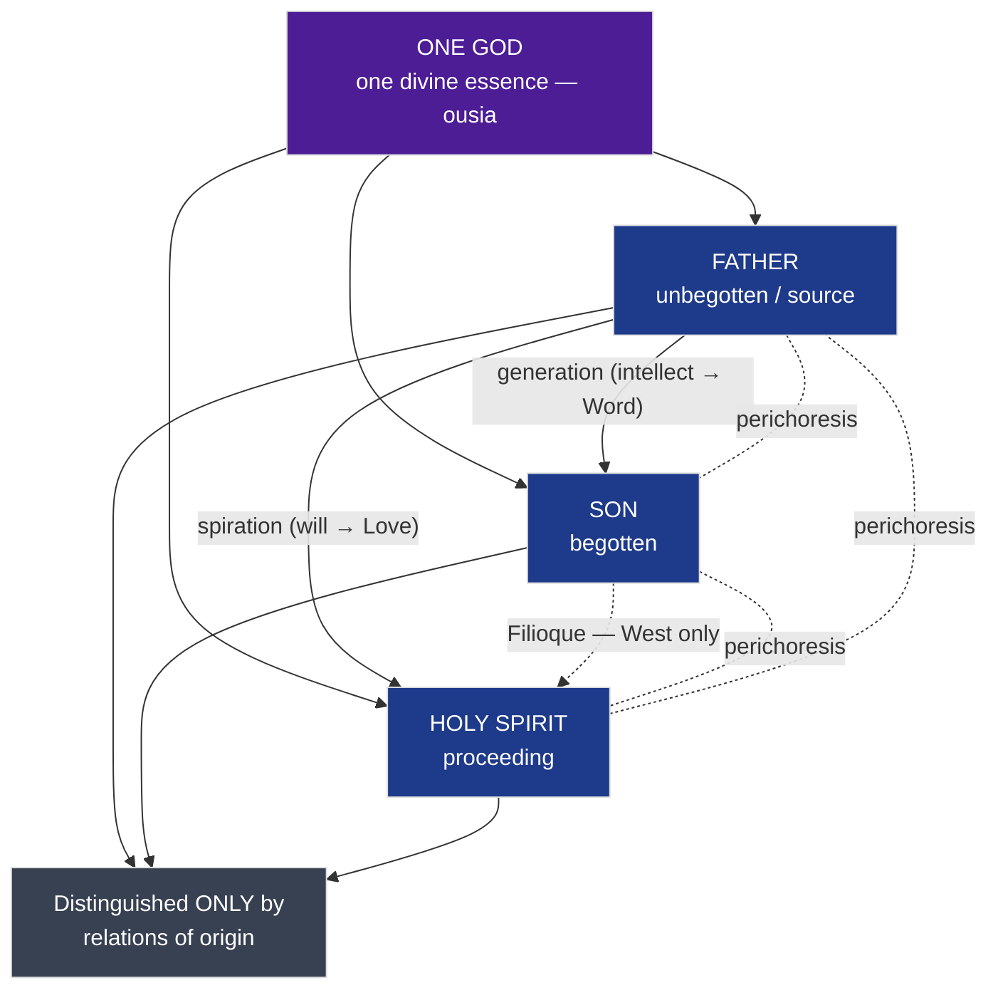
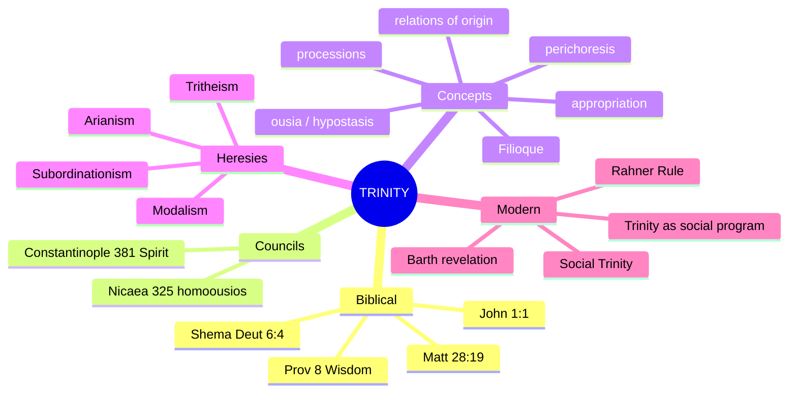
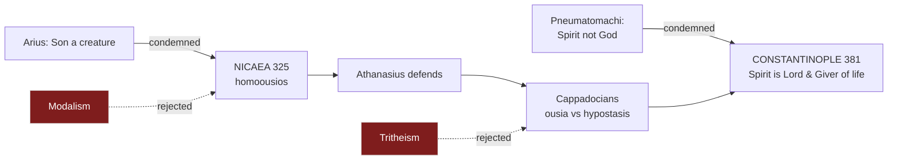

# 08 — Mind Map of the Dogma

> [!info] Home: [[Theology of the Trinity - Course Home]] · reads with [[03 - Systematic Concepts and Terminology]]
> Mermaid renders live in Obsidian reading/live-preview mode.

## 1. The structure of the dogma

## 2. Topic overview (mindmap)

## 3. Councils & heresies map

> [!tip] Study use
> Diagram 1 = **what the dogma says**. Diagram 2 = **whole-topic recall net**. Diagram 3 = **how history got there**. Reproduce Diagram 1 from memory before an exam.
