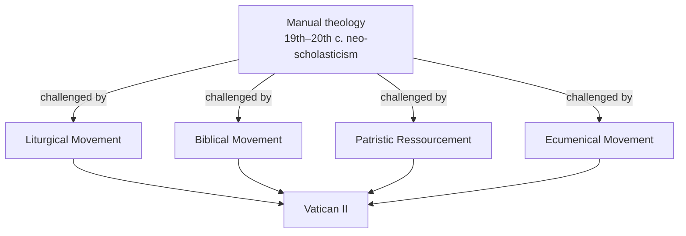

# 02 — The Church Before the Council

> [!info] Why this note matters
> You cannot see what Vatican II changed unless you can picture what came before. This note builds that picture.

## 1. The fortress Church (roughly 1789–1959)

From the French Revolution onward, the Catholic Church understood itself as **under siege**. Revolution had killed and exiled clergy, seized Church property, and replaced Christian worship with a cult of Reason. What followed — liberalism, nationalism, socialism, historical-critical scholarship, evolutionary science — looked like more of the same attack.

The response was defensive, and it hardened over a century:

| Year | Act | Effect |
|------|-----|--------|
| 1864 | Pius IX, *Syllabus of Errors* | Condemned 80 propositions of the modern age; famously rejected the idea that the Pope should reconcile himself with "progress, liberalism and modern civilisation" |
| 1870 | Vatican I | Defined papal infallibility and universal primacy |
| 1907 | Pius X, *Pascendi* and *Lamentabili* | Condemned "Modernism" as the "synthesis of all heresies" |
| 1910 | Anti-Modernist Oath | Required of clergy and teachers until 1967 |
| 1950 | Pius XII, *Humani Generis* | Warned against the "new theology"; several theologians silenced |

The result was a Church of enormous internal confidence and almost no external dialogue. Its theology was taught from **manuals** — standardised Latin textbooks presenting a simplified scholasticism as timeless truth. Its worship was uniform, Latin, and unchanged in essentials since Trent. Its self-image was the **societas perfecta**: a complete, self-sufficient society, hierarchical from top to bottom, whose members were divided into "the Church teaching" (clergy) and "the Church taught" (everyone else).

> [!quote] The picture in one image
> A fortress on a hill. Well built, well defended, well provisioned. The drawbridge is up.

## 2. What ordinary Catholic life looked like

Concretely, before 1962:

- **Mass** was in Latin, said by the priest facing the altar, with his back to the people. Much of it was inaudible — the Roman Canon was recited silently.
- The **people's role** was to attend, watch, and pray privately. Many prayed the Rosary during Mass. Receiving Communion frequently was not the norm.
- **Scripture** was not widely read by lay Catholics. Bible reading was quietly regarded as a Protestant practice.
- **Other Christians** were "separated brethren" at best, heretics and schismatics in the formal vocabulary. Attending a Protestant service required permission.
- **Non-Christian religions** were regarded, in the ordinary teaching, as human constructions outside the order of salvation.
- **Religious liberty** as a civil right was not Catholic doctrine. The official position was that error has no rights; a Catholic state should privilege Catholicism.

Every single item on that list was changed or reframed by the Council. That is the measure of what happened.

## 3. The movements that undermined the fortress from within

Here is the crucial point, and the one students most often miss: **Vatican II was not a bolt from the blue.** Four scholarly movements had been building for decades, all of them doing the same thing — going *behind* the manuals to older sources.

**The Liturgical Movement.** Begun by Dom Prosper Guéranger at Solesmes in the 19th century and developed by Lambert Beauduin, Odo Casel, Romano Guardini and Josef Jungmann. Its claim: the liturgy is the *public prayer of the whole Church*, not a clerical performance the people observe. Pius X had already encouraged frequent Communion and called for the faithful's "active participation" in 1903 — the very phrase the Council would adopt. → [[04 - Sacrosanctum Concilium - The Liturgy]]

**The Biblical Movement.** Catholic scholars gaining access to historical-critical method. The turning point was Pius XII's encyclical *Divino Afflante Spiritu* (1943), which permitted and encouraged study of the original languages and literary forms. This made *Dei Verbum* possible. → [[06 - Dei Verbum - Divine Revelation]]

**Patristic *ressourcement*.** French theologians — Henri de Lubac, Jean Daniélou, Yves Congar, Marie-Dominique Chenu — returning to the Greek and Latin Fathers. They founded the *Sources Chrétiennes* series to put patristic texts back in circulation. Their argument: the manuals were not "the tradition"; they were one recent, narrow slice of it. This was labelled *la nouvelle théologie* by its opponents and was the target of *Humani Generis* (1950).

**The Ecumenical Movement.** Largely Protestant and Orthodox in origin — the World Council of Churches was formed in 1948. Catholics were forbidden to take part. Congar's *Chrétiens désunis* (1937) argued for Catholic engagement anyway; he was disciplined for it.

> [!warning] The rehabilitation
> De Lubac, Congar, Chenu, Rahner, Murray — several of the theologians silenced or restricted in the 1940s and 50s were invited to the Council as ***periti*** (expert advisers) and became the principal drafters of its documents. The men under suspicion in 1950 were writing the Church's teaching by 1964. Hold on to this: it explains why the prepared texts were rejected so quickly.

## 4. The immediate pre-conciliar situation

By 1959 there was, in effect, **two theologies operating in the same Church**:

| | Roman manual theology | *Ressourcement* theology |
|---|---|---|
| Base | Neo-scholastic manuals | Scripture, Fathers, liturgy |
| Method | Deductive — from principles to conclusions | Inductive/historical — from sources and experience |
| Church as | *Societas perfecta*, hierarchical institution | Mystery, communion, People of God |
| Toward the world | Condemnation, defence | Dialogue, engagement |
| Institutional power | Held the Roman congregations and the preparatory commissions | Held the universities and the best young minds |

The preparatory commissions drafting the Council's texts were dominated by the first column, chiefly through the Holy Office under **Cardinal Alfredo Ottaviani**. The bishops who arrived in Rome in October 1962 — many with *ressourcement* theologians as their personal advisers — largely belonged to the second.

That collision is the Council's opening act. → [[03 - How the Council Ran]]

## 5. One counterweight worth naming

Not everything before the Council was defensive. Pius XII, for all the caution of *Humani Generis*, prepared the ground in three specific ways:

- ***Mystici Corporis*** (1943) — the Church as the **Mystical Body of Christ**, an organic and mystical reality, not merely an institution. *Lumen Gentium* builds directly on this.
- ***Divino Afflante Spiritu*** (1943) — opened Catholic biblical scholarship.
- ***Mediator Dei*** (1947) — the first papal encyclical on the liturgy; cautious, but it accepted the liturgical movement's core principle.

> [!tip] Exam framing
> If asked "was Vatican II continuity or rupture?", this section is your evidence for continuity: every major conciliar move has a pre-conciliar root. The counter-case is in [[10 - After the Council]].

## Recall
- The pre-conciliar Church's self-image was::*societas perfecta* — a complete, self-sufficient hierarchical society
- The *Syllabus of Errors* (1864) was issued by::Pius IX
- Modernism was condemned in 1907 by::Pius X, in *Pascendi Dominici Gregis* and *Lamentabili*
- *Humani Generis* (1950) was issued by::Pius XII, warning against *la nouvelle théologie*
- The four pre-conciliar renewal movements were::liturgical, biblical, patristic (*ressourcement*), ecumenical
- *Divino Afflante Spiritu* (1943) did what::opened Catholic biblical scholarship to historical-critical method and the original languages
- *Mystici Corporis* (1943) taught::the Church as the Mystical Body of Christ
- *Sources Chrétiennes* was founded to::put patristic texts back into circulation (de Lubac, Daniélou)
- A *peritus* is::an expert theological adviser at the Council
- The irony of the periti is that::several had been silenced under Pius XII, then became the Council's principal drafters
- Before the Council, the laity were described as::"the Church taught", as distinct from the clergy, "the Church teaching"

---
**Prev:** [[01 - What a Council Is and Why Vatican II Happened]] · **Next:** [[03 - How the Council Ran]] · **Up:** [[Vatican II - Course Home]]
