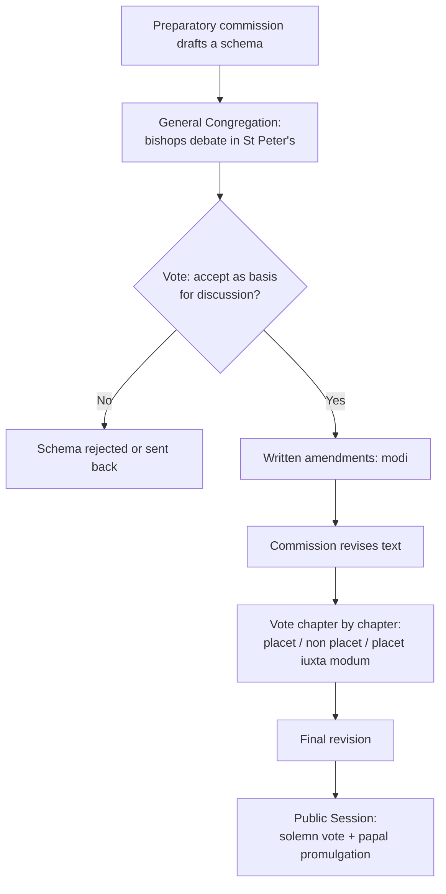

# 03 — How the Council Ran

> [!info] Why the mechanics matter
> The documents were shaped as much by *procedure* as by theology — who sat on which commission, who could speak, what could be voted on. Understanding the machinery explains why particular texts came out as they did.

## 1. The scale

- Around **2,500 bishops** attended, the largest gathering of bishops in Church history. (Vatican I had about 700; Trent rarely more than 250.)
- They came from every continent — for the first time a genuinely **worldwide** council, not a European one with guests.
- Plus several hundred ***periti*** (theological experts), **observers** from other Christian communions, and later **lay auditors**, including women from the third session onward.
- Working language: **Latin**, spoken aloud, all day. This mattered practically — bishops whose Latin was weak were at a disadvantage, and it favoured the Europeans.

## 2. The four sessions

Each session ran roughly October to early December; the bishops went home in between, and the commissions worked through the year.

| Session | Dates | Pope | What happened | Documents promulgated |
|---------|-------|------|---------------|----------------------|
| **I** | 11 Oct – 8 Dec 1962 | John XXIII | The prepared texts were rejected. Nothing was finished. | none |
| **II** | 29 Sep – 4 Dec 1963 | Paul VI | Debate on the Church and on bishops; liturgy completed | *Sacrosanctum Concilium*, *Inter Mirifica* |
| **III** | 14 Sep – 21 Nov 1964 | Paul VI | *Lumen Gentium* finished; "Black Week" | *Lumen Gentium*, *Orientalium Ecclesiarum*, *Unitatis Redintegratio* |
| **IV** | 14 Sep – 8 Dec 1965 | Paul VI | Everything else, in a rush | the remaining 11 documents |

> [!warning] Session I produced no documents at all
> This is not a failure — it is the most important session. In those ten weeks the bishops took the Council away from the preparatory commissions. Everything after that was possible only because of it.

## 3. The players

**The two popes**

| | John XXIII (r. 1958–63) | Paul VI (r. 1963–78) |
|---|---|---|
| Role | Called the Council, set its tone, opened it | Steered it to completion |
| Style | Warm, intuitive, willing to let debate run | Anxious, precise, preoccupied with the majority not crushing the minority |
| Key act | *Gaudet Mater Ecclesia*; intervening to withdraw the revelation schema | The *Nota praevia*; personally guaranteeing texts would pass with near-unanimity |

> [!tip] Understanding Paul VI
> He is often read as having "braked" the Council. Fairer: he was determined that no document should pass by a bare majority, because a council that splits its bishops produces a schism. Nearly every intervention he made was aimed at bringing the conservative minority *inside* the final vote. The cost was compromise texts with tensions left unresolved — which is exactly what later interpreters would fight over. → [[10 - After the Council]]

**The Curial party** — chiefly **Cardinal Alfredo Ottaviani**, head of the Holy Office, who had controlled the preparatory commissions. Motto: *Semper idem* ("always the same"). Not villains: they held that a council's job is to restate and defend received doctrine.

**The transalpine majority** — bishops of France, Germany, Belgium, the Netherlands, Austria, with the *ressourcement* theologians as advisers. Cardinals **Liénart** (Lille), **Frings** (Cologne), **Döpfner** (Munich), **Suenens** (Brussels), **Alfrink** (Utrecht), **Léger** (Montreal), **König** (Vienna).

**Cardinal Augustin Bea** — German Jesuit biblical scholar, head of the newly created **Secretariat for Promoting Christian Unity**. His secretariat, created almost as an afterthought in 1960, ended up producing *Unitatis Redintegratio*, *Nostra Aetate* and *Dignitatis Humanae* — three of the Council's most consequential texts.

**The *periti*** — Karl Rahner, Yves Congar, Henri de Lubac, Joseph Ratzinger (then a young adviser to Frings), Hans Küng, Edward Schillebeeckx, Marie-Dominique Chenu, John Courtney Murray, Jean Daniélou. They could not vote or speak in the hall, but they drafted the texts, briefed the bishops, and lectured in the evenings.

> [!quote] The real mechanism of influence
> Bishops voted. *Periti* wrote. A bishop who could not draft a Latin amendment overnight depended entirely on the theologian at his elbow. That is how a small number of scholars shaped a document approved by 2,000 bishops.

## 4. The procedure, step by step

The three voting formulas are worth knowing:

| Latin | Meaning | Effect |
|-------|---------|--------|
| ***Placet*** | "It pleases" — yes | Approval |
| ***Non placet*** | "It does not please" — no | Rejection |
| ***Placet iuxta modum*** | "Yes, with reservations" | Conditional yes, submitted with a specific amendment |

*Placet iuxta modum* is the interesting one. A flood of them forced the commission back to the text, and it became the minority's main instrument for extracting changes without voting no outright.

## 5. Five procedural facts that changed the outcome

1. **13 October 1962 — the elections are stopped.** On the Council's first working day the bishops were handed lists to elect the ten commissions that would write the documents; the lists were effectively the preparatory membership. Cardinal **Liénart** rose and asked for an adjournment so that the bishops could actually get to know one another and propose their own candidates. **Frings** immediately backed him. The session was suspended after about fifteen minutes. When the elections were held days later, the composition of the commissions had shifted decisively. → [[09 - The Turning Points]]

2. **The Council set its own agenda.** Once the bishops controlled the commissions, the prepared texts had no protection.

3. **Two-thirds majority required.** This is why the minority mattered far beyond its size, and why Paul VI worked so hard for near-unanimity.

4. **Observers were present throughout.** Protestant and Orthodox observers sat in the hall, were briefed, and their reactions circulated. Drafts on ecumenism and revelation were written in the knowledge that they were being read by the people they described.

5. **The commissions worked between sessions.** The real drafting happened in Rome during the year, out of sight, by small groups. Membership of a commission was therefore worth more than any speech in the hall.

## 6. What the Council did *not* do

- It defined **no new dogma**.
- It condemned **no one** — no anathemas, no list of errors.
- It made no change to the **creed**, to the **sacraments' substance**, or to **moral doctrine**. (Contraception was explicitly withdrawn from the Council's competence and reserved to the Pope, producing *Humanae Vitae* in 1968.)

> [!warning] Standard exam trap
> "Vatican II changed Church teaching on X." Almost always false as stated. The Council changed **emphasis, expression, discipline, and pastoral practice** — and reframed how doctrines relate to one another. Distinguishing those from doctrinal change is most of the skill in this subject.

## Recall
- Roughly how many bishops attended Vatican II::about 2,500 — the largest council in Church history
- The working language of the Council was::Latin
- Session I (1962) produced how many documents::none
- The four sessions ran in the years::1962, 1963, 1964, 1965 — each roughly October to December
- *Placet* / *non placet* / *placet iuxta modum* mean::yes / no / yes with reservations (a conditional approval carrying an amendment)
- The majority needed to approve a text was::two-thirds
- Cardinal Ottaviani led::the Holy Office and the conservative curial party; motto *Semper idem*
- Cardinal Bea led::the Secretariat for Promoting Christian Unity
- On 13 October 1962 Cardinal Liénart::asked for the commission elections to be postponed so bishops could choose their own candidates — backed by Frings
- The Secretariat for Christian Unity produced which documents::*Unitatis Redintegratio*, *Nostra Aetate*, *Dignitatis Humanae*
- Contraception was handled how::withdrawn from the Council and reserved to the Pope; resulted in *Humanae Vitae* (1968)
- Joseph Ratzinger was at the Council as::a young *peritus*, theological adviser to Cardinal Frings

---
**Prev:** [[02 - The Church Before the Council]] · **Next:** [[04 - Sacrosanctum Concilium - The Liturgy]] · **Up:** [[Vatican II - Course Home]]
