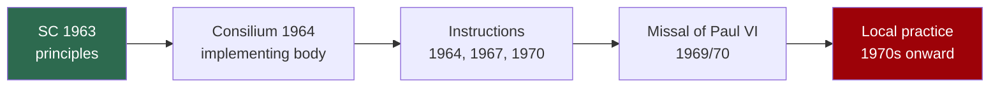

# 04 — *Sacrosanctum Concilium* — The Liturgy

> **Constitution on the Sacred Liturgy** · promulgated **4 December 1963** · the Council's **first** completed document

## 1. Why liturgy came first

Partly accident, partly design. The liturgy schema was the **best-prepared text** the commissions handed over — because the liturgical movement had been working on these questions for fifty years, its draft was mature while others were not. So it was debated first.

But the order also mattered symbolically. Beginning with worship said: the Church is defined first by what it does before God, not by its structures of government.

> [!tip] Exam point
> *Sacrosanctum Concilium* is the document ordinary Catholics actually noticed. For most of the faithful, "Vatican II" **means** the changes in the Mass. Understanding what the document says — as against what was later done in its name — is the single most useful distinction in this whole subject.

## 2. The core idea: *participatio actuosa*

Everything follows from one phrase.

> [!quote] SC 14 — the hinge of the whole document
> Mother Church earnestly desires that all the faithful should be led to that **full, conscious, and active participation** in liturgical celebrations which is demanded by the very nature of the liturgy... and to which the Christian people... have a right and obligation by reason of their baptism.

Three words, each doing work:

- **Full** (*plena*) — the whole person, not merely the mind
- **Conscious** (*conscia*) — understanding what is happening
- **Active** (*actuosa*) — doing something, not watching

And the ground of it: **baptism**. Participation is not a concession granted by the clergy. It is a *right and duty* flowing from the sacrament every Christian has received.

> [!warning] Common misreading
> *Actuosa* does not mean "busy". Active participation is not achieved by giving everyone a job to do in the sanctuary. Silence, listening, and interior assent are forms of *actuosa participatio*. The Latin means engaged, not occupied.

## 3. What liturgy *is* — the theology underneath

**Liturgy is an action of Christ.** Not primarily something the Church does for God, but something Christ does, in which the Church is caught up.

> [!quote] SC 7
> Every liturgical celebration, because it is an action of Christ the priest and of His Body which is the Church, is a sacred action surpassing all others.

**Liturgy is the summit and the source.**

> [!quote] SC 10
> The liturgy is the summit toward which the activity of the Church is directed; at the same time it is the font from which all her power flows.

The Latin is *culmen et fons* — often given as "source and summit". Learn it in both directions:
- **Summit** — everything the Church does leads *toward* worship
- **Font/source** — everything the Church does flows *from* worship

**Liturgy is a foretaste of heaven** (SC 8) — the earthly liturgy participates in the heavenly one.

**But it is not everything.** SC 12–13 explicitly protects private prayer and popular devotions, provided they harmonise with the liturgy. A useful corrective against liturgical maximalism.

## 4. The principles of reform

| Principle | Reference | What it means |
|-----------|-----------|---------------|
| **Noble simplicity** | SC 34 | Rites short, clear, free of useless repetition; understandable without much explanation |
| **Substance preserved** | SC 21 | Distinguish the *unchangeable* (divinely instituted) from the *changeable* (humanly instituted) |
| **Sound tradition + legitimate progress** | SC 23 | Change only where genuine good requires it; new forms should grow organically from existing ones |
| **Communal over private** | SC 27 | Communal celebration preferred to individual and quasi-private |
| **Richer fare from Scripture** | SC 51 | More of the Bible, over a wider cycle |

## 5. The specific changes

**Language.** The most visible change, and the most misunderstood.

> [!quote] SC 36
> The use of the Latin language is to be **preserved** in the Latin rites. But since the use of the mother tongue... frequently may be of great advantage to the people, the limits of its employment may be extended.

Read that carefully. The document **preserves Latin as the norm** and permits vernacular in certain parts, leaving the extent to bishops' conferences with Roman confirmation. Full vernacular celebration was **not** mandated by the Council — it came afterwards, through the post-conciliar reform and episcopal decisions. This gap between text and implementation is the root of the later liturgical dispute. → [[10 - After the Council]]

**Scripture.** A three-year Sunday cycle and a two-year weekday cycle replaced the old one-year cycle, vastly expanding the Bible heard at Mass. Arguably the reform's most durable achievement.

**The homily** was made effectively obligatory on Sundays and holy days, and defined as part of the liturgy itself (SC 52).

**Prayer of the Faithful** (universal prayer) restored (SC 53).

**Concelebration** extended (SC 57). **Communion under both kinds** permitted in defined cases (SC 55).

**Sacramental rites revised** (SC 59–82) — including restoration of the adult **catechumenate** (SC 64), which produced the RCIA.

**Divine Office** reformed for genuine use, including by laity (SC 83–101).

**Music.** Gregorian chant given "pride of place" (*principem locum*, SC 116); polyphony preserved; other forms admitted; the pipe organ held in high esteem while other instruments may be used (SC 120).

**Art.** Noble beauty rather than mere extravagance (SC 124).

**Inculturation.** SC 37–40 is the doorway that made an Indian liturgy possible:

> [!quote] SC 37
> Even in the liturgy the Church has no wish to impose a rigid uniformity in matters which do not involve the faith or the good of the whole community. Rather she respects and fosters the qualities and talents of the various races and nations.

→ [[11 - Vatican II in the Indian Context]]

**What SC never mentions:** the priest facing the people (*versus populum*), Communion in the hand, removal of altar rails, replacement of chant with guitars. None of these are in the document. They came later, through implementation.

## 6. The gap between document and implementation

The Council voted principles. A post-conciliar body — the *Consilium*, under Annibale Bugnini — produced the actual rites. The **Missal of Paul VI** appeared in 1969/70.

> [!warning] The distinction that earns marks
> "Vatican II abolished Latin" — **false**. "Vatican II turned the altars around" — **false**; not in the text. What is true: the Council authorised a reform, and the reform as executed went considerably further than the letter of SC required. Whether that execution was a faithful development or an overreach is precisely the argument that has run ever since. Give both sides; do not simply assert one.

## 7. Where the tensions lie

| Tension | One side | Other side |
|---------|----------|------------|
| Latin vs vernacular | SC preserves Latin; chant has pride of place | Comprehension serves *participatio actuosa* |
| Organic growth vs commission design | SC 23: new forms grow from existing ones | The 1970 Missal was substantially constructed |
| Uniformity vs inculturation | Roman rite's integrity | SC 37–40 mandates adaptation |
| Vertical vs horizontal | Liturgy as Christ's action, foretaste of heaven | Liturgy as the assembly's self-expression |

## Recall
- *Sacrosanctum Concilium* was promulgated on::4 December 1963 — the Council's first document
- Why was liturgy treated first::its schema was the best prepared, product of fifty years of the liturgical movement
- *Participatio actuosa* means::full, conscious and active participation of all the faithful (SC 14)
- Active participation is grounded in::baptism — a right and duty of every Christian
- SC 10 calls the liturgy::the summit toward which the Church's activity is directed and the font from which her power flows (*culmen et fons*)
- SC 7 says every liturgical celebration is::an action of Christ the priest and of his Body the Church
- What does SC 36 actually say about Latin::Latin is to be *preserved*; vernacular may be extended where advantageous — full vernacular was not mandated
- "Noble simplicity" (SC 34) means::rites short, clear, free of useless repetition, understandable without much explanation
- Gregorian chant is given::"pride of place" (*principem locum*), SC 116
- SC 37–40 permits::legitimate variation and adaptation to the genius of different peoples — the basis for inculturation
- The reformed lectionary introduced::a three-year Sunday cycle and two-year weekday cycle
- The Missal of Paul VI appeared in::1969/70, produced by the post-conciliar *Consilium*
- Does SC require the priest to face the people::no — *versus populum* is nowhere in the document

---
**Prev:** [[03 - How the Council Ran]] · **Next:** [[05 - Lumen Gentium - The Church]] · **Up:** [[Vatican II - Course Home]]
