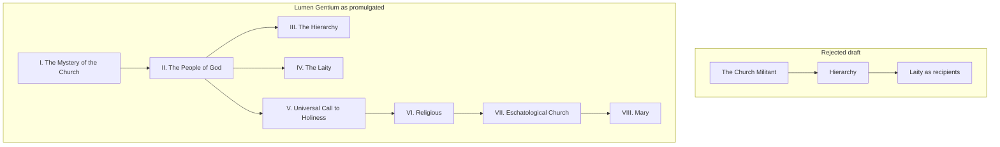

# 05 — *Lumen Gentium* — The Church

> **Dogmatic Constitution on the Church** · promulgated **21 November 1964** · the Council's central document

> [!info] If you learn one document, learn this one
> *Lumen Gentium* is where the Council answers the question it was really called to answer: **what is the Church?** Everything else depends on it.

## 1. The rejected draft

The preparatory schema *De Ecclesia* described the Church in the manual style: a visible, hierarchical, juridical society; a chapter on the Pope, a chapter on bishops, a chapter on the laity as recipients. It was criticised as juridical, clericalist, and triumphalist, and was sent back.

The redrafted text made two structural decisions that carry the whole theology:

**Decision 1 — Begin with mystery, not structure.** Chapter I is "The Mystery of the Church". Before any question of who governs, the Church is presented as a reality rooted in the Trinity — a *sacrament*, "a sign and instrument of communion with God and of unity among all people" (LG 1).

**Decision 2 — Put the People of God before the hierarchy.** In the reordered text, Chapter II is **"The People of God"** — the whole baptised body — and only then Chapter III treats the hierarchy.

> [!quote] Why the chapter order is itself the argument
> Placing "People of God" before "Hierarchy" says: what Christians have **in common** — baptism, the Spirit, the call to holiness — is more fundamental than what **distinguishes** them. Office exists *within* the People of God, serving it; it does not stand above it. This reordering is the single most consequential editorial decision of the Council.

## 2. *Subsistit in* — the most argued-over words of the Council

The old formulation, in *Mystici Corporis* and the draft: the Mystical Body of Christ **is** (*est*) the Roman Catholic Church. Full stop. Everything outside is simply not Church.

*Lumen Gentium* 8 changed one verb:

> [!quote] LG 8
> This Church, constituted and organised in the world as a society, **subsists in** (*subsistit in*) the Catholic Church, governed by the successor of Peter and by the bishops in communion with him, although many elements of sanctification and of truth are found outside her visible confines.

Why this matters:

| *est* ("is") | *subsistit in* ("subsists in") |
|---|---|
| Strict identity | The Church of Christ is **fully realised** in the Catholic Church... |
| Everything outside is non-Church | ...**and** real ecclesial elements exist outside it |
| No basis for ecumenism | Grounds ecumenism: what is outside is genuinely, if incompletely, of Christ |

> [!warning] What *subsistit in* does NOT mean
> It does not mean "the Church of Christ is one denomination among many" or that all communions are equally the Church. The Council maintained that the Church of Christ subsists **in the Catholic Church** — fullness is there. What changed is that the elements outside are now acknowledged as **real and salvific**, not merely counterfeit. Get this balance right; examiners probe it from both sides.

This single verb made *Unitatis Redintegratio* possible. → [[08 - The Other Twelve Documents]]

## 3. Collegiality — the Council's fiercest fight

**The problem** (from [[01 - What a Council Is and Why Vatican II Happened]]): Vatican I defined papal primacy and infallibility but was cut off before treating bishops. Result: a Church that looked like a monarchy with branch managers.

**The teaching** (LG 22–23): the bishops form a **college**, successor to the college of the apostles, with the Pope as its head. This college, *together with and never without its head*, also holds supreme authority over the universal Church.

Three clarifications that stop the standard misunderstandings:

1. A bishop is **not** a papal delegate. He receives authority through **episcopal consecration** itself (LG 21), not by papal grant.
2. The college **never acts against or without** the Pope. There is no "two supreme powers" competing.
3. Each bishop has care for the **whole** Church, not merely his diocese (LG 23).

**Why it was fought so hard.** The minority feared collegiality would relativise papal primacy — turn the Pope into a constitutional monarch answerable to a parliament of bishops. The majority held it simply restored the ancient and patristic understanding that Vatican I had left half-stated.

> [!warning] The *Nota praevia explicativa*
> In November 1964 — "**Black Week**" — Paul VI attached an **explanatory note** to *Lumen Gentium* on his own authority, clarifying that the college has no authority apart from its head, and that the Pope may always act alone. It was added *after* the debate, at the Pope's direction, to secure the minority's votes.
>
> Its status is disputed to this day: is it part of the Council's teaching, or an authoritative gloss upon it? Whichever answer you give, know that this is where the interpretative fight over collegiality begins. → [[09 - The Turning Points]]

Practical fruits: the **Synod of Bishops** (established by Paul VI in 1965), strengthened **episcopal conferences**, and in our own time the synodality programme of Pope Francis.

## 4. The universal call to holiness (Chapter V)

Perhaps the most quietly revolutionary chapter.

> [!quote] LG 40
> All the faithful of Christ of whatever rank or status are called to the fullness of the Christian life and to the perfection of charity.

Before this, the practical assumption was a **two-tier spirituality**: priests and religious pursued perfection; the laity aimed at not sinning. *Lumen Gentium* abolishes the tiers. There is **one holiness**, lived in different states of life. A married accountant is called to exactly the same perfection as a Carmelite — by a different route.

This chapter is the seed of everything the modern Church says about lay vocation.

## 5. The laity (Chapter IV)

- Laypeople share in Christ's **priestly, prophetic and kingly** office by baptism (LG 31).
- Their distinctive sphere is the **secular** — family, work, politics, culture. They sanctify the world *from within*, "like leaven" (LG 31).
- They have the **right and sometimes the duty** to make their opinion known to their pastors on matters concerning the good of the Church (LG 37).

> [!tip] The *sensus fidei*
> LG 12: the whole body of the faithful "cannot err in matters of belief" when, from bishops to the last of the lay faithful, it shows universal agreement in matters of faith and morals. The believing instinct of the whole People of God is a genuine *locus* of truth — not merely a passive echo of the hierarchy. This is a *ressourcement* recovery, and it underpins the current theology of synodality.

## 6. The remaining chapters

**VI — Religious life.** Consecrated life belongs to the Church's holiness, not to its hierarchical structure. It is a state, not a rank.

**VII — The eschatological Church.** The Church is a **pilgrim**, "at once holy and always in need of purification" (LG 8), journeying toward fulfilment, in communion with the saints in heaven.

**VIII — Mary.** The Council took a decisive vote here: rather than issue a separate Marian document, it placed Mary **inside** the Constitution on the Church — as its pre-eminent member and model. The vote was extremely close (roughly 1,114 to 1,074 in October 1963). The decision expresses an ecclesiological choice: Mary is understood *within* the mystery of the Church, not as a parallel devotional track.

## 7. The images of the Church

*Lumen Gentium* deliberately refuses a single definition, offering a cluster of biblical images (LG 6–7): sheepfold, cultivated field, building, temple, spouse, Body of Christ.

| Model | Emphasis | Weakness alone |
|-------|----------|----------------|
| **Institution** | Visible order, continuity | Legalism, clericalism |
| **Mystical Body** | Organic union with Christ | Can obscure the visible, human, sinful reality |
| **People of God** | Historical, pilgrim, all the baptised | Can sound merely sociological |
| **Sacrament** | Sign *and* instrument of unity | Abstract |
| **Communion (*koinonia*)** | Trinitarian relationship | Vague if not specified |

> [!tip] Exam answer
> Asked "how does *Lumen Gentium* define the Church?" — the strong answer is that it **does not offer a single definition**. It presents the Church as a **mystery** requiring multiple complementary images, with *People of God* and *sacrament* as the governing ones. Claiming a single definition loses marks.

## Recall
- *Lumen Gentium* was promulgated on::21 November 1964
- The rejected draft of *De Ecclesia* was criticised as::juridical, clericalist and triumphalist
- Chapter order in LG runs::I Mystery — II People of God — III Hierarchy — IV Laity — V Call to Holiness — VI Religious — VII Eschatological — VIII Mary
- Why does People of God precede Hierarchy::what Christians share by baptism is more fundamental than what distinguishes them; office serves within the People of God
- *Subsistit in* (LG 8) means::the Church of Christ subsists in the Catholic Church, while real elements of sanctification and truth exist outside her visible confines
- *Subsistit in* replaced which word::*est* — strict identification of the Church of Christ with the Catholic Church
- Collegiality means::the bishops form a college, successors of the apostolic college, with the Pope as head, together holding supreme authority (LG 22)
- A bishop receives his authority through::episcopal consecration itself, not papal delegation (LG 21)
- The *Nota praevia explicativa* was::an explanatory note attached to LG by Paul VI in November 1964, stating the college never acts without its head
- "Black Week" refers to::November 1964 — the *Nota praevia* and the postponement of the religious liberty vote
- The universal call to holiness (LG 40) teaches::all the faithful of whatever rank are called to the fullness of Christian life and perfection of charity
- *Sensus fidei* (LG 12) means::the supernatural instinct of the whole body of the faithful, which cannot err when universally agreed
- Mary is treated where::in Chapter VIII of *Lumen Gentium*, not a separate document — decided by a very narrow vote in October 1963
- The Church is called a *sacrament* in the sense of::a sign and instrument of communion with God and of unity among all people (LG 1)

---
**Prev:** [[04 - Sacrosanctum Concilium - The Liturgy]] · **Next:** [[06 - Dei Verbum - Divine Revelation]] · **Up:** [[Vatican II - Course Home]]
