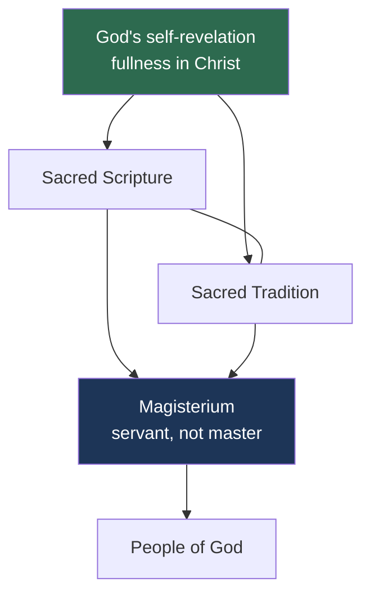

# 06 — *Dei Verbum* — Divine Revelation

> **Dogmatic Constitution on Divine Revelation** · promulgated **18 November 1965** · the shortest of the four constitutions and, many argue, the most important

> [!info] Why it matters most
> *Dei Verbum* is about how God communicates at all. Get this wrong and every other document is misread. It is short — 26 paragraphs — and worth reading in full.

## 1. The fight that started the Council

The preparatory schema was called ***De fontibus revelationis*** — "On the **Sources** of Revelation", plural. It taught the **two-source theory**: Scripture is one source of revelation, Tradition is a second, separate source, containing truths not found in Scripture at all.

In **November 1962**, during the first session, this text was attacked from the floor as scholastically narrow, ecumenically disastrous, and unrepresentative of the Fathers.

The vote to reject it fell **short of the two-thirds** needed to throw it out — but a clear majority had voted against. Procedurally the text survived; morally it was dead.

**John XXIII then intervened personally**, withdrew the schema, and ordered it rewritten by a mixed commission drawing on both the Theological Commission and Bea's Secretariat for Christian Unity.

> [!warning] Why this is the Council's real turning point
> This was the moment the bishops learned they could refuse the prepared texts, and the moment the Pope showed he would back them. Everything the Council later did rests on that precedent. → [[09 - The Turning Points]]
>
> It also took three more years. *Dei Verbum* was finally promulgated in November 1965 — begun first, finished nearly last.

## 2. Revelation is a **person**, not a set of propositions

This is the central move of the document, and the one to memorise.

The old manual model: revelation = a body of supernatural **truths** that God communicated, which the Church guards and transmits. Faith = intellectual assent to those propositions.

*Dei Verbum*'s model:

> [!quote] DV 2
> It pleased God, in his goodness and wisdom, to reveal **himself** and to make known the mystery of his will... by this revelation the invisible God, out of the abundance of his love, speaks to men as friends and lives among them, so that he may invite and take them into fellowship with himself.

Revelation is God's **self-disclosure**, aimed at **communion**. Truths are communicated — but as part of a personal self-gift, not instead of it.

| | Propositional model | *Dei Verbum* model |
|---|---|---|
| What is revealed | Truths *about* God | **God himself** |
| Purpose | Correct knowledge | **Communion / fellowship** |
| Faith is | Assent to propositions | "The obedience of faith" — the whole person entrusted to God (DV 5) |
| Medium | Words | "Deeds and words having an inner unity" (DV 2) |
| Fullness | The complete list of doctrines | **Christ** — mediator and fullness of all revelation (DV 2) |

> [!quote] DV 4
> Jesus Christ... completed and perfected revelation... The Christian dispensation, therefore, as the new and definitive covenant, will never pass away, and we now await no further new public revelation.

## 3. Scripture and Tradition — **one** source, not two

The rewritten document refuses the two-source theory:

> [!quote] DV 9
> Sacred Tradition and Sacred Scripture, then, are bound closely together and communicate one with the other. For both of them, flowing **from the same divine wellspring**, in a certain way merge into a unity and tend toward the same end.

One source — the self-revelation of God in Christ — reaching us through two channels. The Council deliberately declined to say that Tradition contains truths materially absent from Scripture. It left that question **open**, which was itself the decision.

> [!tip] The image to remember
> Not two pipes from two reservoirs. **One reservoir, two pipes.**

## 4. The Magisterium is a **servant**

> [!quote] DV 10
> The task of authentically interpreting the word of God, whether written or handed on, has been entrusted exclusively to the living teaching office of the Church... This teaching office is **not above the word of God, but serves it**, teaching only what has been handed on.

A striking self-limitation. The Magisterium is not a third source alongside Scripture and Tradition; it is the servant of the one word of God.

DV 10 also states the three are "so linked and joined together that one cannot stand without the others."

## 5. Inspiration and inerrancy — the careful sentence

> [!quote] DV 11 — parse this slowly
> The books of Scripture must be acknowledged as teaching firmly, faithfully, and without error **that truth which God wanted put into the sacred writings for the sake of our salvation**.

The qualifying clause is the whole point. Scripture is without error **in what it affirms for the sake of salvation**. The Bible is not a textbook of astronomy, geology or history; its inerrancy attaches to its saving message.

> [!warning] Handle with precision
> This is *not* "parts of the Bible are wrong". The Council did not divide Scripture into reliable and unreliable sections. It specified the **formal object** of inerrancy: the truth God willed for our salvation. How narrowly or broadly to read that clause was debated then and is debated now.

**God's condescension.** DV 13 draws a fine analogy: God's words expressed in human language are like the Word made flesh — divine content in genuinely human form. So the human authors were true authors, with their own language, culture, and literary forms.

**Literary forms.** DV 12 directs the interpreter to attend to genre — poetry, history, prophecy, parable — and to the conventions of the author's time and culture. This ratified for the whole Church what *Divino Afflante Spiritu* (1943) had permitted. → [[02 - The Church Before the Council]]

DV 12 also gives three theological criteria, to prevent interpretation collapsing into pure historical technique:
1. Read with attention to **the content and unity of the whole of Scripture**
2. Read within **the living Tradition of the whole Church**
3. Read with attention to **the analogy of faith**

## 6. Old and New Testament

The classic Augustinian formula, adopted at DV 16:

> [!quote]
> God, the inspirer and author of both Testaments, wisely arranged that the New Testament be **hidden in** the Old and the Old be **made manifest in** the New.

The Old Testament is not superseded rubbish; it retains permanent value (DV 14–15). The four Gospels are affirmed as of "historical character", handing on faithfully what Jesus did and taught (DV 19) — while acknowledging the evangelists selected, synthesised and explicated in the light of the resurrection.

## 7. Scripture in the life of the Church (Chapter VI)

The practical payoff, and the one most visible in ordinary Catholic life:

- **DV 21** — the Church venerates the Scriptures **as she venerates the Body of the Lord**. An extraordinary parallel: two tables, word and Eucharist.
- **DV 22** — easy access to Scripture should be provided for **all** the faithful; good translations, including from the original languages, and — notably — translations produced **in cooperation with other Christians**.
- **DV 25** — all the faithful are urged to frequent reading of Scripture, because "**ignorance of the Scriptures is ignorance of Christ**" (St Jerome). Clergy especially must be steeped in it.

> [!tip] What actually changed
> Catholic Bible reading, Bible study groups, the expanded lectionary, biblical preaching, ecumenical translations. Before the Council these were widely regarded as Protestant practices. *Dei Verbum* made them Catholic duties.

## Recall
- *Dei Verbum* was promulgated on::18 November 1965
- The rejected preparatory schema was called::*De fontibus revelationis* — "On the Sources of Revelation"
- The two-source theory held::Scripture and Tradition are two separate sources, Tradition containing truths absent from Scripture
- Who withdrew the schema in November 1962::John XXIII, personally, after the vote to reject fell short of two-thirds
- DV 2 teaches that God reveals::himself — not merely truths about himself — inviting humanity into fellowship
- The fullness of revelation is::Jesus Christ; no further new public revelation is awaited (DV 4)
- DV 9 on Scripture and Tradition::both flow from the same divine wellspring and merge into a unity toward the same end
- DV 10 on the Magisterium::it is not above the word of God but serves it, teaching only what has been handed on
- DV 11 on inerrancy::Scripture teaches without error that truth which God wanted put into the sacred writings *for the sake of our salvation*
- DV 12 requires interpreters to attend to::literary forms and the author's culture, plus the unity of Scripture, living Tradition, and analogy of faith
- DV 16 on the two Testaments::the New is hidden in the Old, the Old is made manifest in the New
- DV 21 says the Church venerates Scripture::as she venerates the Body of the Lord
- "Ignorance of the Scriptures is ignorance of Christ" is quoted from::St Jerome, at DV 25

---
**Prev:** [[05 - Lumen Gentium - The Church]] · **Next:** [[07 - Gaudium et Spes - The Church in the Modern World]] · **Up:** [[Vatican II - Course Home]]
