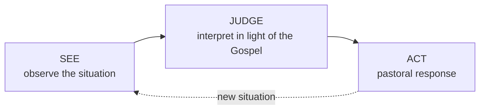

# 07 — *Gaudium et Spes* — The Church in the Modern World

> **Pastoral Constitution on the Church in the Modern World** · promulgated **7 December 1965** · the last document, and the only one with no precedent in the history of councils

## 1. A document nobody planned

*Gaudium et Spes* was not in the preparatory schemas. It began as "Schema 17", later "Schema 13", proposed during the Council itself — reportedly at the prompting of Cardinal Suenens and encouraged by John XXIII — on the argument that a council which had spent years talking about the Church's *interior* life ought to say something about the world it was sent to.

It was drafted last, debated hardest, and finished with the Council days from closing.

> [!info] The strange title
> **"Pastoral Constitution"** — a category invented for this document. "Constitution" signals high authority; "Pastoral" signals that much of its content addresses a *particular historical situation* rather than defining permanent doctrine. A footnote attached to the title makes exactly this point: the first part is doctrinal, the second applies doctrine to contingent circumstances that will change.
>
> This built-in qualification is why the document's authority has been argued over ever since. → [[10 - After the Council]]

## 2. The opening sentence

> [!quote] GS 1 — learn this by heart
> The joys and the hopes, the griefs and the anxieties of the people of this age, especially those who are poor or in any way afflicted, these too are the joys and hopes, the griefs and anxieties of the followers of Christ. Indeed, nothing genuinely human fails to raise an echo in their hearts.

Read what it actually claims. Not "the Church has advice for the world". Rather: **the world's experience is the Church's own experience.** There is no distance to be crossed, because the Church *is* people living in this world. And the poor and afflicted are named first.

Compare the *Syllabus of Errors* (1864) from [[02 - The Church Before the Council]]. Exactly one century separates them. Nothing shows the shift more sharply.

## 3. Method: reading the signs of the times

The Council adopts an **inductive** method here, and it is the formal novelty of the document.

> [!quote] GS 4
> To carry out such a task, the Church has always had the duty of scrutinising the **signs of the times** and of interpreting them in the light of the Gospel.

Deductive method starts from timeless principles and applies them downward. This document starts from **the actual human situation** and asks what the Gospel says to it. That reversal is why GS became the charter of later contextual theologies — liberation theology in Latin America, and Indian contextual theology. → [[11 - Vatican II in the Indian Context]]

> [!warning] Where the deepest disagreement lies
> This method, and this document, are the fault line between two theological traditions — sometimes labelled the **Augustinian** (de Lubac, von Balthasar, Ratzinger: the world is fallen, the Church must not be naïve about it) and the **Thomist/transcendental** (Rahner, Chenu, Congar: grace perfects nature, the world is already graced). *Gaudium et Spes* leans toward the second, and this is precisely what its critics objected to — not conservatism versus progress, but two serious accounts of nature and grace. This is Chapter 04 of your *Battle for Meaning* guide.

## 4. Part I — the human person

**Christ reveals humanity to itself.** The most quoted line of the document, and the one John Paul II built a pontificate on:

> [!quote] GS 22
> In reality it is only in the mystery of the Word made flesh that the mystery of man truly becomes clear... Christ, the final Adam, by the revelation of the mystery of the Father and his love, **fully reveals man to man himself** and makes his supreme calling clear.

Christian anthropology is Christological. You learn what a human being is by looking at Christ.

**Human dignity** (GS 12–22) — rooted in the image of God, not in usefulness, capacity or status.

**Conscience** (GS 16) — "the most secret core and sanctuary of a person", where one is alone with God, whose voice echoes in its depths. Conscience must be **formed**, and it must be **obeyed**.

**Freedom** (GS 17) — genuine freedom is an "exceptional sign of the image of God", not the absence of constraint but the capacity to choose the good.

**Atheism** (GS 19–21) — treated at length and, notably, **not condemned**. The Council examines its causes, and admits that believers themselves bear part of the blame: to the extent that Christians conceal rather than reveal God by their lives, they "must be said to conceal rather than to reveal the authentic face of God" (GS 19).

**Community** (GS 23–32) — the human person is social by nature; the common good; solidarity.

**Human activity** (GS 33–39) — work and technical progress have genuine value, not merely instrumental.

> [!tip] The autonomy of earthly realities (GS 36)
> Created things and societies "enjoy their own laws and values", to be gradually discovered and used. Science has a **rightful autonomy** which the Church respects. But this is *rightful* autonomy, not absolute independence from God. A distinction with a long afterlife in Church–science relations.

## 5. Part II — five urgent problems

| Chapter | Topic | Key contribution |
|---------|-------|------------------|
| I | Marriage and family | Redefined as an "**intimate partnership of life and love**" (GS 48); a *covenant*, not a contract. Refused to rank procreation above mutual love as the "primary end" — a deliberate departure from the manuals. Responsible parenthood (GS 50). |
| II | Culture | A right to culture; faith and culture must interact; the Church is not bound to any single culture (GS 58) — **the doctrinal basis of inculturation** |
| III | Economic and social life | Labour over capital; the universal destination of goods; private property is real but not absolute; just wage |
| IV | Political community | The common good; the Church is not tied to any political system (GS 76); citizens' participation |
| V | Peace and international community | See below |

**On war and peace (GS 77–82).** The strongest language in the document:

> [!quote] GS 80
> Any act of war aimed indiscriminately at the destruction of entire cities or of extensive areas along with their population is a **crime against God and man himself**. It merits unequivocal and unhesitating condemnation.

This is one of the very few condemnations the Council issued. It also affirms the right of legitimate defence, calls the arms race a treacherous trap that injures the poor intolerably (GS 81), and urges provision in law for **conscientious objectors** (GS 79).

## 6. Criticism — take it seriously

You will be expected to know that *Gaudium et Spes* has serious theological critics, not merely reactionary ones.

- **Too optimistic.** Written in the confidence of the mid-1960s; some judge it insufficiently reckoning with sin, the cross, and the tragic. Its critics note it was promulgated shortly before 1968 and the collapse of that confidence.
- **Ratzinger's critique.** He worked on the text and later argued that parts approached a "downright Pelagian" tone, and that its picture of the relation between nature and grace was too smooth.
- **Von Balthasar and de Lubac** raised related concerns about a Church too eager to be at home in the world.
- **Dated.** By its own admission tied to a specific historical moment — the language of "modern man" reads now as very much of 1965.

> [!tip] Balanced exam answer
> Grant the criticisms, then note what has proved durable: GS 22 (Christ reveals man to man), the dignity of conscience, the social teaching, the condemnation of total war, and the method of reading the signs of the times. The optimism dated; the anthropology did not.

## Recall
- *Gaudium et Spes* was promulgated on::7 December 1965 — the last document of the Council
- It was originally known as::Schema 17, later Schema 13 — it was not among the preparatory texts
- "Pastoral Constitution" signifies::high authority (constitution) but content partly addressing contingent historical circumstances (pastoral)
- The opening line of GS 1 says::the joys and hopes, griefs and anxieties of this age, especially of the poor and afflicted, are those of the followers of Christ
- "Signs of the times" (GS 4) means::the Church must scrutinise the events of the age and interpret them in the light of the Gospel
- The method of GS is::inductive — see, judge, act — starting from the human situation rather than from timeless principles
- GS 22 teaches::Christ fully reveals man to man himself and makes his supreme calling clear
- GS 16 describes conscience as::the most secret core and sanctuary of a person, where they are alone with God
- GS 36 teaches the::rightful autonomy of earthly realities and of the sciences — autonomy, not independence from God
- GS 48 defines marriage as::an intimate partnership of life and love, established by covenant
- GS 80 condemns::any act of war aimed indiscriminately at the destruction of entire cities or areas with their populations
- GS 79 asks states to make provision for::conscientious objectors
- How does GS treat atheism::examines its causes without condemning it, and admits believers may share the blame by concealing God's face
- Ratzinger's later criticism of GS was::that parts approach a "Pelagian" tone and its account of nature and grace is too optimistic

---
**Prev:** [[06 - Dei Verbum - Divine Revelation]] · **Next:** [[08 - The Other Twelve Documents]] · **Up:** [[Vatican II - Course Home]]
