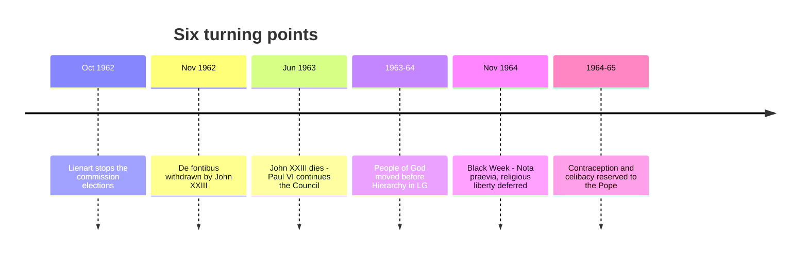

# 09 — The Turning Points

> [!info] What this note is for
> Six moments where the Council could have gone another way. Knowing these turns a list of documents into a story you can actually narrate in an exam.

> [!warning] Pending expansion
> This note is written from the public record of the Council. Ralph Wiltgen's *The Inside Story of Vatican II* — a journalist's firsthand account of the manoeuvring behind these moments — is **not yet incorporated**. When it is, this note and [[03 - How the Council Ran]] will gain the most.

---

## 1. The bishops seize the Council — 13 October 1962

**The situation.** Day one of business. The bishops are handed ballots to elect the ten commissions that will draft every document. Most of them have never met each other. The obvious move is to re-elect the preparatory members — who were largely chosen by the Roman congregations.

**What happened.** Cardinal **Achille Liénart** of Lille rose and proposed that the vote be deferred so the bishops could consult, form their own judgement, and nominate their own candidates. Cardinal **Josef Frings** of Cologne immediately supported him. The session was suspended within about fifteen minutes.

**Why it mattered.** When elections were held days later, the commissions no longer reflected preparatory control. The Council had taken possession of itself on its first working day.

> [!quote] The significance in one line
> If this had not happened, the Council would have ratified the texts it was handed, and there would have been no Vatican II as we know it.

---

## 2. The rejection of *De fontibus* — November 1962

**The situation.** The schema on revelation taught the two-source theory → [[06 - Dei Verbum - Divine Revelation]]. Debate was fierce. The vote to reject fell short of the two-thirds needed, so procedurally the text survived despite a majority against it.

**What happened.** **John XXIII intervened**, withdrew the schema on his own authority, and handed it to a **mixed commission** — Ottaviani's Theological Commission together with Bea's Secretariat for Christian Unity.

**Why it mattered.** Three things at once: the prepared texts were shown to be vulnerable; the Pope had sided with the majority; and the Secretariat for Christian Unity was given a permanent seat at the doctrinal table. That last consequence produced *Nostra Aetate* and *Dignitatis Humanae*.

---

## 3. The death of John XXIII — 3 June 1963

**The situation.** One session complete, no documents finished, everything unresolved. A council automatically **suspends** on the death of the pope who called it. The next pope was free to end it.

**What happened.** **Paul VI** was elected 21 June 1963 and announced almost at once that the Council would continue. He also set four goals — self-understanding of the Church, renewal, unity among Christians, dialogue with the world — which map neatly onto *Lumen Gentium*, *Sacrosanctum Concilium*, *Unitatis Redintegratio* and *Gaudium et Spes*.

**Why it mattered.** Continuity was not guaranteed. A different election ends the Council in 1963 with nothing but an unfinished liturgy text.

---

## 4. Reordering *Lumen Gentium* — 1963–64

**The situation.** The redrafted schema on the Church still followed the old sequence: mystery, then **hierarchy**, then the laity.

**What happened.** The chapter on the **People of God** was lifted out and placed **before** the chapter on the hierarchy, applying to the whole baptised body.

**Why it mattered.** A structural edit that is itself a theological argument: what all Christians share precedes what distinguishes them; office exists inside the People of God and serves it. Most of the Council's teaching on laity, holiness and *sensus fidei* follows from this one move. → [[05 - Lumen Gentium - The Church]]

---

## 5. "Black Week" — November 1964

The third session's end, and the most bitter episode of the Council. Three blows landed together:

1. **The religious liberty vote was postponed.** A vote was expected; the minority argued the text was too new to rush. Delay was granted. American bishops in particular were furious — many believed the document was being killed. It passed the following year as *Dignitatis Humanae*.
2. **The *Nota praevia explicativa*.** Paul VI attached an explanatory note to *Lumen Gentium* stating that the episcopal college never acts without its head and that the Pope may always act alone. Not voted on by the Council; attached by papal authority. → [[05 - Lumen Gentium - The Church]]
3. **Late changes to the ecumenism decree.** Around forty modifications were introduced into *Unitatis Redintegratio* shortly before the final vote, at the Pope's instance.

**Why it mattered.** For the majority, evidence that curial power could still override the Council. For the minority, evidence that their concerns had to be forced onto the agenda. Both readings survive in the literature — this week is where the "who really won?" argument crystallises.

> [!tip] How to read Paul VI here
> Not obstruction for its own sake. He was working to keep the vote near-unanimous, on the judgement that a council carried by a bare majority produces schism. That judgement has a cost — texts with unresolved tensions — and the post-conciliar disputes are largely quarrels over those unresolved seams.

---

## 6. Reserving contraception and celibacy to the Pope

**The situation.** Both were live questions. A papal commission on birth control already existed.

**What happened.** Paul VI **removed both from the Council's competence**, reserving them to himself.

**Why it mattered.** Contraception returned as ***Humanae Vitae*** (1968) — a papal document, issued without conciliar deliberation, against the majority advice of his own commission. The reaction was the first mass public dissent of the modern era. Whatever one's view of the encyclical's content, the *procedure* mattered: a decision taken alone, three years after a council that had just taught collegiality, was received very differently from one taken with the bishops.

---

## The story in one diagram

## Recall
- On 13 October 1962::Liénart, seconded by Frings, had the commission elections postponed so bishops could nominate their own candidates
- The consequence of the 13 October intervention was::the drafting commissions passed out of preparatory/curial control
- *De fontibus revelationis* was withdrawn by::John XXIII, in November 1962, after the rejection vote fell short of two-thirds
- A council is suspended automatically when::the pope who convoked it dies
- Paul VI's four goals for the Council were::the Church's self-understanding, renewal, Christian unity, dialogue with the modern world
- "Black Week" (Nov 1964) consisted of::postponement of the religious liberty vote, the *Nota praevia*, and late changes to the ecumenism decree
- The *Nota praevia* was attached by::Paul VI on his own authority, not voted by the Council
- Contraception and celibacy were::withdrawn from the Council's competence and reserved to the Pope
- *Humanae Vitae* was issued in::1968, by Paul VI, against the majority advice of his own commission
- Why does the *procedure* of *Humanae Vitae* matter::it was decided papally alone, three years after a Council that had taught collegiality

---
**Prev:** [[08 - The Other Twelve Documents]] · **Next:** [[10 - After the Council]] · **Up:** [[Vatican II - Course Home]]
