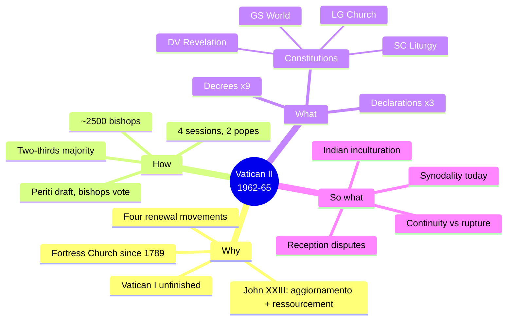
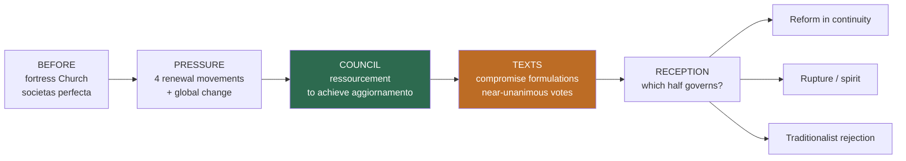
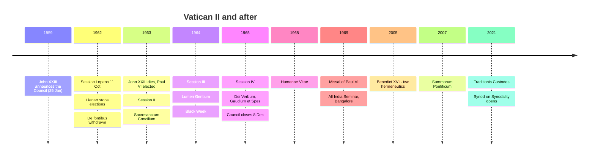
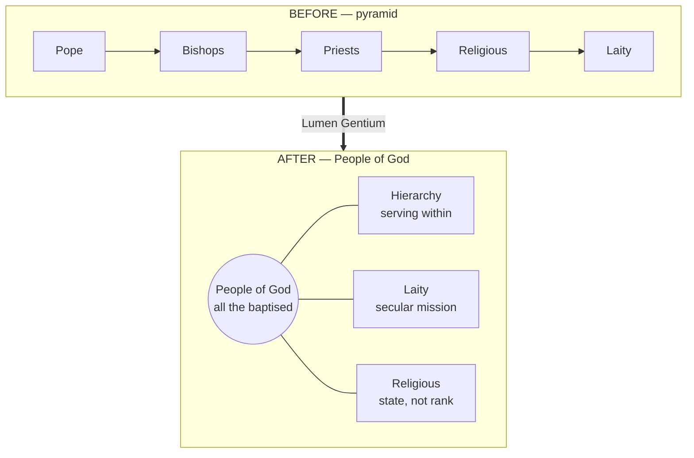
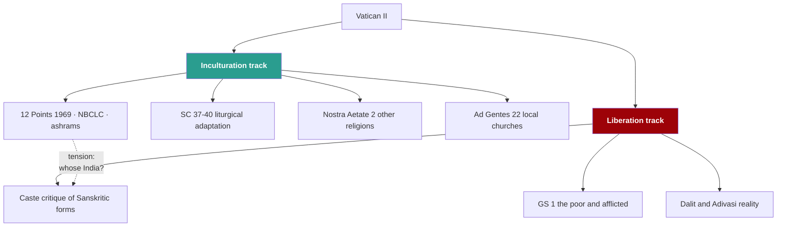

# 12 — Mind Maps

> [!info] How to use these
> Redraw them from memory. If you can reproduce map 1 and map 3 on blank paper, you can structure any essay on this subject.

## 1. The whole Council at a glance

## 2. The four Constitutions and their key terms

```mermaid
flowchart TD
    C[The Four Constitutions]
    C --> SC["<b>Sacrosanctum Concilium</b><br/>4 Dec 1963"]
    C --> LG["<b>Lumen Gentium</b><br/>21 Nov 1964"]
    C --> DV["<b>Dei Verbum</b><br/>18 Nov 1965"]
    C --> GS["<b>Gaudium et Spes</b><br/>7 Dec 1965"]

    SC --> SC1[participatio actuosa SC 14]
    SC --> SC2[culmen et fons SC 10]
    SC --> SC3[adaptation SC 37-40]

    LG --> LG1[People of God before Hierarchy]
    LG --> LG2[subsistit in LG 8]
    LG --> LG3[collegiality LG 22]
    LG --> LG4[universal call to holiness LG 40]

    DV --> DV1[God reveals himself DV 2]
    DV --> DV2[one wellspring DV 9]
    DV --> DV3[magisterium serves DV 10]
    DV --> DV4[inerrancy for our salvation DV 11]

    GS --> GS1[signs of the times GS 4]
    GS --> GS2[Christ reveals man GS 22]
    GS --> GS3[autonomy of earthly realities GS 36]

    style SC fill:#264653,color:#fff
    style LG fill:#2a9d8f,color:#fff
    style DV fill:#e76f51,color:#fff
    style GS fill:#e9c46a,color:#000
```

## 3. The argument structure — how to plan any essay

## 4. Chronology

## 5. Ecclesiology — before and after

## 6. Indian reception — two tracks

---
**Prev:** [[11 - Vatican II in the Indian Context]] · **Next:** [[13 - Flashcards]] · **Up:** [[Vatican II - Course Home]]
