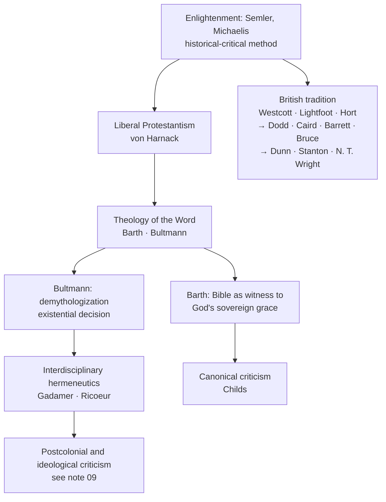

# 05 — Texts, Truth and Signification

Three chapters on the same underlying question: **after the Enlightenment, what authorises a theological statement?** The Bible read how? Philosophy in what role? And what survives when the very idea of stable meaning is put under suspicion?

---

## A. Biblical interpretation (Anthony Thiselton)

- **Historical-critical method** (Semler, Michaelis): interpret the Bible free of imposed theological categories, attending to the historical particularity of the texts. Its later radicalization: **Räisänen**'s programme of a wholly non-confessional biblical study.
- **Theology of the Word** — Barth and Bultmann's joint revolt against Harnack's liberalism. They then split: Barth on the Bible as **witness to God's sovereign grace**; Bultmann on **demythologization** — interpreting mythological texts existentially to expose their challenge to human **decision**. Ford's Type 4 in its purest form.
- **The British line** — the Cambridge triumvirate (Westcott, Lightfoot, Hort) and successors (Dodd, Caird, Barrett, F. F. Bruce, Barr, Stanton, Dunn, N. T. Wright): historical rigour joined to theological commitment.
- **Interdisciplinary hermeneutics** — Gadamer (fusion of horizons, effective history) and **Paul Ricoeur**: the **double hermeneutic of suspicion and retrieval**, and the mutual implication of time and narrative.
- **Canonical criticism** — **Brevard Childs**: the authoritative object is the **final form** of the text within the canon and its reception, not the reconstructed sources behind it.
- Also in this stream: **Horace Bushnell** and **G. E. Wright** on language and God's acts in history.

## B. Philosophical theology (Ingolf Dalferth)

Emerged with modern science and **fractured into three programmes after Kant and Hume demolished the traditional proofs**:

| Programme | What it does | Representatives |
|---|---|---|
| **Dogmatic philosophical theology** (philosophical theism) | A decontextualized rational account of God, independent of confessional faith | Swinburne, Plantinga |
| **Critical philosophical theology** | Explores the internal **grammar of a particular faith** and relates it to wider cultural and scientific contexts | Kant → Schleiermacher → Tillich |
| **Philosophy of religion** | Refocuses on religion as a universal or historical phenomenon: how beliefs and practices orient human life | Hick, D. Z. Phillips |

## C. Postmodern theology (Graham Ward)

> [!abstract] Postmodernism, in the book's glossary
> An intellectual position regarding the present as **discontinuous with modernity**, sceptical about universal rational principles, objective truth and progress. **Deconstruction**: a destabilizing analysis exposing the arbitrariness or bias of texts and showing how their logic invites its own refutation. **Metanarrative**: an overarching narrative claiming to comprehend and explain all others.

### Liberal postmoderns — radicalizing liberal theology
- **Mark C. Taylor** — deconstructive **"a/theology"**: the endless deferral of truth, linguistic idealism, the erasure of the transcendent signified.
- **Thomas J. J. Altizer** — the **death of God** as an evolutionary historical era in which Christ merges entirely into secular creation.
- **Don Cupitt** — French poststructuralism enlisted for a naturalistic, **anti-realist** philosophy of life; God as a guiding spiritual ideal, not a being.
- Also: David Ray Griffin, Charles Winquist, Robert Scharlemann.

### Conservative postmoderns — postmodern critique used *for* theology
- **Jean-Luc Marion**, *God Without Being* — critique of the **onto-theology** of modern metaphysics; a **phenomenology of the icon** (against the idol): the invisible God crosses into the visible as **pure gift of love**, revealed supremely in the *kenosis* of the cross.
- **Michel de Certeau**, *The Mystic Fable* — a **"poetics of the body"** and the experience of the divine Other; mysticism as a **rupture of the logic of the written word**, opening new spaces of knowledge driven by spiritual desire.
- **John Milbank / Radical Orthodoxy** — Christianity must **reject secular social theory and postmodern nihilism** alike. Theology must not accommodate secular reason but proclaim its own **cultural-linguistic metadiscourse**, grounded in an ontology of peace rather than of violence. (His critique of sociology is in [[06 - Theology and the Sciences]].)

> [!warning] The dividing line
> Both wings accept that modernity's foundations have collapsed. The liberals conclude that theology must give up transcendence; the conservatives conclude that **theology was never dependent on those foundations in the first place** and is now free of the secular referee. Whether that freedom is a recovery or a retreat is the argument of the last thirty years.

## Flashcards
Demythologization :: Interpreting mythological texts to expose their continuing existential relevance and their challenge to human decision, despite an outmoded worldview (Bultmann)
Barth and Bultmann's common enemy :: Harnack's liberal theology; both reassert a theology of the Word before splitting over existential interpretation
Ricoeur's double hermeneutic :: A hermeneutic of suspicion joined to a hermeneutic of retrieval
Canonical criticism :: Brevard Childs — the authoritative object is the final canonical form of the text and its reception, not the reconstructed sources
Three programmes of philosophical theology :: Dogmatic philosophical theism (Swinburne, Plantinga); critical philosophical theology (Kant–Schleiermacher–Tillich); philosophy of religion (Hick, Phillips)
Postmodernism (glossary) :: Discontinuity with modernity; scepticism about universal rational principles, objective truth and progress
Deconstruction :: Destabilizing analysis that exposes textual arbitrariness or bias and shows how a text's logic invites its own refutation
Metanarrative :: An overarching narrative that claims to comprehend and explain all other narratives
Taylor's a/theology :: A deconstructive theology embracing the endless deferral of meaning and the loss of the transcendent signified
Altizer's death of God :: An evolutionary historical era in which Christ merges completely into secular creation
Cupitt's non-realism :: A naturalistic, anti-realist account of religion in which God is a spiritual ideal rather than a being
Marion's icon and idol :: The idol reflects the gaze back on the viewer; the icon lets the invisible cross into the visible as pure gift
Onto-theology :: The metaphysical treatment of God as the highest being within a system of being — what Marion's *God Without Being* refuses
De Certeau on mysticism :: A rupture of the logic of the written word that inaugurates new spaces of knowledge driven by desire
Radical Orthodoxy's core claim :: Theology must not accommodate secular reason but proclaim its own metadiscourse, grounded in an ontology of peace rather than violence

---
**Prev:** [[04 - Reappropriating Traditions]] · **Next:** [[06 - Theology and the Sciences]]
