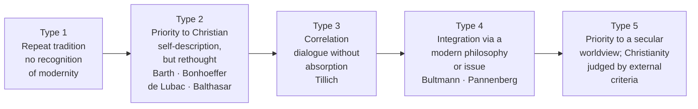
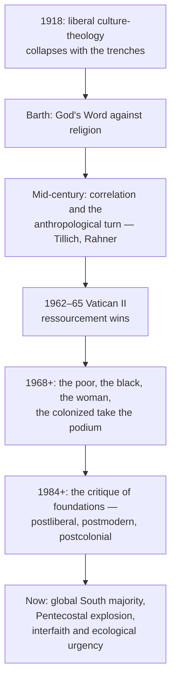

# Modern Theologians Since 1918 — Map of Content

The whole field of Christian theology from **Barth's *Romans* (1919) to the present**, built from the Ford–Muers *The Modern Theologians* (42 chapters, 8 parts, epilogue, glossary). This unit is the **post-1918 continuation** of [[10 - Major Theologians and Their Methods]], which runs Clement → Packer. Where that note asks *who ran which method*, this unit asks *what happened to theology after Christendom, the trenches, Auschwitz, and empire*.

> [!abstract] The one-sentence core
> Modern theology is not theology that abandons tradition but theology **done by people whose societies were remade by the Renaissance, Enlightenment, industry and the sciences** — so it must take account of that context in content and method, whether to adapt to it, criticise it, resist it, or try to reverse it (Ford, Introduction).

> [!info] Ford's two criteria for inclusion
> A theologian earns a chapter if they (1) **wrote constructively across a broad range of theological issues**, and (2) are **widely studied now** in universities and seminaries. "Quality and significance" decided the borderline cases.

## The spine: Ford's five types

Full account with worked examples: [[01 - What Makes Theology Modern - Ford's Map]].

## Notes in this unit
1. [[01 - What Makes Theology Modern - Ford's Map]] — what "modern" means, the forces since 1918, the five types, inclusion criteria, how to use the typology without abusing it
2. [[02 - Classics of the Twentieth Century]] — Barth, Bonhoeffer, Tillich, de Lubac, Rahner, Balthasar
3. [[03 - Responses to Modernity - Germany, Britain, USA]] — Pannenberg, Moltmann, Torrance, the Anglicans, the two Niebuhrs, revisionists and liberals, process theology
4. [[04 - Reappropriating Traditions]] — postliberalism (Lindbeck, Frei), systematics after Barth (Jüngel, Jenson, Gunton), Catholic theology after Vatican II (Lonergan, Schillebeeckx, Küng, Wojtyła, Lash)
5. [[05 - Texts, Truth and Signification]] — biblical interpretation, philosophical theology, postmodern theology (Marion, de Certeau, Cupitt, Taylor, Altizer, Milbank)
6. [[06 - Theology and the Sciences]] — physics and divine action, biology and Teilhard/Peacocke, the social sciences and Milbank's quarrel with sociology
7. [[07 - Theology, Prayer and Practice]] — the divorce and reunion of theology and spirituality (Stolz, Weil, Balthasar); pastoral and practical theology (Hiltner, Browning, Nouwen, Oden)
8. [[08 - Particularizing Theology I - Feminist, Black, Latin American]] — Ruether, Chung Hyun Kyung, Irigaray; Cone and the generations after; Gutiérrez, Sobrino, Segundo, Tamez
9. [[09 - Particularizing Theology II - African, South Asian, East Asian, Postcolonial]] — Bediako, Oduyoye, Mugambi; Abhishiktananda, M. M. Thomas, Pieris, Panikkar; Koyama, Kitamori, Minjung; Sugirtharajah and Segovia **← the Indian material lives here**
10. [[10 - Global Engagements]] — ecumenical theology, Eastern Orthodoxy (Bulgakov, Lossky, Florovsky, Zizioulas, Stăniloae), Pentecostal and charismatic, evangelical
11. [[11 - Theology Between Faiths and in Many Media]] — theology of religions, Judaism, Islam, Buddhism; the visual arts, music, film
12. [[12 - Ford's Twelve Theses and Theology Today]] — the epilogue in full, and what all of this is *for* now
13. [[13 - Master Roster of Modern Theologians]] — **the list**: every figure, dates, tradition, central concept, significance, application today
14. [[14 - Glossary, Revision and Exam Questions]] — the book's glossary, a one-page revision sheet, exam questions, bibliography

## Quick reference — the map at a glance
| Part | Question it answers | Signature figures |
|---|---|---|
| I. Classics | How did theology recover its nerve after 1918? | Barth, Bonhoeffer, Tillich, de Lubac, Rahner, Balthasar |
| II. Responses to modernity | How does faith argue with modern reason, history and politics? | Pannenberg, Moltmann, Torrance, R. and H. R. Niebuhr, Tracy, Cobb |
| II-D/E. Reappropriation | Can tradition be retrieved after the critique of foundations? | Lindbeck, Frei, Jüngel, Jenson, Gunton, Lonergan, Schillebeeckx, Küng, Marion, Milbank |
| III. Sciences | How does God act in a world described by physics and biology? | Clayton, Peacocke, Teilhard, Troeltsch, Milbank |
| IV. Prayer and practice | Can theology be reunited with prayer and with pastoral care? | Stolz, Weil, Balthasar, Hiltner, Browning, Nouwen, Oden |
| V. Particularizing | Who was excluded, and what does theology look like from there? | Ruether, Cone, Gutiérrez, Oduyoye, Pieris, Koyama, Sugirtharajah |
| VI. Global engagements | What holds a divided and exploding world Church together? | Faith and Order, Lossky, Bulgakov, Azusa Street, Carl Henry |
| VII. Between faiths | How does Christ relate to the other great traditions? | Hick, Rahner, D'Costa, Soulen, Cragg, Cobb, Knitter |
| VIII. Many media | Where else does theology happen besides the printed page? | Balthasar, Begbie, Dillenberger, film criticism |

## The great shift this unit records

## Competency checklist
- [ ] State Ford's minimal definition of "modern" theology and his two inclusion criteria
- [ ] Name and illustrate all five of Ford's types with one theologian each
- [ ] List six secular and six religious forces that shaped theology since 1918
- [ ] Explain Barth's *infinite qualitative distinction*, actualism, and the threefold Word
- [ ] Define Bonhoeffer's *Stellvertretung*, cheap grace, *analogia relationis*, and religionless Christianity
- [ ] Run Tillich's method of correlation on two questions (finitude, estrangement)
- [ ] State de Lubac's case against *natura pura* and why it mattered at Vatican II
- [ ] Define Rahner's *Vorgriff*, supernatural existential, anonymous Christian — and one criticism of each
- [ ] Explain Balthasar's theological aesthetics, *Gestalt Christi*, theo-drama
- [ ] Contrast Pannenberg's Christology "from below" with Moltmann's dialectic of cross and resurrection
- [ ] State the three positions of Lindbeck's *Nature of Doctrine* and what "the text absorbs the world" means
- [ ] Explain Frei's "eclipse of biblical narrative" and identity-before-presence
- [ ] Distinguish the liberal and conservative postmoderns and place Marion and Milbank
- [ ] Name four models of divine action and say which ones concede the least to science
- [ ] State Teilhard's law of complexity–consciousness and the Omega point
- [ ] Define *kyriarchy*, womanist theology, *han*, *minjung*, *ochlos*, subaltern, contrapuntal reading
- [ ] Give Gutiérrez's two phases and state what "preferential option for the poor" is a statement *about*
- [ ] State the Dalit critique of inculturation and Pieris's two-poles thesis
- [ ] Explain Lossky's essence/energies distinction and Bulgakov's sophiology
- [ ] Give D'Costa's objection to the threefold typology of religions
- [ ] Recite the substance of at least six of Ford's twelve theses
- [ ] Place any named theologian in this unit on Ford's five-type spectrum and defend the placement

> [!warning] Two cautions when using this unit
> 1. **The typology is a tool, not a verdict.** Ford himself notes most serious theologians move across types depending on the topic. Use it to ask *why* a theologian starts where they start.
> 2. **The book is a Cambridge-Anglophone map.** Its "South Asia" chapter (Wilfred) is excellent but short; Dalit and tribal theology get a paragraph where they deserve a volume. Patch from [[09 - Indian Theological Method]] and the Soares-Prabhu notebooks — and keep the citation streams separate.

## The Zettelkasten layer
This unit has been atomized into the `Theology Vault (Zettelkasten)`:
- **Claims** (arguable propositions to write from) — [[Modern theology is defined by its relation to modernity, not by its conclusions]] · [[The universal theology of the textbooks was always somebody's particular theology]] · [[Doctrine is a rule of communal grammar, not a proposition or a feeling]] · [[Starting from the hearer or from the form divides modern Catholic theology]] · [[A self-sufficient pure nature is the root of secularism]] · [[Evolutionary suffering makes divine passibility close to obligatory]] · [[Every liberating theology is criticized by the next one it excluded]] · [[Inculturation drawn from Brahminical Hinduism sacralizes the caste order]] · [[The Bible is a tainted text of both emancipation and enslavement]] · [[The poor left the base communities for the churches of the Spirit]] · [[Pluralism is a disguised exclusivist secular agnosticism]] · [[Theological truth is participation, not mastery of facts]]
- **Schemas** — [[Ford's Five Types of Modern Theology]] · [[Three Models of Doctrine]] · [[Eight Positions on Divine Action]] · [[Three Mediations of Liberation Theology]] · [[Four Sources of Black Theology]] · [[Three Styles of Practical Theology]] · [[Three Phases of Pentecostalism]]
- **Debates** — [[11a - Fault Lines Since 1918]] (twelve fault lines, with the exam procedure)
- **People** — 96 notes in `50 People/`, queryable by era, region, school and Ford type: [[Theologians Index (Dataview)]]

## Related units in this vault
- [[Theological Methods - MOC]] — the method behind each of these figures
- [[10 - Major Theologians and Their Methods]] — the pre-1918 roster this unit continues
- [[11 - Fault Lines and Lineages]] — who reacts against whom
- [[09 - Indian Theological Method]] — *anubhava*, ashram, Dalit critique, Soares-Prabhu
- [[000 - Vatican II MOC]] — the council that sits at the centre of Part I and Part II-D
- [[Theology MOC]] — Zettelkasten entry point; person notes live in `50 People/`

---
**Next:** [[01 - What Makes Theology Modern - Ford's Map]]
