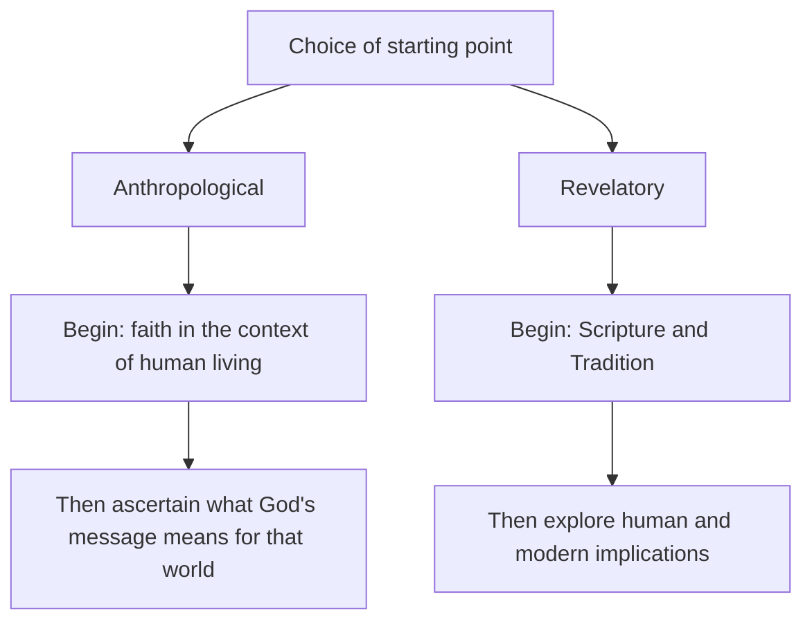

# 01 — What Is Theological Method and Why It Matters

> [!abstract] In one line
> Theological method examines **the bases, the proper ordering, and the norms of theology** — it is a procedure that can be worked out and *critically appraised* so as to attain systematic understanding in religion.

## 1. What a method is

A method organises the theological enterprise into **distinct, interlocking stages** that carry the theologian from raw data to communicated results, instead of addressing isolated questions haphazardly.

Lonergan's definition is the one to memorise:

> [!quote] Lonergan
> A method is **"a normative pattern of recurrent and related operations yielding cumulative and progressive results."**

Unpack each word:

| Term | Meaning |
|------|---------|
| **normative** | It binds — it tells you what you *ought* to do next |
| **pattern** | Ordered, not random |
| **recurrent** | Repeatable by anyone, in any generation |
| **related operations** | The steps feed one another; output of one is input of the next |
| **cumulative** | Results add up; nobody starts from zero |
| **progressive** | The discipline actually advances |

These operations are rooted in the **dynamic structure of human consciousness itself** — experiencing, understanding, judging, deciding — expressed as the four **transcendental precepts**:

> [!info] The four precepts
> **Be attentive** → **Be intelligent** → **Be reasonable** → **Be responsible**

## 2. Method vs. technique vs. system

| | What it is | Relation |
|---|---|---|
| **Technique** | A mechanical rule applied uniformly | Method is *not* a rigid set of rules |
| **Method** | The open, self-correcting framework of operations | Produces systems; enables collaboration |
| **System** | The explicit end-product, a "fragment" fixed at a point in time | Brought into existence *by* method |

> [!tip] Exam formula
> A *system* is what a theologian **has**; a *method* is what a theologian **does**. Systems date; method regenerates.

## 3. Why method is necessary

1. **It orders the chaos.** Without method, theology faces a "Babel of opinions" and conflicting truth claims with no way to adjudicate.
2. **Historical consciousness forced the issue.** With the rise of modern historical awareness, ancient sources ceased to function as absolute premises and became **data requiring critical historical investigation** — traditional theology was thrown into disarray.
3. **It lets theology be scientific without ceasing to be theology.** A rigorous method synthesises historical-critical insight with Church doctrine, so the theologian navigates modern thought without losing normative foundations.
4. **It makes theology collaborative.** An explicitly stated method breaks the whole task into specialised jobs, turning theology into a genuine cultural project rather than a set of private syntheses.

## 4. What goes wrong when method is neglected or badly chosen

> [!warning] Four characteristic failures
> - **Discord between methods** — far graver than opposition between doctrines. Disputants fight over concrete problems in "guerilla warfare" while their real disagreement lies in unexamined, irreconcilable presuppositions.
> - **Methodological imperialism** — importing the method of the natural sciences wholesale forces theology into false naturalism and rigid empiricism, impoverishing the vision of reality and overlooking the living soul of religion.
> - **Irrationalism** — the opposite error. Abandoning reason isolates theology, breeds sectarianism, and destroys the capacity to speak with sincere inquirers.
> - **Loss of balance among sources** — see the table below.

### Distortions from imbalance
| Over-emphasis | Resulting distortion |
|---------------|---------------------|
| **Experience** | Mysticism |
| **History** | False naturalism |
| **Reason** | Rationalism |

## 5. Method and the sources of theology

Method dictates *how* one engages Scripture, Tradition, Magisterium, reason, experience and context. The single most consequential decision is the **starting point**:

In Lonergan's differentiated method the sources are handled in **two phases**:

- **Positive phase** — Scripture, Tradition and historical context investigated as *raw data* by critical reason (research, interpretation, history, dialectics).
- **Normative phase** — that data synthesised with the theologian's living faith and magisterial doctrine, then understood and communicated to a contemporary culture (foundations, doctrines, systematics, communications).

## 6. What a good method secures

| Function | How method delivers it |
|----------|------------------------|
| **Scientific rigour** | Obedience to the transcendental precepts. Genuine **objectivity is the fruit of authentic subjectivity** — knowing is *not* merely "taking a good look" at facts |
| **Cumulative progress** | Functional specialisation lets new work build on secured research rather than restarting |
| **Self-correction** | Like inductive science: expand the data sample, refine the language, stay ready to revise original convictions |
| **Fidelity** | Control lies not only in logic but in **conversion** — intellectual, moral, religious (and for Doran, psychic). The capacity to interpret divine meaning faithfully depends on an otherworldly falling in love; this is what blocks arbitrary construction |

> [!quote] The key epistemological claim
> Objectivity is the fruit of authentic subjectivity. The "myth of knowing as taking a good look" is precisely what a critical method destroys.

## Flashcards
Define theological method (Lonergan's formula) :: A normative pattern of recurrent and related operations yielding cumulative and progressive results
The four transcendental precepts :: Be attentive, Be intelligent, Be reasonable, Be responsible
Method vs system :: Method is the open self-correcting framework of operations; system is the explicit end-product it generates at a given time
What does theological method examine? :: The bases, the proper ordering, and the norms of theology
Gravest consequence of neglecting method :: Discord between methods — worse than opposition between doctrines; debates become guerilla warfare over unexamined presuppositions
Distortion from over-emphasis on experience / history / reason :: Mysticism / false naturalism / rationalism
The two possible starting points :: Anthropological (from human living to God's message) or revelatory (from Scripture and Tradition to human implications)
What secures fidelity in Lonergan's method? :: Conversion — intellectual, moral, religious (and psychic) — not logic alone
Objectivity is... :: the fruit of authentic subjectivity

---
**Prev:** [[Theological Methods - MOC]] · **Next:** [[02 - Historical Development of Theological Method]]
