# 03 — Catalogue of Theological Methods

Each entry: **definition → proponents → operative moves**. Practical procedures are in [[05 - How to Use the Methods - Step by Step]]; strengths and limits in [[06 - Choosing a Method - Where When Strengths Limits]].

---

## 1. Classical / Scholastic
*Also: Neo-Thomism, empirico-metaphysical method, via disciplinae*

**Definition** — Systematic, speculative theology that correlates revealed truth (authority/faith) with natural reason and philosophy, resolving problems logically and unifying doctrines into a seamless whole.
**Proponents** — Thomas Aquinas, Peter Lombard, Duns Scotus, Joseph Kleutgen.
**Moves** — Balance authority and *ratio*. Begin from authoritative texts; extract statements (*sententiae*); organise by *quaestiones*; apply logic and dialectic. In Aquinas, move from the way of discovery to the way of teaching, using **analogy** for fruitful but limited understanding of mysteries — never absolute proof.

## 2. Transcendental
*Also: Foundational theology*

**Definition** — Method grounded in the analysis of human intentional consciousness and subjectivity; genuine objectivity is the fruit of authentic subjectivity.
**Proponents** — Bernard Lonergan, Robert Doran, Donald Gelpi.
**Moves** — Four levels of consciousness under the transcendental precepts (attentive, intelligent, reasonable, responsible). Eight **functional specialties** in two phases: *positive* (research, interpretation, history, dialectics) retrieving the tradition; *normative* (foundations, doctrines, systematics, communications) mediating it to culture. The pivot is the theologian's own **conversion** — religious, moral, intellectual, psychic.

## 3. Method of Correlation
*Also: apologetic theology, philosophical theology*

**Definition** — Dialectical relating of the existential questions implied in the human situation to the answers given in the Christian message.
**Proponents** — Paul Tillich; Karl Heim.
**Moves** — Analyse the human situation (finitude, self-estrangement, despair) with philosophy, psychology, sociology to expose questions of ultimate concern; then interpret religious symbols (God as ground of being; Christ as New Being) as the adequate answers.

## 4. Biblical-Exegetical
*Also: biblical humanism, argumentum ex verbo*

**Definition** — Direct exegesis of Scripture as the central and normative theological task, rejecting scholastic metaphysics and speculative systems.
**Proponents** — Erasmus, Lorenzo Valla.
**Moves** — *Ad fontes*: direct engagement with the biblical text through linguistic, semantic and historical analysis; theology aims to move God's people to piety and Christian living.

## 5. Historical-Critical
*Includes the stratigraphic method*

**Definition** — Treats canonical texts as historical documents shaped by time, place and culture, emancipating theology from dogmatic prejudice.
**Proponents** — J.D. Crossan (stratigraphic), historical-Jesus scholarship generally.
**Moves** — Textual, form, narrative and rhetorical criticism to uncover the author's intended meaning. Stratigraphically: excavate the chronological layers of texts to reconstruct a multidimensional web of historical conflict.

## 6. Praxis / Liberation
*Also: inductive theology, theology of the people, see-judge-act*

**Definition** — Method grounded in the transformation of history and society, granting **hermeneutical privilege to the victims of history**.
**Proponents** — Gustavo Gutiérrez, Juan Carlos Scannone, Carlos Galli, Jorge Bergoglio (Pope Francis).
**Moves** — **See** (analyse the socio-cultural situation; name decline and oppression) → **Judge** (apply the tradition and the preferential option for the poor) → **Act** (strategies that communicate redemptive meaning, evangelise culture, transform structures).

## 7. Contextual / Inculturation
*Also: globalizing theology*

**Definition** — Theological reflection taking the **Incarnation as the model for translating** the Gospel into specific, culturally conditioned localities.
**Proponents** — Kosuke Koyama, Kazoh Kitamori, Shusaku Endō.
**Moves** — Start from personal commitment and faith rather than abstract reason; adopt a **kenotic** (self-emptying) attitude, replacing superiority with humility and interrelatedness; use paradoxical, parabolic and aesthetic media (including literature) to do theology. See [[04 - Contextual, Liberation and Non-Western Methods]].

## 8. Feminist / Womanist / Antiracist
**Definition** — Critical approach exposing systemic bias (patriarchy, white supremacy) embedded in traditional theology and centring the bodies and experience of marginalised groups to reclaim human dignity.
**Proponents** — M. Shawn Copeland, Kathryn Tanner, Elisabeth Schüssler Fiorenza, Mary McClintock Fulkerson.
**Moves** — Deconstruct hidden normative assumptions (whiteness, male privilege) that distort readings of tradition; cultivate practices of solidarity with "the least"; re-centre theology on the physical bodies of the oppressed; **recode** traditional symbols rather than sweep them away.

## 9. Comparative / Interreligious
*Also: polycontextual method, theologia religionis*

**Definition** — Multi-systemic thinking that navigates pluralism by relating different symbol systems and rationalities **without homogenising them**.
**Proponents** — Michael Welker, W. Cantwell Smith, Francis Clooney, John B. Cobb Jr., E.A. Burtt.
**Moves** — Construct "bridge theories" to appreciate diverse religious logics; engage in open public critical discourse across traditions; focus on the living personal faith of persons, not merely abstract historical institutions.

## 10. Phenomenological / Religio-Historical
**Definition** — Impartial, empirical study of religious phenomena, seeking structure and meaning without pronouncing on absolute truth.
**Proponents** — C.J. Bleeker, W.B. Kristensen.
**Moves** — ***Epoché*** (suspension of judgement): accept phenomena as they present themselves to believers; then **eidetic vision**: search out the underlying essence or structure.

## 11. Imaginative Construction
**Definition** — Theology as a human, imaginative endeavour constructing a worldview oriented around God as the ultimate point of reference, giving overall orientation to human life.
**Proponent** — Gordon D. Kaufman.
**Moves** — Collect models and metaphors from ordinary experience to build a concept of "world"; construct a concept of God that **relativises** that world; reformulate the worldview to fit intelligibly with that concept of God. Evaluate **pragmatically**: does it lead to a fruitful, humanising life?

## 12. Inductive Method in Religion
*Also: modern method, evolutionary method*

**Definition** — Empirical theology aligned with modern scientific paradigms, treating religion and doctrine as growing, evolutionary realities rather than static *a priori* truths.
**Proponents** — the "modern" party against traditionalism (e.g. Herbert Alden Youtz).
**Moves** — Start from experience and history; observe facts comprehensively and accurately; interpret rationally; **test hypotheses by verification in experience** rather than deducing from absolute dogma.

## 13. Relational / Experiential
**Definition** — Method built on the analysis of religious consciousness and feeling: God is known **only in relation to the believer**, not in a hidden internal essence.
**Proponent** — Friedrich Schleiermacher (on motifs from Luther and Calvin).
**Moves** — Avoid speculative metaphysics; abstract formulations directly from the *feeling of absolute dependence*; interpret divine attributes strictly as modes of divine causality experienced in human life.

## 14. Typological / Symbolic (*Ressourcement*)
**Definition** — A theology of history relying on the patristic reading of Scripture and reality, emphasising the poetic and symbolic grasp of the sacred.
**Proponent** — Jean Daniélou.
**Moves** — Identify **correspondences (types)** between the economies of salvation; respect distinct "orders" or levels of reality; read Scripture and world **synthetically** rather than by historical-critical dissection alone.

## 15. Authoritarian-Deductive
**Definition** — Early method applying Platonic principles, relying on assumed authority for its axioms.
**Proponent** — Origen.
**Moves** — Begin from authoritative tradition; apprehend general truths by noetic insight; deduce detailed truths; confirm from scriptural texts.

## 16. Dialectical / Kerygmatic
*Also: neo-orthodoxy, theology of crisis*

**Definition** — Theology of the Word radically opposing the divine to the human, rejecting natural theology and insisting on the total otherness of God.
**Proponents** — Karl Barth; Søren Kierkegaard as forebear.
**Moves** — Interpret and organise the *kerygma* strictly in biblical/classical terms without correlation to secular philosophy; bypass historical probability — revelation breaks into history from the transcendent.

## 17. Semiotic Theory of Religion
**Definition** — Religion as a hermeneutical process structuring asymmetrical relations by means of non-ordinary beings or states.
**Proponents** — Tim Murphy, J.Z. Smith.
**Moves** — Select from an "ensemble of signifiers" — a "mobile army of metaphors" — deploying religious strategies for specific, fluid situations rather than applying a rigid all-encompassing worldview.

## 18. Cultural-Linguistic Model
*Also: postliberal theology*

**Definition** — Religion as a comprehensive cultural framework; **doctrine as its grammar**.
**Proponent** — George Lindbeck.
**Moves** — Analyse doctrines not as objective propositions nor as expressive symbols but as **grammatical rules** shaping the life, language and practice of a community.

## 19. Narrative
**Definition** — Narrative structure itself as a primary means of doing theology and interpreting Scripture.
**Proponents** — Hans Frei; modern narrative critics.
**Moves** — Examine how the author structured the narrative, which sources were used, and what message the unfolding story conveys.

---

## Method families — a map

```mermaid
flowchart TD
    R[Theological methods]
    R --> D[Deductive / authority-first]
    R --> I[Inductive / data-first]
    R --> S[Subject-turn]
    R --> P[Praxis / context-first]
    R --> L[Language & symbol]
    D --> D1[Authoritarian-deductive - Origen]
    D --> D2[Scholastic - Aquinas]
    D --> D3[Dialectical - Barth]
    I --> I1[Biblical-exegetical - Erasmus]
    I --> I2[Historical-critical]
    I --> I3[Inductive/evolutionary]
    I --> I4[Phenomenological - Bleeker]
    S --> S1[Relational - Schleiermacher]
    S --> S2[Correlation - Tillich]
    S --> S3[Transcendental - Lonergan]
    S --> S4[Imaginative construction - Kaufman]
    P --> P1[Liberation - Gutierrez]
    P --> P2[Contextual - Koyama]
    P --> P3[Feminist / antiracist - Copeland]
    P --> P4[Comparative - Clooney, Cobb]
    L --> L1[Typological - Danielou]
    L --> L2[Narrative - Frei]
    L --> L3[Cultural-linguistic - Lindbeck]
    L --> L4[Semiotic - J.Z. Smith]
```

## Flashcards
Scholastic method in four moves :: Lecture and identify the question; define terms; lay out arguments on all sides (sic et non); resolve rationally by dialectic
Lonergan's eight functional specialties :: Research, Interpretation, History, Dialectics // Foundations, Doctrines, Systematics, Communications
Tillich's method :: Correlation — existential questions from the human situation answered by the symbols of the Christian message
Crossan's stratigraphic method :: Excavate the chronological layers of texts to reconstruct the web of historical conflict around Jesus
Hermeneutical privilege of the victims :: Liberation theology's principle that the marginalised have interpretive priority
Kenosis in contextual method :: The self-emptying posture that abandons cultural superiority and epistemic arrogance
Epoché and eidetic vision :: Suspension of judgement about truth claims; then the search for the essential structure of the phenomenon
Kaufman's three constructive steps :: Build a concept of world from experience; construct a concept of God that relativises it; reformulate the worldview to fit
Lindbeck's cultural-linguistic thesis :: Doctrines function as grammatical rules of a community's life, not primarily as propositions or expressive symbols
Copeland/Fiorenza method move :: Deconstruct hidden norms (whiteness, patriarchy), centre the bodies of the oppressed, recode rather than discard symbols

---
**Prev:** [[02 - Historical Development of Theological Method]] · **Next:** [[04 - Contextual, Liberation and Non-Western Methods]]
