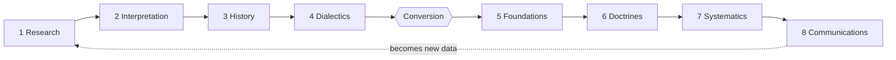

# 05 — How to Use the Methods: Step by Step

Working procedures. Each is a sequence you can actually run on a text, a doctrine or a pastoral situation.

---

## 1. The Scholastic *Quaestio*

Developed as a universal intellectual tool for probing problems raised by authoritative texts.

1. **Lecture and identify** — the master lectures on an authoritative text (chiefly the Bible) and identifies the question: a problem in the text, a conflict of interpretations, or a doubtful solution.
2. **Define** — clearly define, distinguish and examine the words, ideas and realities involved.
3. **Dialectical analysis (*sic et non*)** — set out and appreciate the arguments on *every* side.
4. **Resolve** — give a rational, orderly solution, dialectic being the primary tool.

> [!example] Historic instance
> Statements were extracted piecemeal from the authorities (*sententiae*) and compiled into anthologies organised by issue (*quaestiones*) — Peter Lombard's *Book of Sentences* — so each issue could be probed in an orderly, rational way.

---

## 2. Lonergan's Transcendental Method — the eight functional specialties

Two phases: a **positive/mediating** phase (encountering the past) and a **normative/mediated** phase (handing on to the future), pivoting on **conversion**.

### Phase 1 — Encountering the data
| # | Specialty | Precept | Governing question |
|---|-----------|---------|--------------------|
| 1 | **Research** | Be attentive | *Have we got an accurate text?* |
| 2 | **Interpretation** | Be intelligent | *What is the literary form? What did the author intend?* |
| 3 | **History** | Be reasonable | *What was moving forward in history? What really happened?* |
| 4 | **Dialectics** | Be responsible | *Where do I stand in the face of these oppositions?* |

### Pivot — Conversion
The theologian evaluates their own authenticity: **religious, moral, intellectual and psychic conversion**.

### Phase 2 — Handing on the tradition
| # | Specialty | Task |
|---|-----------|------|
| 5 | **Foundations** | Objectify one's conversion; deliberately choose the framework and categories |
| 6 | **Doctrines** | Judgements of fact and value affirming the truths of the tradition |
| 7 | **Systematics** | Coherent understanding of the mysteries affirmed — *how do these doctrines connect, what analogies explain them?* |
| 8 | **Communications** | Transpose systematic meaning into common-sense language to bear fruit in a culture (preaching, catechesis, pastoral care) |

> [!example] Systematics at work
> Aquinas asked whether there are processions in God. Having affirmed it doctrinally, he sought *understanding* by analogy drawn from human psychology: the procession of a concept from an act of understanding.

> [!info] The hermeneutical circle
> Communications produces present realities which become the historical **data** for the next generation's Research. The method loops.

---

## 3. Tillich's Method of Correlation

1. **Existential analysis** — analyse the human situation using psychology, sociology or existential philosophy; extract the ultimate questions implied in human existence.
2. **Theological correlation** — interpret the classical religious symbols as the adequate answers to *those* questions.
3. **Mutual shaping** — the *form* of the question shapes the answer; the *substance* of the answer determines the question.

| Existential question | Symbolic answer |
|---------------------|-----------------|
| Finitude, anxiety, contingency | **God** — transcendent courage |
| Existential disruption, despair | **The Christ** — the New Being conquering demonic mechanisms |
| Meaning of history | **The Kingdom of God** |

---

## 4. Historical-Critical Exegesis

Aligns with Lonergan's first three specialties.

1. **Textual criticism** — establish the best text. Tool: *lectio difficilior* (prefer the harder reading) to eliminate scribal smoothing.
2. **Literary / narrative criticism** — identify genre. *Is the text poetic, mythic, legendary? What rhetorical tropes are deployed?*
3. **Historical reconstruction** — look behind the narrative. *What really happened?*

> [!example] Quest for the historical Jesus
> The Gospels are not treated as exact diaries; scholars apply **criteria of authenticity** to sift the narratives for genuine sayings and events.

---

## 5. See – Judge – Act (the pastoral spiral)

From the Young Christian Workers movement; central in Latin American theology.

1. **SEE** — study the concrete situation with analytical tools; examine cultural and social structures; identify progress, decline and the needs of the poor.
2. **JUDGE** — theological reflection on that situation: bring the tradition (through doctrines and systematics) to articulate what the Christian message means *here*.
3. **ACT** — plan and execute strategies (Lonergan's *communications*) that bring redemptive meanings and values into the situation and transform history.

> [!tip] Spiral, not circle
> The act generates a new situation, which must be seen again. Each turn should be better informed than the last.

---

## 6. Contextual / Inculturation Method

1. **Adopt a kenotic posture** — self-emptying; abandon epistemic arrogance and assumptions of cultural superiority.
2. **Work "from above to below"** — take the universal Gospel and particularise it under culture-specific conditions, on the model of the Incarnation.
3. **Dialogical conversation** — learn the local languages and idioms; practise **mutual correction**, not monologue; let Western and non-Western theologies enrich each other.
4. **Canonical and catholic assessment** — guard against relativism by testing constructions against the **biblical canon** and the **global ecclesial community**.

---

## 7. Comparative Theology (Burtt's cooperative procedure)

1. ***Epoché*** — listen attentively to adherents; accept phenomena as religious without immediately judging their truth.
2. **Analysis of agreement** — identify where agreement already exists (the objective/sharable) and where it is lacking.
3. **Impartial terminology** — build a neutral vocabulary that does not beg the question (e.g. the neutral term *value* instead of *good/bad*, *right/wrong*).
4. **Objective comparison** — analyse each contrasting position in that impartial language to discover its exact virtues and defects.
5. **Progressive synthesis** — integrate the dependably good values of each into a richer, more inclusive perspective.

> [!example] Christianity and Buddhism
> Define an impartial goal such as **"spiritual freedom."** Analyse under what conditions the Christian way and the Buddhist way each secure release from craving/suffering. Then synthesise the dependable values of both into a fuller whole.

---

## Cross-method decision aid
| If your material is… | Run… |
|---|---|
| A disputed doctrinal proposition | *Quaestio* (§1), then Systematics (§2) |
| An ancient text you must not misapply | Historical-critical (§4) inside Lonergan's phase 1 (§2) |
| A culture in crisis asking real questions | Correlation (§3) |
| A parish, slum or campus situation | See-judge-act (§5) |
| A missionary or cross-cultural setting | Inculturation (§6) |
| A neighbouring religious tradition | Comparative (§7) |

## Flashcards
The four moves of the scholastic quaestio :: Identify the question from an authoritative text; define terms; lay out all arguments (sic et non); resolve rationally
Question governing Research :: Have we got an accurate text?
Question governing Interpretation :: What is the literary form and what did the author intend?
Question governing History :: What was moving forward — what really happened?
Question governing Dialectics :: Where do I stand in the face of these oppositions?
Task of Foundations :: Objectify one's conversion and deliberately select the framework and categories for theology
Task of Systematics :: Seek coherent understanding of the mysteries affirmed in doctrines, using analogies
Task of Communications :: Transpose systematic meaning into common-sense language to bear fruit in a specific culture
Lectio difficilior :: Text-critical rule preferring the more difficult reading, since scribes tend to smooth texts
Tillich's three correlations :: Finitude→God; despair→the Christ; meaning of history→Kingdom of God
See-judge-act in one line each :: See = analyse the situation; Judge = evaluate it by the tradition and the option for the poor; Act = strategies that transform structures
Step 3 of comparative method :: Develop impartial terminology that does not beg the question — e.g. "value" instead of "good/bad"
Guard-rails of inculturation :: The biblical canon and the global ecclesial community

---
**Prev:** [[04 - Contextual, Liberation and Non-Western Methods]] · **Next:** [[06 - Choosing a Method - Where When Strengths Limits]]
