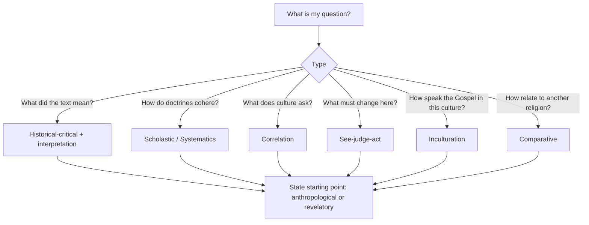

# 06 — Choosing a Method: Where, When, Strengths, Limits

> [!abstract] Principle
> A method is a **tool fitted to a task**. Ask first what kind of question you face; the method follows from the question, not from taste or fashion.

---

## 1. Scholastic / empirico-metaphysical (Aquinas)

- **Where/when** — formal academic settings; when the Church needs a comprehensive logical framework of belief or must defend the rationality of faith against philosophical challenge.
- **Fits** — classroom dogmatics, systematic theology.
- **Answers well** — *What are the ultimate causal grounds of reality, and how do truths of faith organise rationally?*
- **Strengths** — orderly, rational, comprehensive probing; structural stability; exhaustive answers.
- **Limits** — heavy reliance on Aristotelian metaphysics and deduction; abstraction.
- **Dangers** — divorcing theology from lived piety (truth for its own sake); treating authorities piecemeal (*sententiae* torn from context).
- **Criticism** — Renaissance humanists: it leans on dialectic and Greek philosophy rather than Scripture, becoming more philosophy than theology.

## 2. Humanist / exegetical (Erasmus, Valla)

- **Where/when** — periods of spiritual renewal; when returning *ad fontes* to recover the lived message.
- **Fits** — exegesis, preaching, moral formation.
- **Answers well** — *What did the author mean, and how does this text call Christians to change?*
- **Strengths** — philology, semantics, historical context of language; direct link to piety and Christian living.
- **Limits** — deliberately avoids metaphysics and speculation, so it struggles to build complex systemic doctrine.
- **Dangers** — zeal against philosophy may leave intellectual contradictions and cosmological questions unaddressed.
- **Criticism** — without dialectic and philosophy, theologians are poorly equipped to defend the faith rigorously in advanced debate.

## 3. Correlation (Tillich)

- **Where/when** — on the boundary of faith and culture; in times of widespread existential crisis, despair, scepticism.
- **Fits** — apologetics, philosophical theology.
- **Answers well** — *How does the Christian message answer the questions implied by finitude, disruption and despair?*
- **Strengths** — mutual interdependence of question and answer; frees theology from resting on historical probabilities; avoids the sterile naturalism/supranaturalism quarrel.
- **Limits** — bound to a particular philosophical framing of the human situation (existentialism).
- **Dangers** — the divine becomes a purely immanent principle in the "depth" of human being; the transcendent pole is lost.
- **Criticism** — Taubes: the dialectical method secretly impels theology toward atheism or a theology of immanence, and is paralysed if it tries to steer a middle course between strict historical criticism and pneumatic exegesis.

## 4. Transcendental / functional specialisation (Lonergan)

- **Where/when** — the modern differentiated academy, where historical consciousness must be reckoned with while doctrine remains normative.
- **Fits** — doctoral research, history of doctrine, comprehensive systematics.
- **Answers well** — *How do we integrate critical historical research with dogmatic truth?*
- **Strengths** — eight collaborative steps let specialists build cumulatively; overcomes relativism by grounding theology in authentic **conversion**.
- **Limits** — highly complex; depends on "authentic subjectivity," a spiritual-psychological state that cannot be strictly measured.
- **Dangers** — Systematics becomes technical and elitist, cut off from the lived Church.
- **Criticism** — many hold that the separation of *Doctrines* from *Systematics* is artificial and unworkable.

## 5. Sociological / prophetic discernment (Yoder)

- **Where/when** — when the Church faces political, social or ethical crises testing its allegiance to the Gospel.
- **Fits** — social action, pastoral planning, ethics.
- **Answers well** — *How do contemporary powers and church practices compare with the nonviolent way of Jesus in Scripture?*
- **Strengths** — practical, *ad hoc*, focused on lived obedience; acts as "linguistic self-consciousness" and memory, untangling the Church from justifications of violence.
- **Limits** — avoids metaphysical language and system-building, so it cannot specify deeper concepts.
- **Dangers** — "doxological historiography" and "biblical realism" can slide into slanted, uncritical, eisegetical readings serving a predetermined ethical agenda.
- **Criticism** — cynical/reductionist memory of Church history; essentialised dualisms (Hebrew vs. Greek); lacks the conceptual construction needed to avoid internal contradiction.

## 6. Cooperative discovery / ecumenical (Burtt)

- **Where/when** — pluralistic settings where traditions or world religions meet and clash.
- **Fits** — interreligious dialogue, ecumenical theology.
- **Answers well** — *How can champions of opposing religions advance from disagreement to shared understanding?*
- **Strengths** — applies the Golden Rule to intellectual inquiry: loving unity, impartial terminology, mutual appreciation without prior dogmatic commitments.
- **Limits** — assumes no perspective is universally valid, which conflicts with traditional claims to absolute truth.
- **Dangers** — dilutes distinct, historically grounded truths into an abstract synthesised "common end."
- **Criticism** — traditionalists: surrendering authoritative revelation for ongoing cooperative synthesis destroys the foundation of Christian faith.

---

## Master comparison
| Method | Best home | Signature strength | Signature danger |
|--------|-----------|-------------------|------------------|
| Scholastic | Dogmatics classroom | Order and comprehensiveness | Divorce from piety |
| Humanist-exegetical | Exegesis, preaching | Philological fidelity | Systemic thinness |
| Correlation | Apologetics | Speaks to real crisis | Immanentism |
| Transcendental | Research, systematics | Cumulative collaboration | Elitist complexity |
| Prophetic-sociological | Ethics, social action | Concrete obedience | Eisegesis for an agenda |
| Cooperative/comparative | Dialogue | Impartial mutual learning | Dilution of truth claims |
| Contextual | Mission, local church | Incarnational translation | Relativism (checked by canon + catholicity) |
| Liberation/praxis | Pastoral planning | Option for the poor | Ideological capture |

---

## Criteria for choosing a method

1. **The starting point** — anthropological (begin from human context, extract meaning) or revelatory (begin from God's message, apply to humanity). The choice determines the trajectory of the whole theology. **State it explicitly.**
2. **The nature of the task — discovery vs. teaching** — historical recovery and establishing facts require inductive/historical-critical methods; pedagogical presentation of doctrine requires systematic/deductive method.
3. **The life situation** — issues often choose the theologian: bioethics, parish planning, an existential or social crisis. Tailor the method to the actual "powers" and practical questions at hand.
4. **Epistemic humility vs. systematic exigency** — judge whether the task calls for humility before mystery that cannot be fully grasped, or for the drive to synthesise and correlate truths coherently for a modern audience.

---

## Can methods be combined?

**Yes — and they must be**, for comprehensive theological reflection.

- **Cognitive integration** — blend *sequential thinking* (linear, logical, analytical: textual criticism, dogmatics) with *parallel synthetic thinking* (gestalt, intuitive, imaginative: pastoral care, interpretation).
- **Methodological collaboration (Lonergan)** — the eight specialties are explicitly built to combine divergent methods in one pipeline: the positive phase uses the inductive, empirical methods of secular historians and philologists; the normative phase uses the deductive, constructive and pastoral methods of traditional theology.
- **Ad hoc mixing (Yoder)** — in practical and social ethics, employ "skills of mixing and matching according to the shape of a particular debate" — duties, consequences and virtues can be weighed simultaneously.

> [!warning] Not eclecticism
> Combining is legitimate when the methods are **sequenced by task** (each doing what it does well) — not when they are mixed to dodge a difficulty or to smuggle in a conclusion.

## Flashcards
Four criteria for choosing a method :: Starting point (anthropological/revelatory); nature of task (discovery vs teaching); the life situation; epistemic humility vs systematic exigency
Taubes's criticism of Tillich :: The dialectical method secretly impels theology toward atheism or immanence and is paralysed between historical criticism and pneumatic exegesis
Standard criticism of Lonergan's scheme :: The separation between Doctrines and Systematics is artificial and unworkable
Danger of Yoder's method :: Doxological historiography and biblical realism can become slanted, eisegetical readings serving a predetermined agenda
Danger of Burtt's cooperative method :: Dilutes distinct historically grounded truths into an abstract synthesised common end
Humanists' criticism of scholasticism :: It relies on dialectic and Greek philosophy rather than Scripture — more philosophy than theology
Scholastics' counter-criticism of humanism :: Without philosophy and dialectic, theologians cannot rigorously defend the faith
Two modes of thinking to combine :: Sequential (linear, analytical) and parallel synthetic (gestalt, intuitive)
Where correlation belongs :: On the boundary of faith and culture — apologetics in a time of existential crisis
Where see-judge-act belongs :: Pastoral planning, social action, ethics — a concrete situation needing transformation

---
**Prev:** [[05 - How to Use the Methods - Step by Step]] · **Next:** [[07 - Applying Method as a Student]]
