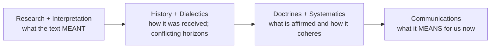

# 07 — Applying Method as a Student

For essays, exegesis papers, seminar presentations — and for the methodological paragraph every good paper contains.

---

## 1. Determine and state your starting point

Choose deliberately, then **say so in the introduction**; it heavily influences your conclusions.

| Starting point | You begin with | You move to |
|---|---|---|
| **Anthropological** | Christian faith within the context of human living and the contemporary situation | What God's message means for that world |
| **Revelatory** | God's message as revealed in Scripture and Tradition | Its human and modern implications |

> [!tip] Sentence template
> "This paper proceeds from a **revelatory** starting point: it first establishes what *Dei Verbum* 11 affirms about inspiration, and only then asks what this implies for the Indian reader of Scripture."

## 2. Structure the paper — Stone & Duke's four steps

A four-step diagnostic procedure for analysing any issue (pastoral challenge, ethical dilemma, textual debate):

1. **Theological analysis** — make explicit the theological understandings or assumptions *implicit* in the discussion.
2. **Evaluate** — examine those understandings; note strengths and limitations.
3. **Theological construction** — propose the most adequate resolution in the light of the Christian message.
4. **Justify** — explain in explicit theological terms *why* your proposal is preferable to the alternatives.

> [!info] Why this works for exams too
> Steps 1–2 show you have read; steps 3–4 show you can think. Most marks are lost by stopping at step 2 or by jumping to step 3 without step 1.

## 3. Employ both modes of thinking

| Mode | What it does | Where it helps |
|------|-------------|----------------|
| **Sequential** | Logical, linear, analytical (A→B→C) | Dissecting texts, building the argument |
| **Parallel synthetic** | Intuitive, gestalt — grasps the totality | Seeing interconnection of themes, pastoral insight |

**Practical tip — "pump-priming":** read Scripture or engage in spiritual disciplines to spark intuitive insight, then **write the insight down and test it** by rigorous sequential logic.

## 4. Move from data to conclusion responsibly

Follow Lonergan's ladder — do not skip rungs:

## 5. Common methodological mistakes

> [!warning] The four killers
> 1. **The "short-circuit" fallacy** — jumping straight from what an ancient text *meant* to what it *means for us*, skipping the historical, dialectical and doctrinal work. Result: anachronistic application, and history pitted against faith.
> 2. **The illusion of neutrality** — pretending you approach the text without bias. Every thinker works from a horizon; name how your social location, background and cultural assumptions shape your analysis.
> 3. **Impatience** — rushing to conclusions or dismissing opposing views. Practise **methodological patience**: tarry with dissenting voices and uncover the root of the disagreement before settling your thesis.
> 4. **Loss of epistemic humility** — forgetting that all human theology is a limited, constructive attempt to grasp the infinite.

## 6. Checklist before submitting

- [ ] Starting point named (anthropological / revelatory) and justified
- [ ] Method named, and the reason it fits *this* question stated ([[06 - Choosing a Method - Where When Strengths Limits]])
- [ ] Implicit theological assumptions in the debate made explicit
- [ ] At least one serious opposing position engaged on its strongest form
- [ ] No leap from "meant" to "means" without the intermediate steps
- [ ] Own horizon and social location acknowledged
- [ ] Constructive proposal stated *and* justified against alternatives
- [ ] Limits of the argument acknowledged (epistemic humility)

## 7. Ready-made methodological paragraph (adapt)

> This study adopts a **[revelatory / anthropological]** starting point and proceeds by **[named method]**, chosen because the question at issue is one of **[historical recovery / doctrinal coherence / cultural correlation / pastoral transformation]**. Following [Lonergan's functional specialties / the see-judge-act spiral / the grammatical-historical procedure], I first **[establish the text / analyse the situation]**, then **[interpret / judge]**, and only then **[construct / act]**. I write as **[social location]**, which shapes what I notice and what I may overlook; where the sources conflict I have preferred to tarry with the disagreement rather than resolve it prematurely.

## Flashcards
Stone and Duke's four steps :: Theological analysis; evaluation; theological construction; justification
The short-circuit fallacy :: Jumping from what a text meant to what it means today without the intermediate historical, dialectical and doctrinal work
The illusion of neutrality :: Pretending to approach a text without bias; every thinker works from a horizon shaped by social location
Methodological patience :: Tarrying with dissenting voices to uncover the root of a disagreement before deciding one's thesis
Pump-priming :: Sparking intuitive insight through reading Scripture or spiritual discipline, then writing it down and testing it with sequential logic
First thing to state in a theology paper :: Your starting point — anthropological or revelatory — because it shapes the conclusions

---
**Prev:** [[06 - Choosing a Method - Where When Strengths Limits]] · **Next:** [[08 - Glossary Revision and Exam Questions]]
