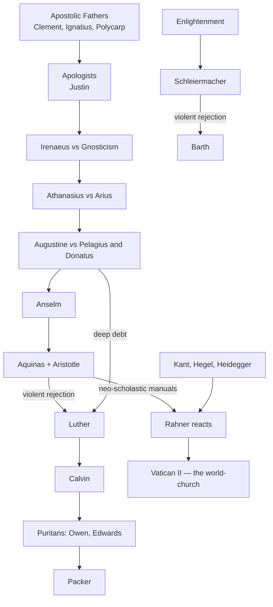

# 11 — Fault Lines and Lineages

The history of theology is largely **a history of reactions**. Persons and their methods: [[10 - Major Theologians and Their Methods]]. The opponents who provoked each reaction: [[10b - Interlocutors Opponents and Heresies]]. Rahner's side of every debate below, in full: [[10a - Karl Rahner - A Deep Dive]].

---

## 1. Lineages of influence

| Lineage | Chain |
|---|---|
| **Patristic-Augustinian** | Apostolic Fathers → Apologists (Justin) → Irenaeus (vs. Gnosticism) → Augustine (Neoplatonism vs. Pelagius and Donatists) → the Western Church |
| **Scholastic** | Anselm ("father of scholasticism") → Aquinas (Aristotle, systematic frameworks) |
| **Reformation → Puritan** | Luther (violently against Aristotle: *"the whole Aristotle is to theology as darkness is to light"*) → Calvin (deeply formed by Augustine and Luther) → Owen → Edwards → Packer |
| **Liberal vs. orthodox** | Enlightenment → Schleiermacher (religion as absolute dependence) → Barth reacts, the break triggered by Harnack and Herrmann endorsing the war in 1914 → neo-orthodoxy. Packer later sums up the verdict: liberalism is *"subjectivism trying to be Christianity"* |
| **Transcendental Thomism** | Neo-scholastic rigidity → Rahner rescues Aquinas by absorbing the modern turn to the subject (Kant, Hegel, Heidegger) → Vatican II |

> [!tip] Method payoff
> Each rejection is **methodological before it is doctrinal**. Luther does not merely disagree with Aquinas's conclusions; he refuses his starting point (reason). Barth does not merely correct Schleiermacher; he abolishes his source (experience). This is exactly the "discord between methods" of [[01 - What Is Theological Method and Why It Matters#4. What goes wrong when method is neglected or badly chosen]].

---

## 2. Nature and grace

| Position | Claim |
|---|---|
| **Pelagius** | Humans possess the natural capacity for moral perfection |
| **Augustine** | Fallen nature makes salvation utterly dependent on grace |
| **Aquinas** | Grace does not destroy but **perfects** nature; reason supplies *preambles* to faith, revelation is required for salvation |
| **Rahner** | Overcomes the two-tiered neo-scholastic separation with the **supernatural existential**: nature is *always already* graced, dynamically oriented to God; grace is not an add-on but God's self-communication |

## 3. Revelation and reason

- **Aquinas** — reason a reliable foundation on which revelation builds.
- **Luther** — autonomous reason and natural theology are "the Devil's whore," breeding pride and idolatry; knowledge of God comes only by revelation.
- **Schleiermacher** — shifts the locus of revelation from external historical proposition into human subjectivity; doctrines are *"accounts of the Christian religious affections set forth in speech."*
- **Barth** — rejects both natural theology and Schleiermacher's experientialism: God is absolutely other and known only because he crosses the gulf in his self-revealing Word.

## 4. Faith and history

- **Irenaeus** — strongly historical: **recapitulation**, Christ the second Adam historically undoing the fall.
- **Schleiermacher** — evolutionary: Christianity as the highest stage of religious evolution.
- **Rahner** — bridges: transcendentality is always **mediated through categorical history**; God's self-communication occurs in concrete world-history, culminating in Christ the absolute saviour.

Compare the methodological crisis of historical consciousness in [[02 - Historical Development of Theological Method#6. Enlightenment and historical consciousness (18th–19th c.)]].

## 5. Church and world

- **Augustine** — the City of God vs. earthly institutions; never confuse the two.
- **Rahner** — reshapes ecclesiology for Vatican II: the **world-church**, not a European export; **anonymous Christians** who respond to conscience and hidden grace; the Church is embedded in the world and must confess its own sinfulness.
- **Clement / Ignatius** — the earliest form of the question: order and episcopal unity as the Church's survival under pressure.

## 6. God and suffering

| Theologian | Answer |
|---|---|
| **Justin** | Suffering as God's discipline of those he loves; martyrdom as proof of Christianity's truth |
| **Luther** | **Theology of the cross** shatters the theology of glory — God is found precisely where reason least expects: weakness, suffering, the cross |
| **Rahner** | The **incomprehensibility of God**: surrender to incomprehensible mystery, above all in death and suffering, is the supreme act of faith, hope and love |
| **Kitamori** (see [[04 - Contextual, Liberation and Non-Western Methods#2. Kazoh Kitamori (Japan)]]) | The pain of God — impassibility cannot bear the sins of the world |

---

## 7. Contributions to method — the short list

| Theologian | Methodological contribution |
|---|---|
| **Irenaeus** | Scripture interprets Scripture; refuse externally imposed frameworks |
| **Anselm** | *Fides quaerens intellectum* — deduce doctrine by reason as meditation on God's beauty |
| **Aquinas** | The *Summa* procedure: thesis, objections, master synthesis, replies |
| **Calvin** | Separate the tracks — exegesis in commentaries, doctrine in the *Institutes* |
| **Schleiermacher** | Copernican revolution: affections/experience as the source of theological knowledge |
| **Barth** | Dogmatics as preaching; assertive and aesthetic rather than argumentative |
| **Rahner** | The transcendental method: from the facticity of revelation to the *a priori* conditions in the hearer |

## 8. Standard criticisms — quick table
| Theologian | Charge |
|---|---|
| Irenaeus | Blundering, confused, "barbarous" style |
| Augustine | Neoplatonism distorts his exegesis and theology of love |
| Anselm | Binds God to logical necessity; atonement as harsh transaction |
| Aquinas | Too much pagan philosophy; a theology of glory |
| Luther | Vitriol, coarseness, extreme paradox |
| Calvin | Cantankerous dictator; chilling doctrine of reprobation |
| Schleiermacher | Pantheism; doctrine dissolved into subjective feeling |
| Barth | Impenetrable bulk; no natural theology; latent universalism |
| Rahner | Subjectivises being; anonymous Christianity undercuts mission; Christology drifting toward Nestorianism/Arianism |

---

## 9. Essay questions
1. "Every major theological reversal is first a reversal of method." Test this on Luther against Aquinas and Barth against Schleiermacher.
2. Compare Aquinas's *gratia perficit naturam* with Rahner's supernatural existential. Does Rahner solve the two-tier problem or dissolve nature?
3. Is Barth's rejection of natural theology methodologically consistent with his own use of Scripture?
4. Assess "anonymous Christianity" as a methodological consequence of the transcendental starting point.
5. Luther's theology of the cross and Kitamori's pain of God: same insight in two cultures, or two different claims?
6. Which of the criticisms in §8 are criticisms of *method* rather than of *doctrine*? Does the distinction hold?

## Flashcards
Luther on Aristotle :: "The whole Aristotle is to theology as darkness is to light"
Who said liberalism is subjectivism trying to be Christianity :: J. I. Packer in 'Fundamentalism' and the Word of God, stating the Barthian verdict — not Barth himself
What actually broke Barth from liberalism :: His teachers Harnack and Herrmann endorsing the First World War in 1914
Pelagius vs Augustine :: Natural human capacity for moral perfection vs total dependence on grace because of fallen nature
Aquinas on nature and grace :: Grace does not destroy but perfects nature; reason gives preambles to faith
Rahner's solution to the two-tier problem :: The supernatural existential — nature is always already graced and oriented to God
Schleiermacher's definition of doctrine :: Accounts of the Christian religious affections set forth in speech
Rahner on history and transcendence :: Transcendentality is always mediated through categorical history, culminating in Christ the absolute saviour
Rahner's ecclesial shift at Vatican II :: The world-church rather than a European export; the Church embedded in the world and confessing its own sinfulness
Rahner on suffering :: Surrender to the incomprehensible mystery of God, especially in death, is the supreme act of faith, hope and love
Three standard criticisms of Rahner :: Subjectivising being; anonymous Christianity undermining Church and mission; Christology tending to Nestorianism or Arianism

---
**Prev:** [[10 - Major Theologians and Their Methods]] · **Home:** [[Theological Methods - MOC]]
