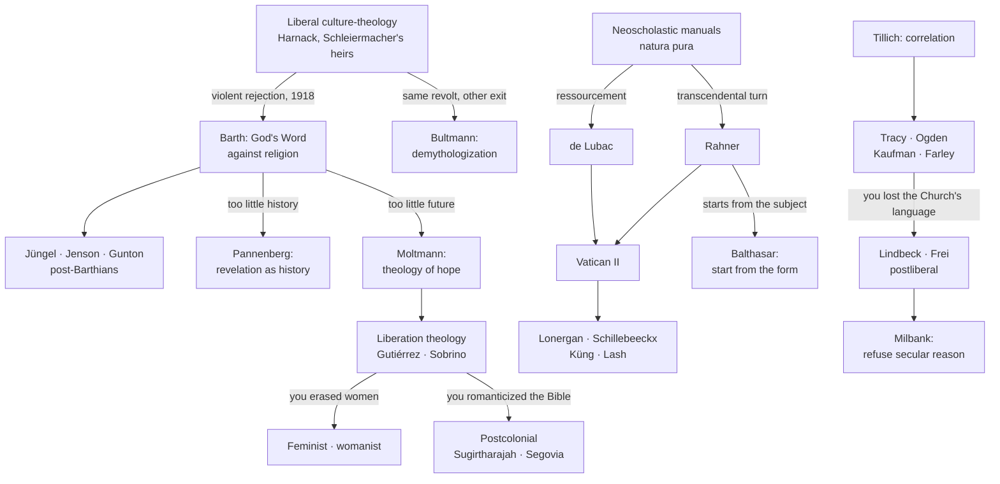

# 11a — Fault Lines Since 1918

Continuation of [[11 - Fault Lines and Lineages]], which runs Clement → Packer. Same principle: **the history of theology is a history of reactions.** Persons: [[13 - Master Roster of Modern Theologians]].

## Lineages of reaction

## The arguments, stated as oppositions

| # | Fault line | One side | The other | What is really at stake |
|---|---|---|---|---|
| 1 | **Where theology starts** | Rahner — the *a priori* conditions in the hearer | Balthasar — the *form* of Christ, perceived before analysis | Whether the subject may set the terms of revelation ⇒ [[Starting from the hearer or from the form divides modern Catholic theology]] |
| 2 | **Nature and grace** | Neoscholastic *natura pura* | de Lubac's natural desire for the supernatural | Whether a world that does not need God was invented by theology itself ⇒ [[A self-sufficient pure nature is the root of secularism]] |
| 3 | **Retrieval or correlation** | Lindbeck, Frei — intratextual retrieval, the text absorbs the world | Tracy, Ogden — correlation with the modern situation | Whether Christian distinctiveness survives mediation ⇒ [[Doctrine is a rule of communal grammar, not a proposition or a feeling]] |
| 4 | **Theology and secular reason** | Milbank — sociology is a Christian heresy on an ontology of violence | Troeltsch, Farley — mutual assimilation | Whether public theology is possible at all |
| 5 | **God and suffering** | Classical impassibility | Moltmann, Kitamori, Jüngel, Peacocke — divine passibility | Whether God is with the victims, and at what metaphysical cost ⇒ [[Evolutionary suffering makes divine passibility close to obligatory]] |
| 6 | **Faith and history** | Pannenberg — revelation as history, verified publicly | Barth — revelation as God's self-positing act | Whether faith submits to the historian's court |
| 7 | **Christ and the religions** | Rahner's anonymous Christian; Hick's pluralism | D'Costa's trinitarian engagement; Asian core-to-core dialogue | Whether tolerance requires flattening ⇒ [[Pluralism is a disguised exclusivist secular agnosticism]] |
| 8 | **Culture or justice** | Inculturation (African, Indian) | Liberation (South African black, Dalit, minjung) | Whose culture is being inculturated, at whose cost ⇒ [[Inculturation drawn from Brahminical Hinduism sacralizes the caste order]] |
| 9 | **Liberation and its critics** | Gutiérrez, Sobrino — the poor, economically defined | Womanist, postcolonial — race, gender, caste, the Canaanites | Whether a single-axis analysis can avoid excluding ⇒ [[Every liberating theology is criticized by the next one it excluded]] |
| 10 | **Church and world** | Hauerwas, Yoder — the Church has its own politics | Reinhold Niebuhr — responsibility inside the world's politics | Whether faithfulness or effectiveness governs Christian ethics |
| 11 | **After foundationalism** | Liberal postmoderns — give up transcendence | Conservative postmoderns — theology never needed those foundations | Whether the loss of foundations is a recovery or a retreat |
| 12 | **Theology and prayer** | Academic theology as a specialized discipline | Stolz, Weil, Balthasar — participation, not mastery | Whether theology can be done without conversion ⇒ [[Theological truth is participation, not mastery of facts]] |

> [!tip] Exam use
> Any twenty-mark essay in this field is one of these twelve lines. Identify the fault line, name both sides with a text, state what is at stake, then say where you stand and why. The claims notes give you the sharpened proposition to argue for or against.

---
**Prev:** [[11 - Fault Lines and Lineages]] · **See also:** [[Modern Theologians Since 1918 - Course Home]] · [[13 - Master Roster of Modern Theologians]]
